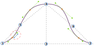

Diese Option steuert die Aufwärtsverteilung im vierten Quadranten der Ärmel.

<Tip>

Unter [understanding the sleevecap](/docs/designs/brian/options#understanding-the-sleevecap) findest du unter
einen detaillierten Einblick in die Konstruktion der Sleevecap und den Einfluss der verschiedenen Optionen auf ihre Form.

</Tip>
