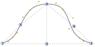
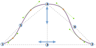
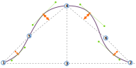

- - -
title: "Breanna body block: Design Options"
- - -

<PatternOptions pattern='breanna' />

## Entendiendo la manga

The Breanna sleevecap was designed to be adaptable into different types of sleeves and garments. As a result, the sleevecap alone has 20 options to control its shape. Whereas that may seem a bit overwhelming at first, understanding how the sleevecap is drafted makes it easy to understand what all the individual options do.

### La caja delimitadora

The _bounding box_ of the sleevecap is a rectangle that is as wide as the sleeve, and as high as the sleevecap. Inside this box, we will construct our sleevecap later.

The image above shows a sleevecap, starting at point 1, then going up until point 4, and then down again to point 2.

<Note>

###### Encontrar cuál es la parte frontal de la manga(capa)

En nuestro ejemplo, el frente de la manga está en el lado derecho. Pero, ¿cómo sabría usted?

Mientras que los patrones normalmente tienen una indicación que muestra qué lado es qué (una sola nota
significa el frente, mientras que una batida doble significa la parte trasera), también puedes
reconocer la parte frontal de una manga porque está más curvada. La parte trasera del manga
también se curvará, pero es una curva más plana. That's because the human shoulder
is more pronounced and curved on the front of the body, thus the sleevecap is more curved
there to fit the shoulder.

</Note>

The width of the sleevecap (and thus the width of the sleeve at the bottom of the armhole) is equal to the distance between points 1 and 2. That distance depends on the measurements of the model, the amount of ease, the cut of the garment and so on. For our sleevecap, all we need to know is that we start with a given width. And while that width can be influenced by other factors, we can not influence it by any of the sleevecap options.

The height of the sleevecap is equal to the distance between points 3 and 4. The exact height is a trade-off between the measurments of the model, options, ease, sleevecap ease, and the fact that the sleeve ultimately has to fit the armhole. So the height may vary, and we don't control the exact value. But there are two options that control the shape of our sleevecap:

- [Sleevecap top X](/docs/patterns/breanna/options/sleevecaptopfactorx/) : Controla la colocación horizontal del punto 3 y 4
- [Sleevecap superior Y](/docs/patterns/breanna/options/sleevecaptopfactory/) : Controla la posición vertical del punto 4

In other words, point 4 can be made higher and lower and, perhaps less intutitively, it can also be changed to lie more to the right or the left, rather than smack in the middle as in our example.

### Los puntos de inflexión

With points 1, 2, 3, and 4 in place, we have a box to draw our sleevecap in. Now it's time to map out our _inflection points_. These are points 5 and 6 on our drawing, and their placement is determined by the following 4 options:

- [Mantén dormido X](/docs/patterns/breanna/options/sleevecapbackfactorx) : Controla la colocación horizontal del punto 5
- [Retroceso Y](/docs/patterns/breanna/options/sleevecapbackfactory) : Controla la posición vertical del punto 5
- [Dulce frontal X](/docs/patterns/breanna/options/sleevecapbackfactorx) : Controla la colocación horizontal del punto 6
- [Sueño frontal Y](/docs/patterns/breanna/options/sleevecapbackfactory) : Controla la posición vertical del punto 6

<Note>

Como usted ve en nuestro ejemplo, estos puntos no siempre se encuentran en nuestra línea de manga. En cambio, ellos
son instrumentales en la creación de los puntos que siempre se encuentran en la manga: los puntos de fondo.

</Note>

### Los puntos de ancla

Ultimately, our sleevecap will be the combination of 5 curves. In addition to points 1 and 2, the four _anchor points_ that are marked in orange in our example will be the start/finish of those curves.

The points are _offset_ perpendicular from the middle of a line between the two anchor points surrounding them. The offset for each point is controlled by these 4 options:

- [Desplazamiento Q1 de Sleevecap](/docs/patterns/breanna/options/sleevecapq1offset) : Controla el perpendicular de desplazamiento a la línea desde puntos 2 a 6
- [Desplazamiento Q2 en durmiente](/docs/patterns/breanna/options/sleevecapq2offset) : Controla el perpendicular a la línea desde puntos 6 a 4
- [Desplazamiento Q3 en durmiente](/docs/patterns/breanna/options/sleevecapq3offset) : Controla el perpendicular a la línea desde puntos 4 a 5
- [Desplazamiento Q4 en durmiente](/docs/patterns/breanna/options/sleevecapq3offset) : Controla el perpendicular a la línea desde los puntos 5 a 1

<Note>

Hemos dividido nuestra manga en 4 cuarteles. Empezamos en el frente (la derecha en nuestro ejemplo)
con el trimestre 1, y hacer nuestro camino hacia atrás hasta el final con el cuarto trimestre.

Like the offset option, the last options to determine the shape of our sleevecap will just repeat so you can
control each quarter individually.

</Note>

### La propagación

We now have all the start and end points to draw the 5 curves that will make up our sleevecaps. What we're missing are the control points (see [our info on Bézier curves](https://freesewing.dev/concepts/beziercurves) to learn more about how curves are constructed). These are determined by the so-called _spread_.

For each of the anchor points (the ones marked in orange, not points 1 and 2) there is an option to control the spread upwards, and downwards:

- [Sleevecap Q1 dispersión a la baja](/docs/patterns/breanna/options/sleevecapq1spread1) : Controla la dispersión a la baja en el primer trimestre
- [Sleevecap Q1 upward spread](/docs/patterns/breanna/options/sleevecapq1spread2) : Controla la dispersión ascendente en el primer trimestre
- [Sleevecap Q2 a dispersión a la baja](/docs/patterns/breanna/options/sleevecapq2spread1) : Controla la dispersión a la baja en el segundo trimestre
- [Sleevecap Q2 upward spread](/docs/patterns/breanna/options/sleevecapq2spread2) : Controla la dispersión ascendente en el segundo trimestre
- [Sleevecap Q3 upward spread](/docs/patterns/breanna/options/sleevecapq3spread1) : Controla la dispersión ascendente en el tercer trimestre
- [Sleevecap Q3 con dispersión a la baja](/docs/patterns/breanna/options/sleevecapq3spread2) : Controla la dispersión a la baja en el tercer trimestre
- [Sleevecap Q4 al alza](/docs/patterns/breanna/options/sleevecapq4spread1) : Controla la dispersión ascendente en el cuarto trimestre
- [Sleevecap Q4 a dispersión a la baja](/docs/patterns/breanna/options/sleevecapq4spread2) : Controla la dispersión a la baja en el cuarto trimestre

<Note>

Los lectores atentos habrán notado que el punto 4 no es un punto de fondo. En otras palabras, no hay garantía
de que se acostará en la línea de manga. Lo cual también significa que la dispersión hacia arriba entre los trimestres 2 y 3 influirá
en la altura de la manga. Reduce la propagación hacia arriba y la curva se sumergirá por debajo del punto 4. Aumenta y
la curva se elevará por encima.

</Note>

### Takeaways

While the sleevecap in Breanna (and all patterns that extend Breanna) have a lot of options, understanding how the sleevecap is constructed can help you design the exact sleevecap shape you want. To do so:

- Empezar con colocar la parte superior de tu manga
- Luego determina los puntos de inflexión
- A continuación, utilice el desplazamiento para controlar la inclinación de la curva
- Por último, utilice la propagación para suavizar las cosas

What's important to remember is that you're only ever controlling the shape of the sleevecap. Whatever shape you design, it will be fitted to the armhole, meaning that its size can and will be adapted to make sure the sleeve fits the armscye. However, the shape you design will always be respected.
