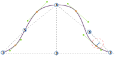

Diese Option steuert den Versatz im ersten Quadranten der Ärmel.

<Tip>

Siehe [die Armkugel verstehen](/docs/patterns/brian/options#understanding-the-sleevecap) für eine detaillierte Erklärung, wie die Armkugel konstruiert wird und wie die einzelnen Optionen ihre Form beeinflussen.

</Tip>

