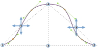

- - -
title: "Breanna body block: Design Options"
- - -

<PatternOptions pattern='breanna' />

## Understanding the sleevecap

The Breanna sleevecap was designed to be adaptable into different types of sleeves and garments. As a result, the sleevecap alone has 20 options to control its shape. Whereas that may seem a bit overwhelming at first, understanding how the sleevecap is drafted makes it easy to understand what all the individual options do.

### The bounding box

The _bounding box_ of the sleevecap is a rectangle that is as wide as the sleeve, and as high as the sleevecap. Inside this box, we will construct our sleevecap later.

The image above shows a sleevecap, starting at point 1, then going up until point 4, and then down again to point 2.

<Note>

###### Finding out which is the front of the sleeve(cap)

In our example, the front of the sleevecap is on the right hand side. But how would you know?

While patterns typically have an indication that shows which side is which (a single notch
means the front, whereas a double notch means the back), you can also
recognize the front side of a sleevecap because it is more curved. The backside of the
sleevecap will also be curved, but it's a flatter curve. That's because the human shoulder
is more pronounced and curved on the front of the body, thus the sleevecap is more curved
there to fit the shoulder.

</Note>

The width of the sleevecap (and thus the width of the sleeve at the bottom of the armhole) is equal to the distance between points 1 and 2. That distance depends on the measurements of the model, the amount of ease, the cut of the garment and so on. For our sleevecap, all we need to know is that we start with a given width. And while that width can be influenced by other factors, we can not influence it by any of the sleevecap options.

The height of the sleevecap is equal to the distance between points 3 and 4. The exact height is a trade-off between the measurments of the model, options, ease, sleevecap ease, and the fact that the sleeve ultimately has to fit the armhole. So the height may vary, and we don't control the exact value. But there are two options that control the shape of our sleevecap:

- [Sleevecap top X](/docs/patterns/breanna/options/sleevecaptopfactorx/) : Controls the horizontal placement of point 3 and 4
- [Sleevecap top Y](/docs/patterns/breanna/options/sleevecaptopfactory/) : Controls the vertical placement of point 4

In other words, point 4 can be made higher and lower and, perhaps less intutitively, it can also be changed to lie more to the right or the left, rather than smack in the middle as in our example.

### The inflection points

With points 1, 2, 3, and 4 in place, we have a box to draw our sleevecap in. Now it's time to map out our _inflection points_. These are points 5 and 6 on our drawing, and their placement is determined by the following 4 options:

- [Sleevecap back X](/docs/patterns/breanna/options/sleevecapbackfactorx) : Controls the horizontal placement of point 5
- [Sleevecap back Y](/docs/patterns/breanna/options/sleevecapbackfactory) : Controls the vertical placement of point 5
- [Sleevecap front X](/docs/patterns/breanna/options/sleevecapbackfactorx) : Controls the horizontal placement of point 6
- [Sleevecap front Y](/docs/patterns/breanna/options/sleevecapbackfactory) : Controls the vertical placement of point 6

<Note>

As you see in our example, these points do not always lie on our sleevecap line. Instead, they
are instrumental in creating the points that always lie on the sleevecap: the anchor points.

</Note>

### The anchor points

Ultimately, our sleevecap will be the combination of 5 curves. In addition to points 1 and 2, the four _anchor points_ that are marked in orange in our example will be the start/finish of those curves.

The points are _offset_ perpendicular from the middle of a line between the two anchor points surrounding them. The offset for each point is controlled by these 4 options:

- [Sleevecap Q1 offset](/docs/patterns/breanna/options/sleevecapq1offset) : Controls the offset perpendicular to the line from points 2 to 6
- [Sleevecap Q2 offset](/docs/patterns/breanna/options/sleevecapq2offset) : Controls the offset perpendicular to the line from points 6 to 4
- [Sleevecap Q3 offset](/docs/patterns/breanna/options/sleevecapq3offset) : Controls the offset perpendicular to the line from points 4 to 5
- [Sleevecap Q4 offset](/docs/patterns/breanna/options/sleevecapq3offset) : Controls the offset perpendicular to the line from points 5 to 1

<Note>

We've divided our sleevecap into 4 quarters. We start at the front (the right in our example)
with quarter 1, and make our way to the back to end with quarter 4.

Like the offset option, the last options to determine the shape of our sleevecap will just repeat so you can
control each quarter individually.

</Note>

### The spread

We now have all the start and end points to draw the 5 curves that will make up our sleevecaps. What we're missing are the control points (see [our info on Bézier curves](https://freesewing.dev/concepts/beziercurves) to learn more about how curves are constructed). These are determined by the so-called _spread_.

For each of the anchor points (the ones marked in orange, not points 1 and 2) there is an option to control the spread upwards, and downwards:

- [Sleevecap Q1 downward spread](/docs/patterns/breanna/options/sleevecapq1spread1) : Controls the downward spread in the first quarter
- [Sleevecap Q1 upward spread](/docs/patterns/breanna/options/sleevecapq1spread2) : Controls the upward spread in the first quarter
- [Sleevecap Q2 downward spread](/docs/patterns/breanna/options/sleevecapq2spread1) : Controls the downward spread in the second quarter
- [Sleevecap Q2 upward spread](/docs/patterns/breanna/options/sleevecapq2spread2) : Controls the upward spread in the second quarter
- [Sleevecap Q3 upward spread](/docs/patterns/breanna/options/sleevecapq3spread1) : Controls the upward spread in the third quarter
- [Sleevecap Q3 downward spread](/docs/patterns/breanna/options/sleevecapq3spread2) : Controls the downward spread in the third quarter
- [Sleevecap Q4 upward spread](/docs/patterns/breanna/options/sleevecapq4spread1) : Controls the upward spread in the fourth quarter
- [Sleevecap Q4 downward spread](/docs/patterns/breanna/options/sleevecapq4spread2) : Controls the downward spread in the fourth quarter

<Note>

Attentive readers will have noticed that point 4 is not an anchor point. In other words, there is no guarantee
that it will lie on the sleevecap line. Which also means that the upwards spread in quarters 2 and 3 will influence
the height of the sleevecap. Reduce the upwards spread, and the curve will dip below point 4. Increase it and
the curve will rise above it.

</Note>

### Takeaways

While the sleevecap in Breanna (and all patterns that extend Breanna) have a lot of options, understanding how the sleevecap is constructed can help you design the exact sleevecap shape you want. To do so:

- Start with placing the top of your sleevecap
- Then determine the inflection points
- Next, use the offset to control the steepness of the curve
- Finally, use the spread to smooth things out

What's important to remember is that you're only ever controlling the shape of the sleevecap. Whatever shape you design, it will be fitted to the armhole, meaning that its size can and will be adapted to make sure the sleeve fits the armscye. However, the shape you design will always be respected.
