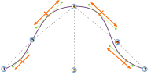

<PatternOptions pattern='breanna' />

## Розуміння втулки рукава

Накидка на рукав Breanna була розроблена таким чином, щоб її можна було пристосувати до різних типів рукавів та одягу. В результаті, лише для одного рукава є 20 варіантів керування його формою. Хоча на перший погляд це може здатися дещо складним, розуміння того, як розробляється , дозволяє легко зрозуміти, що роблять всі окремі варіанти.

### Обмежувальна рамка

Обмежувальна рамка __ рукава - це прямокутник завширшки з рукав, а заввишки з рукава. Усередині цієї коробки ми згодом сконструюємо наш чохол для рукава.

The image above shows a sleevecap, starting at point 1, then going up until point 4, and then down again to point 2.

<Note>

###### Визначення передньої частини рукава (шапки)

У нашому прикладі передня частина рукава (шапки) знаходиться з правого боку. Але звідки ви знаєте?

Хоча на викрійках зазвичай є позначення, яке показує, яка сторона є якою (одинарна надсічка
означає передню, а подвійна - задню), ви також можете
розпізнати передню сторону рукава, тому що вона більш вигнута. Зворотний бік
також буде вигнутим, але більш пласким. Це тому, що людське плече
більш виражене і вигнуте на передній частині тіла, тому рукав більш вигнутий
там, щоб прилягати до плеча.

</Note>

Ширина втачного рукава (і, відповідно, ширина рукава по низу пройми) дорівнює відстані між точками 1 і 2. Ця відстань залежить від вимірів моделі, ступеня вільності, крою одягу тощо. Для нашого рукава все, що нам потрібно знати, це те, що ми починаємо з заданої ширини. І хоча на ширину можна впливати іншими факторами, ми не можемо впливати на неї за допомогою жодного з варіантів наконечників рукавів.

Висота втачного рукава дорівнює відстані між точками 3 і 4. Точна висота - це компроміс між вимірами моделі, опціями, легкістю, зручністю вкладання рукава і тим фактом , що рукав в кінцевому підсумку повинен відповідати проймі. Тому висота може змінюватися, і ми не контролюємо точне значення. Але є дві опції, які контролюють форму нашої втачки:

- [Верх рукава X](/docs/patterns/breanna/options/sleevecaptopfactorx/) : Контролює горизонтальне розташування точок 3 і 4
- [Верх рукава Y](/docs/patterns/breanna/options/sleevecaptopfactory/) : Керує вертикальним розміщенням точки 4

In other words, point 4 can be made higher and lower and, perhaps less intutitively, it can also be changed to lie more to the right or the left, rather than smack in the middle as in our example.

### Точки перегину

Коли пункти 1, 2, 3 і 4 виконані, у нас є коробка, в яку ми можемо втягнути наш рукав. Тепер настав час намітити наші _точки перегину_. Це точки 5 і 6 на нашому кресленні, і їх розміщення визначається наступними 4 варіантами:

- [Пілочка спинки рукава X](/docs/patterns/breanna/options/sleevecapbackfactorx) : Контролює горизонтальне розміщення точки 5
- [Пілочка рукава ззаду Y](/docs/patterns/breanna/options/sleevecapbackfactory) : Керує вертикальним розміщенням точки 5
- [Рукав передній X](/docs/patterns/breanna/options/sleevecapbackfactorx) : Керує горизонтальним розміщенням точки 6
- [Рукав передній Y](/docs/patterns/breanna/options/sleevecapbackfactory) : Керує вертикальним розміщенням точки 6

<Note>

Як ви бачите на нашому прикладі, ці точки не завжди лежать на лінії оката рукава. Натомість вони
допомагають створити точки, які завжди знаходяться на манжеті рукава: опорні точки.

</Note>

### Опорні точки

Зрештою, наш рукав буде комбінацією 5 вигинів. На додаток до точок 1 і 2, чотири _опорні точки_ , які в нашому прикладі позначені помаранчевим кольором, будуть початком/фінішем цих кривих.

Точки _зміщені_ перпендикулярно до середини лінії між двома опорними точками , що їх оточують. Зміщення для кожної точки контролюється цими 4 опціями:

- [Зсув пілочки Q1](/docs/patterns/breanna/options/sleevecapq1offset) : Керує зсувом перпендикулярно до лінії від точок 2 до 6
- [Зсув пілочки Q2](/docs/patterns/breanna/options/sleevecapq2offset) : Керує зсувом перпендикулярно до лінії від точок 6 до 4
- [Зсув пілочки Q3](/docs/patterns/breanna/options/sleevecapq3offset) : Керує зсувом перпендикулярно до лінії від точок 4 до 5
- [Зсув пілочки Q4](/docs/patterns/breanna/options/sleevecapq3offset) : Керує зсувом перпендикулярно до лінії від точок 5 до 1

<Note>

Ми розділили наш рукав на 4 чверті. Ми починаємо спереду (у нашому прикладі праворуч)
з чверті 1 і рухаємося до задньої частини, щоб закінчити чвертю 4.

Як і в варіанті зі зміщенням, останні опції для визначення форми нашої втачки просто повторюватимуться, щоб ви могли
контролювати кожну чверть індивідуально.

</Note>

### Розкид

Тепер у нас є всі початкові та кінцеві точки, щоб накреслити 5 кривих, з яких складатимуться рукава. Нам не вистачає контрольних точок (див. [нашу інформацію про криві Безьє](https://freesewing.dev/concepts/beziercurves) , щоб дізнатися більше про те, як будуються криві). Вони визначаються так званим _спредом_.

For each of the anchor points (the ones marked in orange, not points 1 and 2) there is an option to control the spread upwards, and downwards:

- [Спред Sleevecap Q1 вниз](/docs/patterns/breanna/options/sleevecapq1spread1) : Контролює спред вниз у першому кварталі
- [Спред Sleevecap Q1 вгору](/docs/patterns/breanna/options/sleevecapq1spread2) : Контролює спред вгору в першому кварталі
- [Спред Sleevecap Q2 вниз](/docs/patterns/breanna/options/sleevecapq2spread1) : Контролює спред вниз у другому кварталі
- [Спред Sleevecap Q2 вгору](/docs/patterns/breanna/options/sleevecapq2spread2) : Контролює спред вгору в другому кварталі
- [Спред Sleevecap Q3 вгору](/docs/patterns/breanna/options/sleevecapq3spread1) : Контролює спред вгору в третьому кварталі
- [Спред Sleevecap Q3 вниз](/docs/patterns/breanna/options/sleevecapq3spread2) : Контролює спред вниз у третьому кварталі
- [Sleevecap Q4 спред вгору](/docs/patterns/breanna/options/sleevecapq4spread1) : Контролює спред вгору в четвертому кварталі
- [Спред на зниження Sleevecap Q4](/docs/patterns/breanna/options/sleevecapq4spread2) : Контролює спред на зниження в четвертому кварталі

<Note>

Уважні читачі помітили, що пункт 4 не є опорним. Іншими словами, немає ніякої гарантії
, що вона ляже на лінію горловини рукава. Це також означає, що висхідний спред у кварталах 2 і 3 вплине на
висоту втачного рукава. Зменшіть спред вгору, і крива опуститься нижче точки 4. Збільште його і
крива підніметься вище.

</Note>

### Висновки

Хоча у Бріанни (і всіх моделей, які продовжують Бріанну) є багато варіантів, розуміння того, як побудований рукав , допоможе вам створити саме ту форму рукава, яку ви хочете. Щоб зробити це:

- Почніть з розміщення верхньої частини рукава
- Потім визначте точки перегину
- Далі, використовуйте зміщення для керування крутизною кривої
- Нарешті, використовуйте спред, щоб згладити ситуацію

Важливо пам'ятати, що ви завжди контролюєте лише форму манжета. Яку б форму ви не спроектували, вона буде припасована до пройми, а це означає, що її розмір може і буде адаптований , щоб переконатися, що рукав підходить до пройми. Однак форма, яку ви спроектували, завжди буде поважатися.
