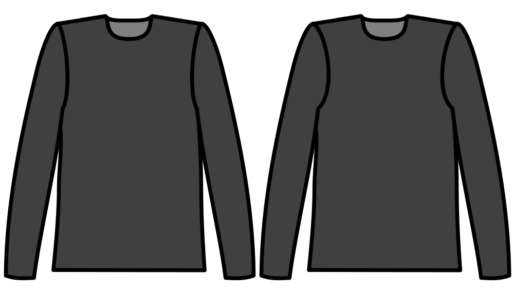

Controla cuánto se corta más en la prenda la parte delantera del orificio que la parte trasera.

Since the human shoulder is more rounded at the front of the body, the sleeve(cap) is more rounded there too, and the armhole is typically cut deeper into the front of the garment than the back. Esta opción controla cuánto más profundo.

