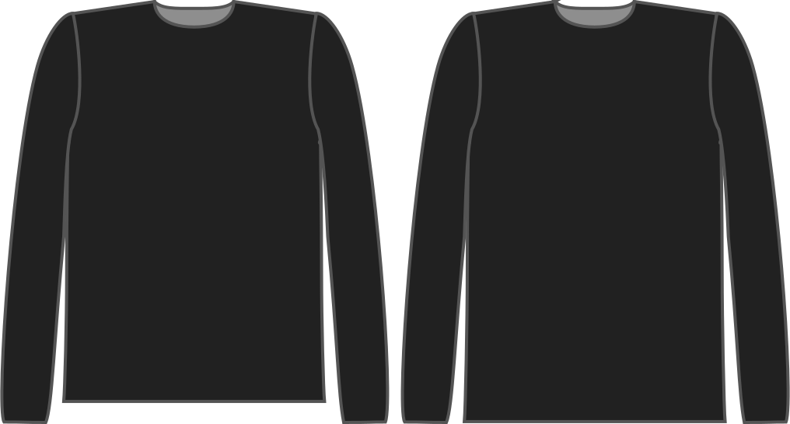

Diese Option bestimmt, wie weit sich der Block unterhalb der Hüfte erstreckt.

> Beachten Sie, dass dieser Block standardmäßig so lange ist, wie Ihre Hüftlinie, die fast sicher zu kurz für das letzte Kleidungsstück ist.

