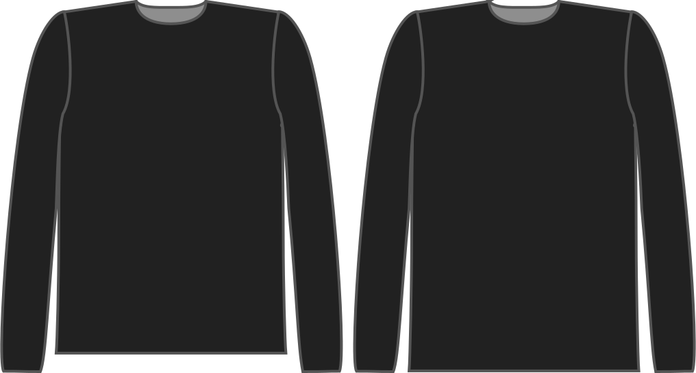

This option controls how far the block extend below your hips.

> Dit basispatroon komt standaard tot aan je heuplijn, wat bijna gegarandeerd te kort zal zijn voor het uiteindelijke kledingstuk.

## Effect van deze optie op het patroon

