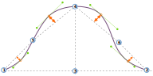

<PatternOptions pattern='brian' />

## De mouwkop begrijpen

In version 2 of FreeSewing, the sleevecap of Brian was redesigned to be more adaptable to different types of sleeves and garments. As a result, the sleevecap alone now has 20 options to control its shape. Whereas that may seem a bit overwhelming at first, understanding how the sleevecap is drafted makes it easy to understand what all the individual options do.

### De grenzendoos

The _bounding box_ of the sleevecap is a rectangle that is as wide as the sleeve, and as high as the sleevecap. Binnen deze doos bouwen we onze mouwkop.

The image above shows a sleevecap, starting at point 1, then going up until point 4, and then down again to point 2.

<Note>

###### Het vinden van de voorkant van de mouw(cap)

In ons voorbeeld staat de voorkant van de mouwkop aan de rechterkant. Maar hoe zou u dat weten?

Terwijl patronen meestal een indicatie hebben die aangeeft welke kant is (een enkel merkteken
betekent het voorpand, overwegende dat een dubbele inkeping de achterkant betekent, kan je ook
de voorkant van een mouwkop herkennen omdat het meer gebogen is. De achterkant van de
mouwkop wordt ook gebogen, maar het is een vlakke curve. Dat komt omdat de menselijke schouder
meer uitgesproken en gebogen is aan de voorkant van het lichaam, dus de mouwkap is daar meer gebogen
om bij de schouder te passen.

</Note>

The width of the sleevecap (and thus the width of the sleeve at the bottom of the armhole) is equal to the distance between points 1 and 2. That distance depends on the measurements of the model, the amount of ease, the cut of the garment and so on. For our sleevecap, all we need to know is that we start with a given width. And while that width can be influenced by other factors, we can not influence it by any of the sleevecap options.

De hoogte van de mouwkop is gelijk aan de afstand tussen de punten 3 en 4. The exact height is a trade-off between the measurments of the model, options, ease, sleevecap ease, and the fact that the sleeve ultimately has to fit the armhole. So the height may vary, and we don't control the exact value. Maar er zijn twee opties die de vorm van onze mouwkop bepalen:

- [Mouwkop top X](/docs/patterns/brian/options/sleevecaptopfactorx/) : Bepaalt de horizontale plaatsing van punt 3 en 4
- [Mouwkop top Y](/docs/patterns/brian/options/sleevecaptopfactory/) : Bepaalt de verticale plaatsing van punt 4

In other words, point 4 can be made higher and lower and, perhaps less intutitively, it can also be changed to lie more to the right or the left, rather than smack in the middle as in our example.

### De inflectiepunten

Met de punten 1, 2, 3 en 4 hebben we een doos om onze mouwkop in te trekken. Now it's time to map out our _inflection points_. These are points 5 and 6 on our drawing, and their placement is determined by the following 4 options:

- [Mouwkop X](/docs/patterns/brian/options/sleevecapbackfactorx) : Bepaalt de horizontale plaatsing van punt 5
- [Mouwkop Y](/docs/patterns/brian/options/sleevecapbackfactory) : Bepaalt de verticale plaatsing van punt 5
- [Mouwkop X](/docs/patterns/brian/options/sleevecapbackfactorx) : Bepaalt de horizontale plaatsing van punt 6
- [Mouwkop Y](/docs/patterns/brian/options/sleevecapbackfactory) : Bepaalt de verticale plaatsing van punt 6

<Note>

Zoals u in ons voorbeeld ziet, liggen deze punten niet altijd op onze mouwlijn. In plaats daarvan
helpen ze bij het creëren van punten die altijd op de mouwkop liggen: de ankerpunten.

</Note>

### De ankerpunten

Uiteindelijk zal onze mouwkop de combinatie van 5 curves zijn. In addition to points 1 and 2, the four _anchor points_ that are marked in orange in our example will be the start/finish of those curves.

The points are _offset_ perpendicular from the middle of a line between the two anchor points surrounding them. De offset voor elk punt wordt bepaald door deze 4 opties:

- [Mouwkop Q1 offset](/docs/patterns/brian/options/sleevecapq1offset) : Bepaalt de offset loopendicular naar de lijn van punt 2 tot 6
- [Mouwkop Q2 offset](/docs/patterns/brian/options/sleevecapq2offset) : Bepaalt de offset perpendicular naar de lijn van punt 6 tot 4
- [Mouwkop Q3 offset](/docs/patterns/brian/options/sleevecapq3offset) : Bepaalt de offset perpendicular naar de lijn van punt 4 tot 5
- [Mouwkop Q4 offset](/docs/patterns/brian/options/sleevecapq3offset) : Bepaalt de offset perpendicular naar de lijn van punt 5 tot 1

<Note>

We hebben onze mouwkop in 4 kwartalen verdeeld. We starten vooraan (rechts in ons voorbeeld)
met kwart 1. en doe onze weg naar de rug om te eindigen met kwart 4.

Net als de offset optie worden de laatste opties om de vorm van onze mouwopzet te bepalen gewoon herhaald, zodat je
elk kwart afzonderlijk kunt regelen.

</Note>

### De spreiding

We hebben nu alle start- en eindpunten om de 5 curves te tekenen die samen onze mouwkoppen zullen vormen. What we're missing are the control points (see [our info on Bézier curves](https://freesewing.dev/concepts/beziercurves) to learn more about how curves are constructed). Deze worden bepaald door de zogenaamde _spread_.

For each of the anchor points (the ones marked in orange, not points 1 and 2) there is an option to control the spread upwards, and downwards:

- [Mouwkop Q1 neerwaardse spreiding](/docs/patterns/brian/options/sleevecapq1spread1) : Bepaalt de neerwaartse spreiding in het eerste kwartaal
- [Mouwkop Q1 opwaardse spreiding](/docs/patterns/brian/options/sleevecapq1spread2) : Bepaalt de opwaartse spreiding in het eerste kwartaal
- [Mouwkop Q2 neerwaardse spreiding](/docs/patterns/brian/options/sleevecapq2spread1) : Bepaalt de neerwaartse spreiding in het tweede kwartaal
- [Mouwkop Q2 opwaartse spreiding](/docs/patterns/brian/options/sleevecapq2spread2) : Bepaalt de opwaartse spreiding in het tweede kwartaal
- [Mouwkop Q3 opwaartse spreiding](/docs/patterns/brian/options/sleevecapq3spread1) : Bepaalt de opwaartse spreiding in het derde kwartaal
- [Mouwkop Q3 neerwaardse spreiding](/docs/patterns/brian/options/sleevecapq3spread2) : Bepaalt de neerwaartse spreiding in het derde kwartaal
- [Mouwkop Q4 opwaartse spreiding](/docs/patterns/brian/options/sleevecapq4spread1) : Bepaalt de opwaartse spreiding in het vierde kwartaal
- [Mouwkop Q4 neerwaardse spreiding](/docs/patterns/brian/options/sleevecapq4spread2) : Bepaalt de neerwaartse spreiding in het vierde kwartaal

<Note>

Attensieve lezers zullen hebben opgemerkt dat punt 4 geen ankerpunt is. Met andere woorden, er is geen garantie
dat het op de mouwkop zal liggen. Dit betekent ook dat de opwaartse spreiding in kwartaal 2 en 3
de hoogte van de mouwkop zal beïnvloeden. Verminder de opwaartse spread, en de curve zal onder punt 4 duiken. Verhoog het en
de curve zal daarboven stijgen.

</Note>

### Takeaways

While the sleevecap in Brian (and all patterns that extend Brian) have a lot of options, understanding how the sleevecap is constructed can help you design the exact sleevecap shape you want. Om dit te doen:

- Begin met het plaatsen van de bovenkant van je mouwkop
- Bepaal dan de invoegpunten
- Vervolgens, gebruik de offset om de kracht van de curve te controleren
- Tot slot gebruik je de spreiding om de zaken vlot te trekken

Wat belangrijk is om te onthouden is dat je alleen de vorm van de mouwkop controleert. Whatever shape you design, it will be fitted to the armhole, meaning that its size can and will be adapted to make sure the sleeve fits the armscye. De vorm die u aanmaakt zal echter altijd worden gerespecteerd.
