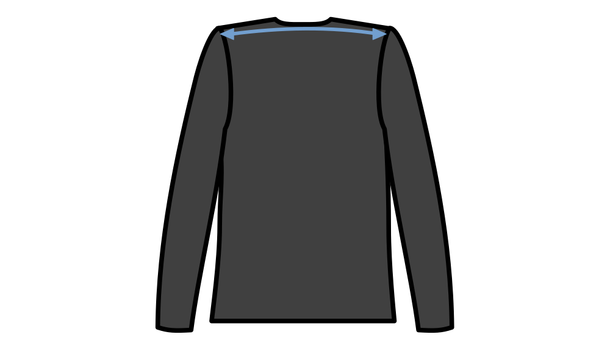

Contrôle l'ampleur de l'aisance sur la mesure d'épaule à épaule.

This option allows you to create some extra ease at the shoulders which shifts the shoulder seam more outwards and off the shoulder. Thereby creating extra room for extra layers of clothing underneath, or more shaped/padded shoulders.

