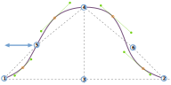

Cette option contrôle la position horizontale du point de flexion du tête de manche à l'arrière de la manche.

<Tip>

Voir [comprendre le sleevecap](/docs/designs/brian/options#understanding-the-sleevecap) pour un aperçu approfondi
de la façon dont le sleevecap est construit et de l'influence des différentes options sur sa forme.

</Tip>

