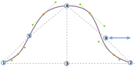

***

Cette option permet de contrôler la position horizontale du point de flexion du tête de manche à l'avant de la manche.

<Tip>

See [understanding the sleevecap](/docs/designs/brian/options#understanding-the-sleevecap) for an in-depth
look into how the sleevecap is constructed and the influence of the different options on its shape.

</Tip>

