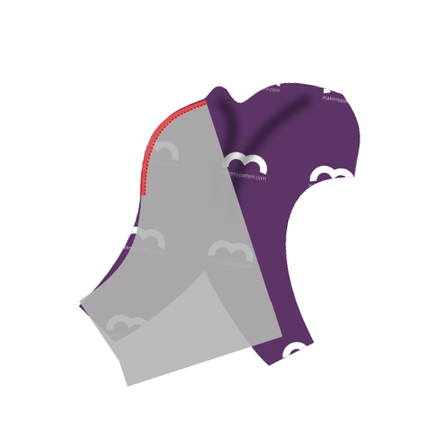

<YouTube id='PL1gv5yv3DoZME1xe5fBEHd0rKPW_xNpF3' playlist />

### Schritt 1: Rückteil an erstes Seitenteil anbringen

Align the side of the back (piece 1) with the side (piece 3) making sure to put the good sides together. The side (piece 3) is not symmetric, so make be careful to correctly match them.

<Tip>
If you look at the part 3 (the side) with the text so you can read it, then then left side should be attached to the back,
and the right side attached to the front & inset. The notches will also help you figure it out.
</Tip>

Serge them together, taking into account that the seam allowance is 1cm. So aim the outside needle of your serger 1cm from the edge of your fabric.

> Falls metrische Einheiten nicht dein Ding sind: 1cm entsprechen 3/8 inch.

> Einige Serger haben einen Hebel zur Wahl zwischen flachen Nähten oder gebündelten Nähten. Wenn Sie vorhaben, später zu starten (siehe Schritt 6), stellen Sie sicher, dass Sie flache Nähte wählen.

### Schritt 2: Rückteil an zweites Seitenteil anbringen

Align the other side of the back (piece 1) with the second side (piece 3) making sure to put the good sides together. Again, because the side (piece 3) is not symmetric, be careful to correctly match them.

Serge them together, as you did on the other side.

> Rücken und Seite sind jetzt miteinander verbunden. Lassen Sie sie einen Moment beiseite, während wir unsere Aufmerksamkeit auf die anderen Stücke richten.

### Schritt 3: ersten Einsatz an Vorderteile anbringen

  

Joining the inset (piece 4) with the fronts (piece 2) requires you to serge them together across their curvy edges.

> Denken Sie daran, dass Sie zwei Fronten haben. Man muss sie einander übereinander setzen und sie als eine doppelte Front behandeln.

Faced with a tricky seam like this, you might reach for your pins or basting thread, but don't. Pinning or basting this will make it harder to sew.

Instead, start at the top of the curved seam, aligning the pieces as shown, and slowly serge them together a few cm.

As you move along, manipulate the fabric to make sure both edges stay on top of each other as you feed them through your serger.

As you manipulate the fabric to get it aligned properly, it's easy to stretch one part more than the other. The notch in the curved edge can help you make sure you're keeping things even.

Once you've passed the notch, things will get easier. This would also be a good time to compare the remaining length of the curved seams. If one is a bit longer than the other, simply stretch the shorter one until they match up.

If the difference is too big however, just leave it. It will get cut off when we do the crotchseam.

<Note>

Dies ist wahrscheinlich die härteste Naht im Muster. Nehmen Sie es langsam, und Sie sind in Ordnung.

</Note>

<Tip>

###### Oder fügen Sie diese Nähte durch das Sandwichen zwischen den Fronten

ein, während es ein bisschen mehr Arbeit ist Sie können diese Naht einschließen, wenn Sie die Einfügungen zu einem der vorderen Teile zuerst einfügen
und nähen Sie dann die vorderen Stücke zusammen mit den ineinander gehängten Einsätzen.

Nähen Sie die Frontdarts separat und drehen Sie die ganze Sache nach draußen, und Sie haben eine schöne nahtlose Verpackungsfläche vorne.

</Tip>

### Schritt 4: zweiten Einsatz an Vorderteile anbringen

After you have joined the first inset and the fronts, continue with the second one.

With the fronts and insets joined together, you are left with 3 parts:

- die miteinander verbundenen Vorderteile und Einsätze
- die miteinander verbunden Seiten- und Rückteile
- der Gummizug

### Schritt 5: vordere Abnäher schließen

Fold the fronts double along the center fronts line, so that the tusks at the bottom line up.

Serge the sides of the tusks to close the fronts dart. For best results, start at the top of the seam (where the fabric is folded) and work your way to the bottom.

<Tip>

##### Halte diese Naht weg von meinem ...

Alternativ kannst du die Abnäher auf jeden Teil einzeln schließen, damit beide Nähte innen umschlossen sind.
Vermutlich ist es für die tragende Person angenehmer, in diesem Bereich keine exponierte Naht zu haben.

</Tip>

### Schritt 6: Optional: Topstitch

<Note>

Dieser Schritt ist optional. Die Stitching fügt einen visuellen Effekt hinzu, der die einzelnen Musterstücke hervorhebt.
Es ist schön, einen festen Stoff visuell zu zerbrechen, aber wenn Sie einen Druck verwenden oder wenn Sie farbig blockieren, wollen Sie vielleicht nicht aufstocken.

</Note>

If you want to topstitch your serged seams for visual effect, you should do so now.

If you topstitch, simply do it for every seam, making sure to do so with a flexible stitch. You can use a zig-zag stitch or twin needle if you don't have a coverlock or specific flexible stitch setting.

<Tip>

Beim Aufstiften der Naht, die den Frontdart geschlossen hat, von unten beginnen,
und lassen Sie die Aufstecknähte ganz nach oben laufen, wohin die Taille kommt.
Die Naht stoppt auf halbem Wege (wo der Dart endet), aber die Aufstiftung sollte fortgesetzt werden.

</Tip>

### Schritt 7: erstes Seitenteil an Vorderteile anbringen

Align the side edge of the first side with the edge made up of the fronts+inset (good sides together as usual) and serge them together.

### Schritt 8: zweites Seitenteil an Vorderteile anbringen

Do the same for the second side.

### Schritt 9: Optional: Topstitch

If you've topstitched before, make sure to do the same now for the seams you made in step 7 and 8.

### Schritt 10: Beende die Crotchseam

We will now serge the arched opening in the back part to the front parts of the boxers, made up of the fronts and insets.

The notches on the back piece will help you. There's the center notch, and the other two notches should match up with where the fronts and inset pieces are joined.

<Tip>

Es ist einfacher, im mittleren Punkt zu starten und Ihren Weg auf eine Seite zu arbeiten. Dann von der Mitte wieder beginnen, um die andere Seite zu tun.

Nimm es langsam und sei **sehr bewusst**, wo deine Sergerklinge schneiden wird.

</Tip>

### Schritt 11: säume das erste Bein

Time to hem the legs. Hem them as you would do any other stretchy knit. Go for a flexible stitch. You can use a zig-zag stitch or twin needle if you don't have a coverlock or specific flexible stich setting.

<Note>

Ich finde, dass Säumen immer sehr viel einfacher ist, wenn die Teile zuerst festgesteckt werden.
Falte also deinen Saum zurück, und stecke ihn fest.
Noch besser: Stecke beide Beine fest und nähe erst dann, wenn es dir das Aussehen gefällt.

</Note>

### Schritt 12: säume das zweite Bein

You know it makes sense.

### Schritt 13: forme den Gummizug zu einer Schlaufe

Sew both ends of your elastic together with good sides together.

<Note>

###### Nicht sicher, wie lang dein Gummizug sein muss?

Einfach die Elastik in die Taille einwickeln, wo sie am Ende sitzt, und bis sie sich richtig fühlt.
Machen Sie eine Markierung, wo die Kantengelenke, fügen Sie 2cm Naht erlaubt, und das ist Ihre Länge.

</Note>

### Schritt 14: Gummizug an Taille befestigen

Attach the elastic to the waist.

Do so good sides together if you're using a flexible stitch or twin needle on a conventional sewing machine.

If you're using a coverlock, put the elastic on top of the good side of the fabric.

<Tip>

Die Länge deines Gummizuges wird wahrscheinlich anders sein als die Länge des Stoffes, weil beide sich unterschiedlich weit dehnen lassen.
Feststecken wird dir dabei helfen, eine gleichmäßige Dehnung zu erzielen.

Teile sowohl deinen Gummizug als auch dein Bund deiner Shorts in 4 (oder 8) Teile auf. Stecke Gummi und Stoff an diesen Stellen zusammen.

Während des Nähens dehnst du nun sowohl Gummi als auch Stoff zwischen den Stecknadeln, wobei du die Stecknadeln Stück für Stück entfernst.

</Tip>

### Schritt 15: Trimmen und bereinigen

Trim any excess fabric you might have at elastic or hem, and any loose threads.
