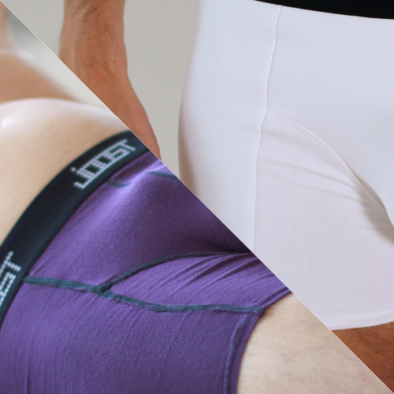
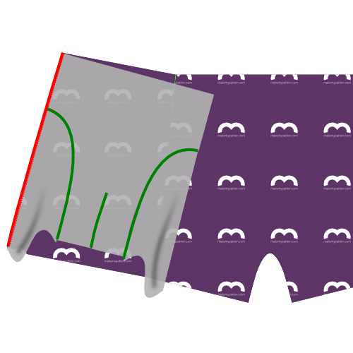
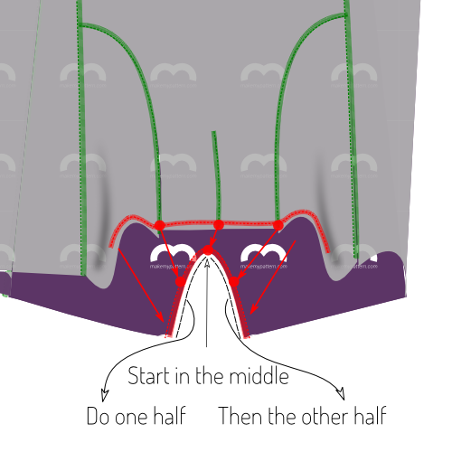

<YouTube id='PL1gv5yv3DoZME1xe5fBEHd0rKPW_xNpF3' playlist />

### Step 1: Join back to first side

Align the side of the back (piece 1) with the side (piece 3) making sure to put the good sides together.
The side (piece 3) is not symmetric, so make be careful to correctly match them.

<Tip>
If you look at the part 3 (the side) with the text so you can read it, then then left side should be attached to the back,
and the right side attached to the front & inset. The notches will also help you figure it out.
</Tip>

Serge them together, taking into account that the seam allowance is 1cm. So aim the outside needle of your serger 1cm from the edge of your fabric.

> If metric is not your bag, 1 cm is 3/8 inch.

> Some sergers have a lever to choose between flat seams, or bundled up seams.
> If you plan to topstitch later (see Step 6), make sure to choose flat seams.

### Step 2: Join back to second side

Align the other side of the back (piece 1) with the second side (piece 3)
making sure to put the good sides together. Again, because the side (piece 3)
is not symmetric, be careful to correctly match them.

Serge them together, as you did on the other side.

> The back and sides are now joined together.
> Put them aside for a moment as we turn our attention to the other pieces.

### Step 3: Join first inset and fronts

Joining the inset (piece 4) with the fronts (piece 2) requires you to serge them together across their curvy edges.

> Remember that you have two fronts.
> You have to put them on top of each other and treat it as one double-layered front.

Faced with a tricky seam like this, you might reach for your pins or basting thread, but don't.
Pinning or basting this will make it harder to sew.

Instead, start at the top of the curved seam, aligning the pieces as shown, and slowly serge them together a few cm.

As you move along, manipulate the fabric to make sure both edges stay on top of each other as you feed them through your serger.

As you manipulate the fabric to get it aligned properly, it's easy to stretch one part more than the other. The notch in the curved edge can help you make sure you're keeping things even.

Once you've passed the notch, things will get easier. This would also be a good time to compare the remaining length of the curved seams. If one is a bit longer than the other, simply stretch the shorter one until they match up.

If the difference is too big however, just leave it. It will get cut off when we do the crotchseam.

<Note>

This is probably the hardest seam in the pattern. Take it slow, and you'll be fine.

</Note>

<Tip>

###### Or enclose these seams by sandwiching them between the fronts

While it's a bit more work, you can enclose this seam if you baste the insets to a single one of the front pieces first,
and then sew your front pieces together with the insets sandwiched inside.

Sew the front darts separately and turn the whole thing inside out, and you have a nice seamless package area in front.

</Tip>

### Step 4: Join second inset and fronts

After you have joined the first inset and the fronts, continue with the second one.

With the fronts and insets joined together, you are left with 3 parts:

- The joined insets and fronts
- The joined sides and back
- The elastic

### Step 5: Close the fronts dart

Fold the fronts double along the center fronts line, so that the tusks at the bottom line up.

Serge the sides of the tusks to close the fronts dart.
For best results, start at the top of the seam (where the fabric is folded) and work your way to the bottom.

<Tip>

###### Keep that seam away from my ...

Alternatively, sew the darts on each piece individually so that both seams are folded inside.
Arguably, not having an exposed seam in this area is more comfortable for the wearer.

</Tip>

### Step 6: Optional: Topstitch

<Note>

This step is optional. Topstitching adds a visual effect that emphasizes the individual pattern pieces.
It's nice to visually break up a solid fabric, but if you're using a print, or when you're colour-blocking, you might want to not topstitch.

</Note>

If you want to topstitch your serged seams for visual effect, you should do so now.

If you topstitch, simply do it for every seam, making sure to do so with a flexible stitch. You can use a zig-zag stitch or twin needle if you don't have a coverlock or specific flexible stitch setting.

<Tip>

When topstitching the seam that closed the fronts dart, start from the bottom,
and let the topstitching run all the way to the top, where the waistband will come.
The seam stops halfway through (where the dart ends) but your topstitching should continue.

</Tip>

### Step 7: Join the first side to the fronts

Align the side edge of the first side with the edge made up of the fronts+inset (good sides together as usual) and serge them together.

### Step 8: Join the second side to the fronts

Do the same for the second side.

### Step 9: Optional: Topstitch

If you've topstitched before, make sure to do the same now for the seams you made in step 7 and 8.

### Step 10: Finish the crotchseam

We will now serge the arched opening in the back part to the front parts of the boxers, made up of the fronts and insets.

The notches on the back piece will help you.
There's the center notch, and the other two notches should match up with where the fronts and inset pieces are joined.

<Tip>

It's easier to start in the middle point and work your way to one side. Then start from the middle again to do the other side.

Take it slow, and be **very aware** of where your serger blade is cutting into.

</Tip>

### Step 11: Hem the first leg

Time to hem the legs. Hem them as you would do any other stretchy knit. Go for a flexible stitch. You can use a zig-zag stitch or twin needle if you don't have a coverlock or specific flexible stich setting.

<Note>

I feel that hemming is much easier when you pin things in place first.
So fold back your hem, and pin it in place.
Even better: pin both legs in place and only sew when you're happy with how it looks.

</Note>

### Step 12: Hem the second leg

You know it makes sense.

### Step 13: Make your elastic into a loop

Sew both ends of your elastic together with good sides together.

<Note>

###### Not sure how much elastic you need?

Simply wrap your elastic around your waist where it would end up sitting, and tighten it until it feels right.
Make a mark of where the edge joins, add 2cm seam allowance, and that's your length.

</Note>

### Step 14: Attach elastic to waist

Attach the elastic to the waist.

Do so good sides together if you're using a flexible stitch or twin needle on a conventional sewing machine.

If you're using a coverlock, put the elastic on top of the good side of the fabric.

<Tip>

The length of your elastic will probably difffer from the fabric length, as they stretch differently.
Pinning will help you achieve an even stretch.

Divide both your elastic and boxer waistline into 4 (or 8) parts. Pin elastic and fabric together at these points.

While sewing, stretch elastic and fabric together between each set of pins, removing the pins as you move on.

</Tip>

### Step 15: Trim and clean up

Trim any excess fabric you might have at elastic or hem, and any loose threads.
