<YouTube id='PL1gv5yv3DoZME1xe5fBEHd0rKPW_xNpF3' playlist />

### Paso 1: Vuelve al primer lado

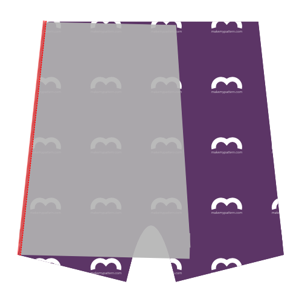

Align the side of the back (piece 1) with the side (piece 3) making sure to put the good sides together. Since the side (piece 3) is symmetric, you can't go wrong.

<Tip>
If you look at the part 3 (the side) with the text so you can read it, then then left side should be attached to the back,
and the right side attached to the front & inset. The notches will also help you figure it out.
</Tip>

Serge them together, taking into account that the seam allowance is 1cm. So aim the outside needle of your serger 1cm from the edge of your fabric.

> Si la métrica no es su bolsa, 1 cm es de 3/8 pulgadas.

> Algunos sergueros tienen una palanca para elegir entre costuras planas o costuras empaquetadas. Si planeas unirte más tarde (ver Paso 6), asegúrate de elegir costuras planas.

### Paso 2: Vuelve al segundo lado

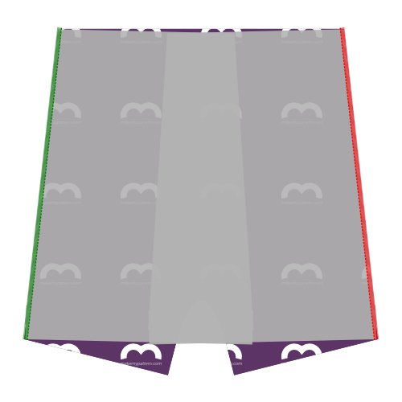

Align the other side of the back (piece 1) with the second side (piece 3) making sure to put the good sides together. Again, because the side (piece 3) is not symmetric, be careful to correctly match them.

Serge them together, as you did on the other side.

> La espalda y los lados ahora se unen. Pongámoslos a un momento mientras dirigimos nuestra atención a las otras piezas.

### Paso 3: Únete al primer recuadro y frontales

 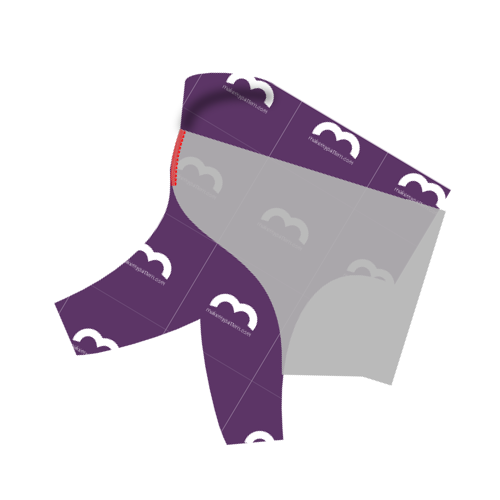 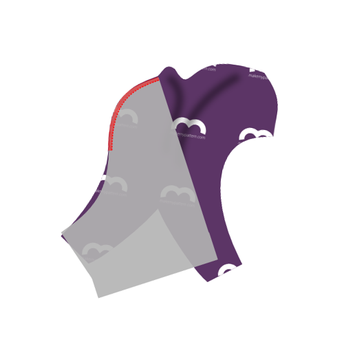

Joining the inset (piece 4) with the fronts (piece 2) requires you to serge them together across their curvy edges.

> Recuerde que tiene dos frentes. Tienes que ponerlas encima y tratarlas como un frente de doble capa.

Faced with a tricky seam like this, you might reach for your pins or basting thread, but don't. Pinning or basting this will make it harder to sew.

Instead, start at the top of the curved seam, aligning the pieces as shown, and slowly serge them together a few cm.

As you move along, manipulate the fabric to make sure both edges stay on top of each other as you feed them through your serger.

As you manipulate the fabric to get it aligned properly, it's easy to stretch one part more than the other. The notch in the curved edge can help you make sure you're keeping things even.

Once you've passed the notch, things will get easier. This would also be a good time to compare the remaining length of the curved seams. If one is a bit longer than the other, simply stretch the shorter one until they match up.

If the difference is too big however, just leave it. It will get cut off when we do the crotchseam.

<Note>

Esta es probablemente la costura más dura en el patrón. Tómelo lento, y estará bien.

</Note>

<Tip>

###### O adjunta estas costuras sándwickeándolas entre los frentes

Mientras que es un poco más de trabajo usted puede encerrar esta costura si usted golpea los insets a una sola de las piezas frontales primero,
y luego coser las piezas delanteras junto con los insectos sándwicked en el interior.

Mantenga los dardos delanteros por separado y dé la vuelta a toda la cosa, y usted tiene una buena zona de paquete en la parte delantera.

</Tip>

### Paso 4: Unirse al segundo recuadro y frontales

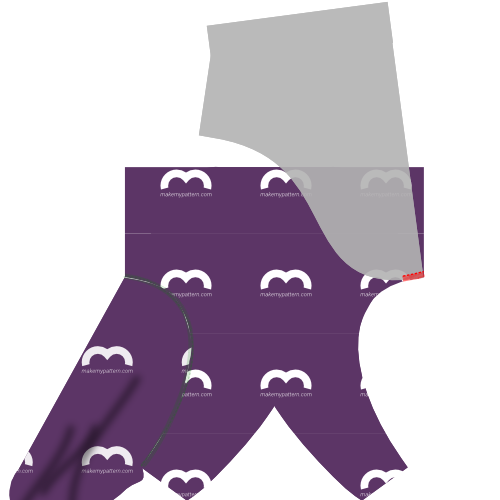

After you have joined the first inset and the fronts, continue with the second one.

With the fronts and insets joined together, you are left with 3 parts:

- Los conjuntos y frontales unidos
- Los lados unidos y atrás
- El elástico

### Paso 5: Cerrar el dart de frontales

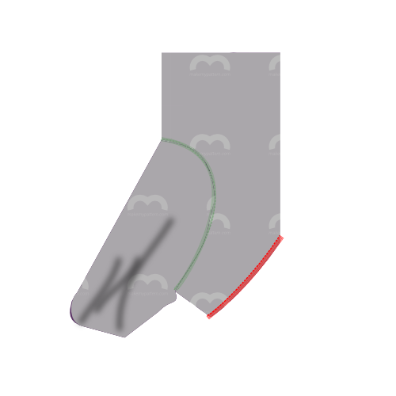

Fold the fronts double along the center fronts line, so that the tusks at the bottom line up.

Serge the sides of the tusks to close the fronts dart. For best results, start at the top of the seam (where the fabric is folded) and work your way to the bottom.

<Tip>

###### Mantener esa costura lejos de mi ...

Alternativamente, coser los dardos en cada pieza individualmente, de modo que ambas costuras se doblen en el interior.
Puede decirse que no tener una costura expuesta en esta zona es más cómodo para el portador.

</Tip>

### Paso 6: Opcional: Topstitch

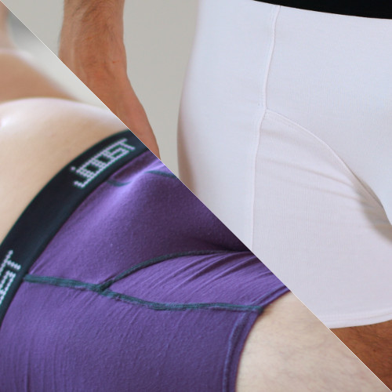

<Note>

Este paso es opcional. Topstitching añade un efecto visual que enfatiza los patrones individuales de piezas.
Es bueno romper visualmente una tela sólida, pero si estás usando una impresión, o cuando estás bloqueando el color, tal vez quieras no empiezar.

</Note>

If you want to topstitch your serged seams for visual effect, you should do so now.

If you topstitch, simply do it for every seam, making sure to do so with a flexible stitch. You can use a zig-zag stitch or twin needle if you don't have a coverlock or specific flexible stitch setting.

<Tip>

Cuando se enciende la costura que cierra el dart de los frentes, empieza desde abajo,
y deja que la parte superior corra hasta la cima, donde vendrá la cintura.
La costura se detiene a mitad de camino (donde termina el dardo), pero la parte superior debe continuar.

</Tip>

### Paso 7: Únete al primer lado de los frentes

Align the side edge of the first side with the edge made up of the fronts+inset (good sides together as usual) and serge them together.

### Paso 8: Únete al segundo lado de los frentes

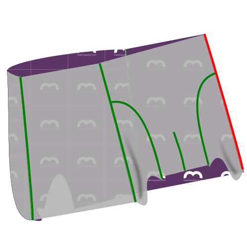

Do the same for the second side.

### Paso 9: Opcional: Enrollar

If you've topstitched before, make sure to do the same now for the seams you made in step 7 and 8.

### Paso 10: Termina la costura de crotchseam

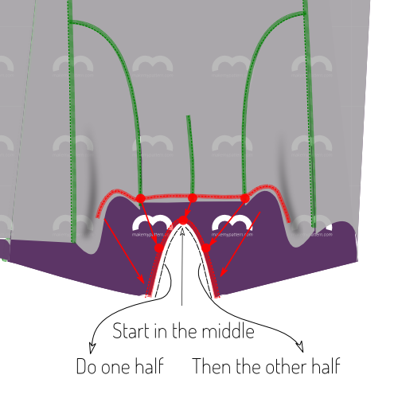

We will now serge the arched opening in the back part to the front parts of the boxers, made up of the fronts and insets.

The notches on the back piece will help you. There's the center notch, and the other two notches should match up with where the fronts and inset pieces are joined.

<Tip>

Es más fácil empezar en el punto medio y llegar a un lado. Luego vuelva a empezar desde el centro para hacer el otro lado.

Tomalo lento, y sé **muy conocido** de dónde corta tu espada serger.

</Tip>

### Paso 11: Hem la primera pierna

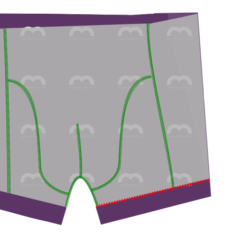

Time to hem the legs. Hem them as you would do any other stretchy knit. Go for a flexible stitch. You can use a zig-zag stitch or twin needle if you don't have a coverlock or specific flexible stich setting.

<Note>

Creo que hemming es mucho más fácil cuando se coloca las cosas en primer lugar.
Así que replíjate tu sombrero y póngalo en su lugar.
Aún mejor: anclar las dos piernas en el lugar y sólo coser cuando estés contento con cómo se ve.

</Note>

### Paso 12: Hem la segunda pierna

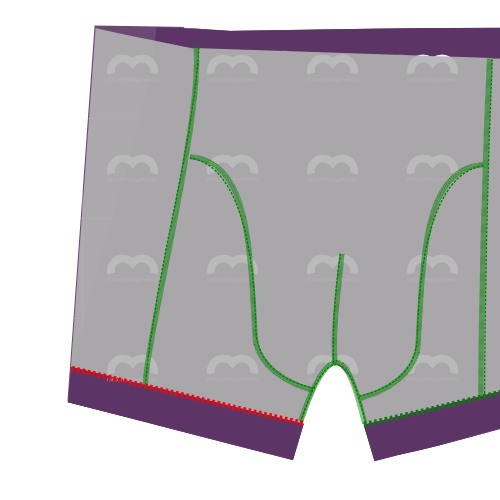

You know it makes sense.

### Paso 13: Haz tu elástico en un bucle

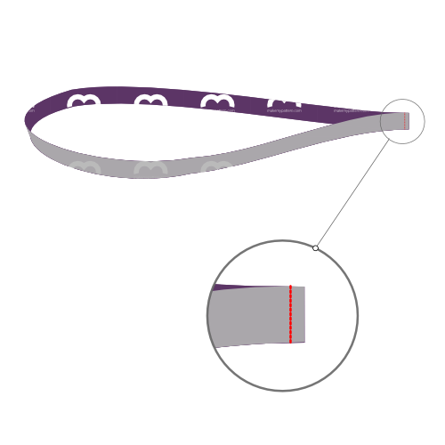

Sew both ends of your elastic together with good sides together.

<Note>

###### ¿No está seguro de cuánto elástico necesita?

###### Not sure how much elastic you need?
Simply wrap your elastic around your waist where it would end up sitting, and tighten it until it feels right.
Haz una marca de dónde se une el borde, añade 2 cm de costura, y esa es tu longitud.

</Note>

### Paso 14: Adjuntar elástico a cintura

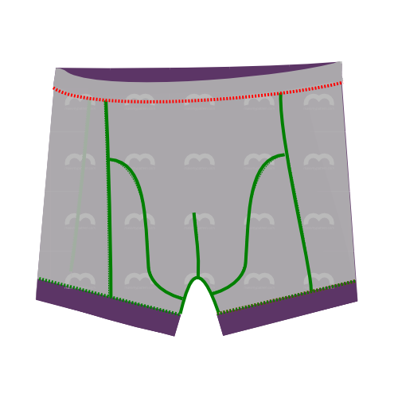

Attach the elastic to the waist.

Do so good sides together if you're using a flexible stitch or twin needle on a conventional sewing machine.

If you're using a coverlock, put the elastic on top of the good side of the fabric.

<Tip>

La longitud de su elástico probablemente difiere de la longitud del tejido, ya que se estiran de forma diferente.
La fijación te ayudará a conseguir un estiramiento uniforme.

Divida su cintura elástica y boxeadora en 4 (o 8) partes. Fijar elástico y tejer juntos en estos puntos.

Al coser, estira elástica y teje juntos entre cada conjunto de pines quitando los pines a medida que se mueve.

</Tip>

### Paso 15: Recortar y limpiar

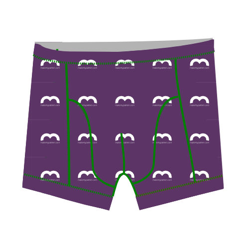

Trim any excess fabric you might have at elastic or hem, and any loose threads.
