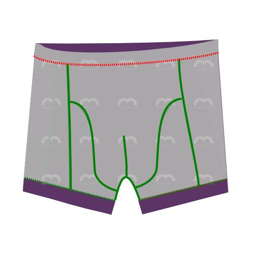

<YouTube id='PL1gv5yv3DoZME1xe5fBEHd0rKPW_xNpF3' playlist />

### Крок 1: Приєднайте назад до першої сторони

Вирівняйте сторону спинки (деталь 1) зі стороною (деталь 3), переконавшись, що виворітні сторони складені разом. Сторона (деталь 3) не симетрична, тому будьте уважні, щоб правильно їх поєднати.

<Tip>
Якщо ви подивитеся на частину 3 (збоку) з текстом так, щоб ви могли його прочитати, то ліву частину слід прикріпити до задньої частини,
, а праву частину - до передньої частини та вставки. Насічки також допоможуть вам у цьому розібратися.
</Tip>

Зшийте їх разом, враховуючи, що припуск на шов становить 1 см. Таким чином, зовнішня голка сергера повинна знаходитися на відстані 1 см від краю тканини.

> Якщо метрична система не для вашої сумки, 1 см дорівнює 3/8 дюйма.

> Деякі сервери мають важіль для вибору між пласкими швами та швами, що об'єднуються в пучок. Якщо ви плануєте згодом обметувати верхню частину (див. Крок 6), переконайтеся, що ви вибрали плоскі шви.

### Крок 2: Приєднайте назад до другої сторони

Вирівняйте іншу сторону спинки (деталь 1) з другою стороною (деталь 3) , переконуючись, що виворітні сторони складені разом. Знову ж таки, оскільки сторона (деталь 3) не симетрична, будьте уважні, щоб правильно їх поєднати.

З'єднайте їх разом, як ви це зробили на іншій стороні.

> Тепер задня і бокові частини з'єднані разом. Відкладіть їх на хвилинку, поки ми звернемо увагу на інші частини.

### Крок 3: З'єднайте першу вставку та фронтальні частини

  

Щоб з'єднати вставку (деталь 4) з лицьовими частинами (деталь 2), потрібно зшити їх разом по вигнутих краях.

> Пам'ятайте, що у вас два фронти. Ви повинні покласти їх один на одного і розглядати це як один двошаровий фронт.

Зіткнувшись з таким складним швом, ви можете потягнутися за шпильками або наметочними нитками, але не варто. Закріплюючи шпильками або пришиваючи, ви ускладните процес шиття.

Замість цього почніть з верхньої частини вигнутого шва, вирівнявши деталі, як показано на малюнку, і повільно зшийте їх разом на кілька сантиметрів.

Під час роботи маніпулюйте тканиною, щоб переконатися, що обидва краї залишаються один над одним, коли ви пропускаєте їх через машинку.

Коли ви маніпулюєте тканиною, щоб вирівняти її належним чином, легко розтягнути одну частину більше, ніж іншу. Виїмка на вигнутому краї допоможе вам переконатися, що ви тримаєте все рівно.

Після того, як ви пройдете цей етап, все стане простіше. Це також гарний час, щоб порівняти залишкову довжину вигнутих швів. Якщо одна з них трохи довша за іншу, просто розтягніть коротшу, поки вони не зрівняються.

Якщо різниця занадто велика, просто залиште її. Він буде відрізаний, коли ми будемо робити паховий шов.

<Note>

Це, мабуть, найскладніший шов у візерунку. Не поспішайте, і все буде добре.

</Note>

<Tip>

###### Або закрити ці шви, вклавши їх між передніми частинами

Хоча це трохи більше роботи, ви можете закрити цей шов, якщо спочатку пришити вставки до однієї з передніх частин,
а потім зшити передні частини разом з вставками, вкладеними всередину.

Зшийте передні виточки окремо і виверніть все це навиворіт, і ви отримаєте гарну безшовну зону пакування спереду.

</Tip>

### Крок 4: З'єднайте другу вставку і передню частину

Після того, як ви з'єднали першу вставку і лицьові сторони, продовжуйте з другою.

З'єднавши лицьову частину і вставки разом, у вас залишиться 3 частини:

- З'єднані вставки та фасади
- З'єднані боки і спинка
- Еластичний

### Крок 5: Закриваємо передню виточку

Складіть передні частини вдвічі вздовж центральної лінії переду так, щоб ікла внизу були спрямовані вгору.

Застрочіть бічні сторони бивнів, щоб закрити виточки спереду. Для досягнення найкращих результатів починайте з верхньої частини шва (там, де тканина згинається) і рухайтеся до низу.

<Tip>

###### Тримайте цей шов подалі від мого ...

Або ж зшийте виточки на кожній деталі окремо так, щоб обидва шви були загнуті всередину.
Можливо, відсутність відкритого шва в цій зоні є більш комфортною для власника.

</Tip>

### Крок 6: Необов'язково: Верхній стібок

<Note>

Цей крок не є обов'язковим. Верхня строчка додає візуального ефекту, який підкреслює окремі частини візерунка.
Добре візуально розбивати суцільну тканину, але якщо ви використовуєте принт або колор-блок, можливо, вам не варто робити верхню строчку.

</Note>

Якщо ви хочете обробити шви для візуального ефекту, зробіть це зараз.

Якщо ви виконуєте верхню строчку, просто виконуйте її для кожного шва, обов'язково гнучким стібком. Ви можете використовувати зигзагоподібну строчку або подвійну голку, якщо у вас немає човникового замка або спеціального налаштування гнучкої строчки.

<Tip>

При обметуванні шва, що закривав передню виточку, починайте знизу,
і прокладіть строчку до самого верху, де буде проходити пояс.
Шов зупиняється на півдорозі (там, де закінчується виточка), але вишивання має продовжуватися.

</Tip>

### Крок 7: Приєднайте перший бік до лицьових сторін

Вирівняйте бічний край першого боку з краєм, що складається з лицьового боку + вставки (лицьові боки разом, як зазвичай) і застрочіть їх разом.

### Крок 8: Приєднайте другу сторону до лицьових сторін

Зробіть те саме з другою стороною.

### Крок 9: Необов'язковий: Верхній стібок

Якщо ви вже виконували верхню строчку раніше, не забудьте зробити те саме зараз для швів, які ви виконали на кроках 7 і 8.

### Крок 10: Обробіть паховий шов

Тепер зшиємо арочний отвір в задній частині з передніми частинами боксерів, що складаються з передньої частини і вставки.

Виїмки на задній частині допоможуть вам. Ось центральний надріз, а два інших надрізи повинні збігатися з місцями з'єднання лицьової та вставної частин.

<Tip>

Простіше почати з середини і рухатися в один бік. Потім знову почніть з середини, щоб зробити іншу сторону.

Не поспішайте і дуже уважно стежте за тим, куди ріже ваше лезо.

</Tip>

### Крок 11: Підшийте першу ногу

Час підшивати ноги. Підшийте їх так само, як і будь-який інший еластичний трикотаж. Використовуйте гнучкий стібок. Ви можете використовувати зигзагоподібний стібок або подвійну голку, якщо у вас немає човникового замка або спеціального налаштування гнучкого стібка.

<Note>

Я відчуваю, що підшивати набагато легше, коли ви спочатку приколюєте речі на місце.
Тому відверніть поділ і закріпіть його булавками.
А ще краще: приколіть обидві ніжки і пришивайте тільки тоді, коли будете задоволені тим, як вони виглядають.

</Note>

### Крок 12: Підшийте другу ногу

Ти знаєш, що це має сенс.

### Крок 13: Зробіть з гумки петлю

Зшийте обидва кінці гумки лицьовими боками один до одного.

<Note>

###### Не знаєте, скільки гумки вам потрібно?

Просто оберніть резинку навколо талії в тому місці, де вона буде сидіти, і затягніть її до потрібного розміру.
Зробіть позначку на місці з'єднання країв, додайте 2 см припуску на шви, і це буде ваша довжина.

</Note>

### Крок 14: Прикріпіть резинку до талії

Прикріпіть резинку до талії.

Якщо ви використовуєте гнучку строчку або подвійну голку на звичайній швейній машині, зробіть це лицьовими сторонами один до одного.

Якщо ви використовуєте накладний замок, покладіть гумку на виворітний бік тканини.

<Tip>

Довжина вашої резинки, ймовірно, відрізнятиметься від довжини тканини, оскільки вони розтягуються по-різному.
Булавки допоможуть вам досягти рівномірного розтягування.

Розділіть еластичну та боксерську талію на 4 (або 8) частин. З'єднайте гумку і тканину разом у цих точках.

Під час шиття розтягуйте гумку і тканину між кожним набором шпильок, знімаючи їх по мірі просування.

</Tip>

### Крок 15: Обріжте та почистіть

Обріжте надлишки тканини, які можуть бути на гумці або подолі, а також вільні нитки.
