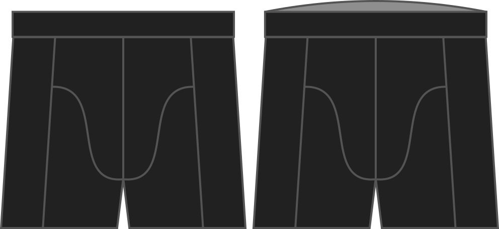

Combien de hauteur supplémentaire voulez-vous au dos ?

Ce facteur augmentera la hauteur seulement à l'arrière de votre boxer.

> Si vous voulez augmenter la hauteur partout, voir l'option **hauteur**

## Effet de cette option sur le motif

