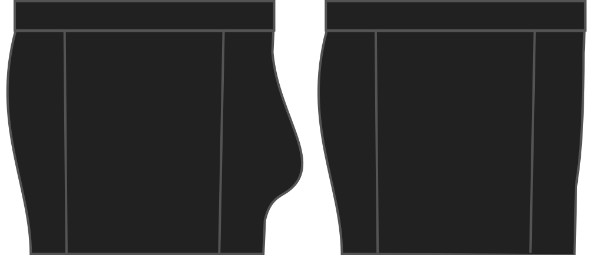

How much room do you want in the front pouch?

This option will increase the front dart, thereby creating more room in the front.

> Als je verticaal meer ruimte nodig hebt, dan moet je naar de **hoogte** optie kijken

## Effect van deze optie op het patroon

