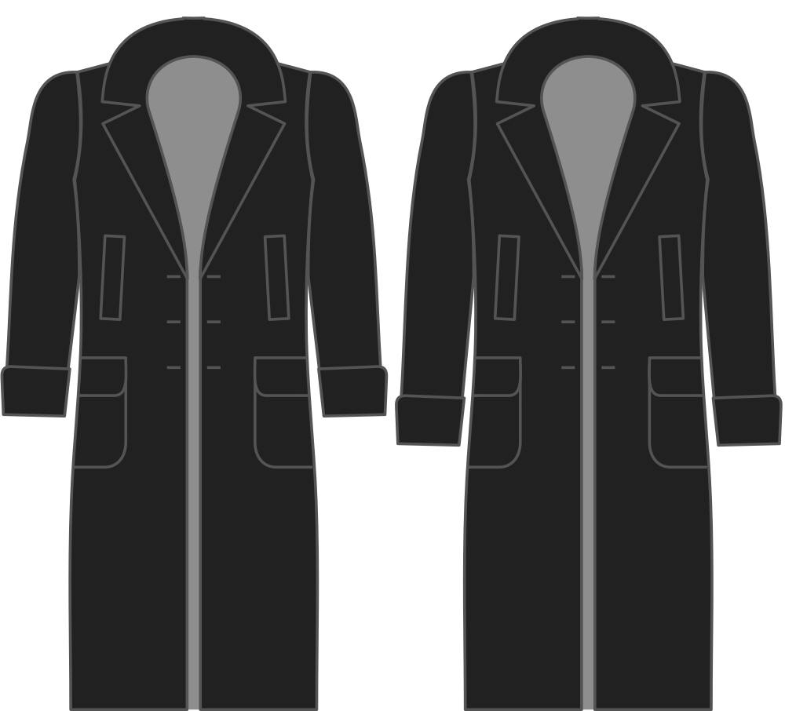

Hoeveel langer de mouw moet worden dan de mouw van de basisvorm.

<Note>

###### Dit mag niet 0 zijn

Als je dit op nul zet, wordt de mouw dezelfde lengte als de basis lengte van het Bent blok,
die zeker te kort is voor een jas.
Let op de standaardwaarde en gebruik dat als basis om de mouw korter of langer te maken.

</Note>

