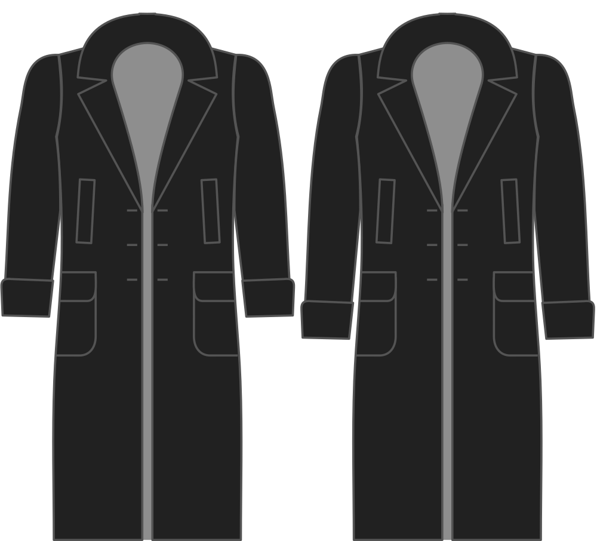

- - -
title: "Sleeve length bonus"
- - -

The amount to extend the sleeve beyond the length of the sleeve in the base block.

<Note>

###### This is not supposed to be zero

Setting this to zero will make the sleeve length the same as the base length of the Bent block,
which is certainly too short for a coat.
Please take note of the default value and use that as a basis to lengthen or shorten the sleeve.

</Note>

## Effect of this option on the pattern

