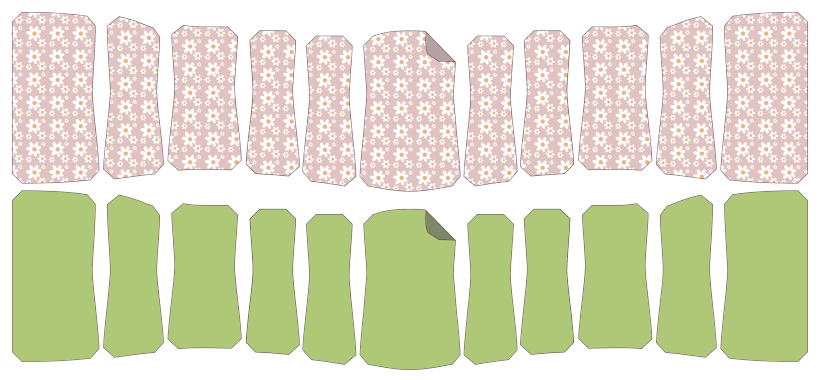

Cut 1 core fabric and 1 outer fabric of the center panel, making sure to cut on the fold.

Cut 2 core and 2 outer of each side panel with _good sides together_.

For example, for the 11-panel version of Cathrin:

- Panel 1 - Schneide 1 Kern und 1 äußer
- Panel 2 - Schneide 2 Kern und 2 äußere
- Panel 3 - Schneide 2 Kern und 2 äußere
- Panel 4 - Schneide 2 Kern und 2 äußere
- Panel 5 - Schneide 2 Kern und 2 äußere
- Panel 6 - Schneide 2 Kern und 2 äußere

