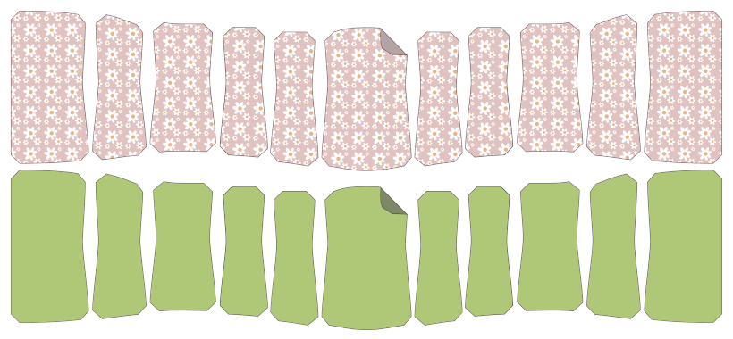

Cut 1 core fabric and 1 outer fabric of the center panel, making sure to cut on the fold.

Cut 2 core and 2 outer of each side panel with _good sides together_.

For example, for the 11-panel version of Cathrin:

- Paneel 1 - Knip 1 kern en 1 buitenzijde
- Paneel 2 - Knip 2 core en 2 buitenste punten
- Paneel 3 - Knip 2 core en 2 buitenste punten
- Paneel 4 - Knip 2 core en 2 buitenste punten
- Paneel 5 - Knip 2 core en 2 buitenste punten
- Paneel 6 - Knip 2 core en 2 buitenste punten

