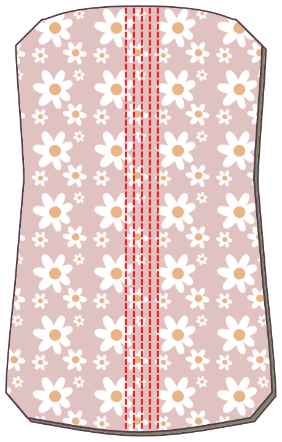
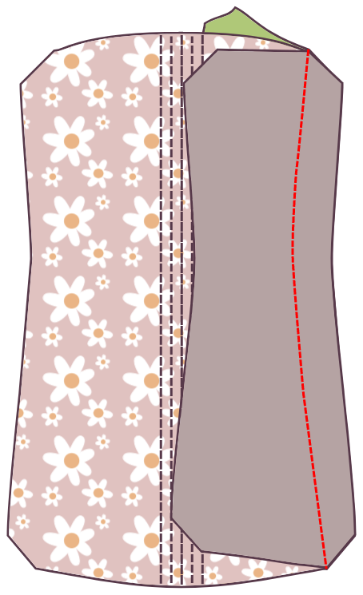
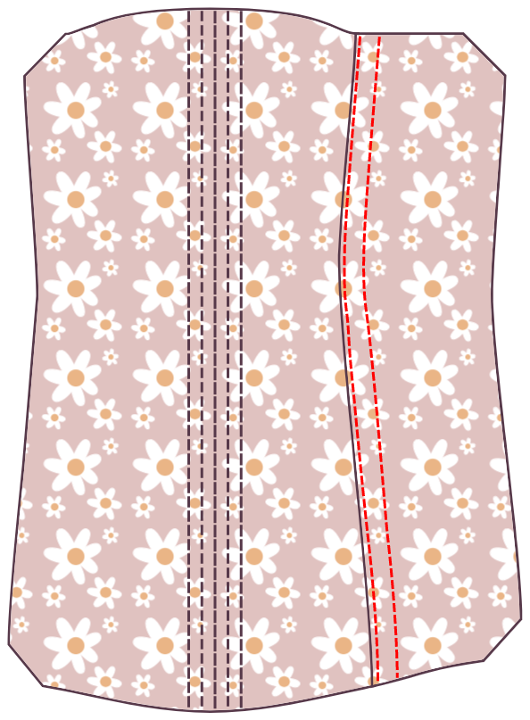
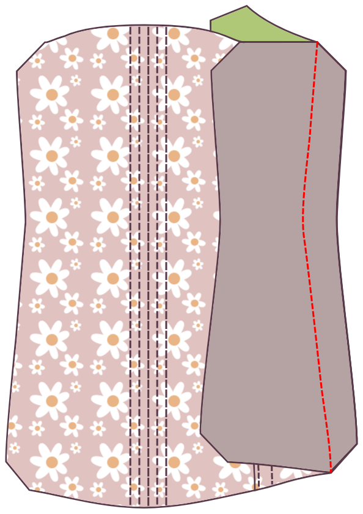
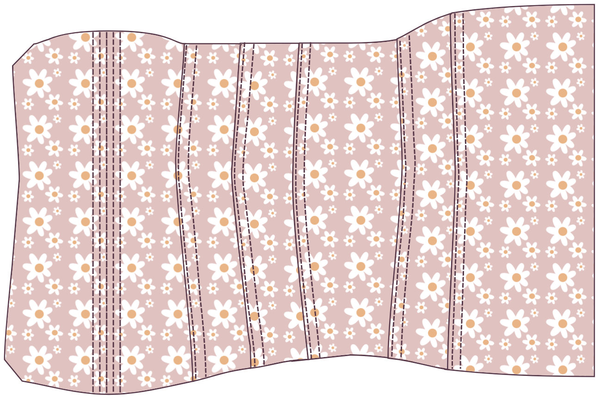
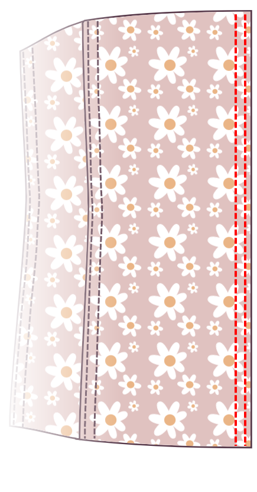
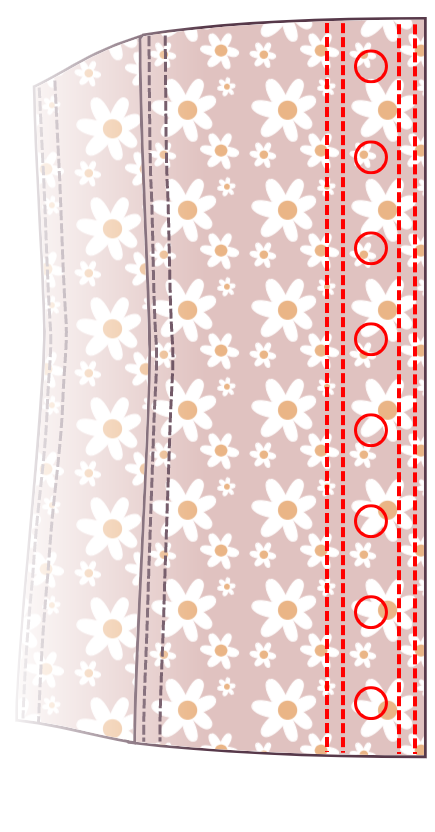

<Note>

#### Il y a plusieurs façons de construire un corset

Ces instructions ne sont qu'une seule façon. Grâce à cette méthode, je recommande d'utiliser une plus grande marge de couture d'au moins 1,5 cm afin que vos canaux de fixation s'intègrent confortablement à l'intérieur de la marge de couture.

Les fabricants de corsets débutants devraient lire les tutoriels écrits par [Sidney Eileen](http://www.sidneyeileen.com), qui montrent plusieurs méthodes de construction différentes. [Foundations Revealed](https://www.foundationsrevealed.com) est un site paywall pour les créateurs de corseaux, avec plusieurs articles exceptionnels gratuits pour les non-membres.

Cathrin a également [cet article informatif sur la création de corsets](https://katafalk.wordpress.com/2009/05/03/how-i-sew-corsets/) sur son blog que vous pourriez trouver utile. Cathrin a également [cet article informatif sur la création de corsets](https://katafalk.wordpress.com/2009/05/03/how-i-sew-corsets/) sur son blog que vous pourriez trouver utile.

</Note>

## Étape 1 : Coudre les canaux de fixation au centre de l'avant

Start with the center front pieces. For an 11-panel Cathrin, this will be Panel 1. Place the outer Panel 1 on the core Panel 1, bad sides together.

With a small stitch width (I set mine to “2”), sew a line straight down the center front. Then sew two boning channels to either side, allowing a bit of extra space, about 2mm, in addition to the width of your boning.

## Étape 2 : Attacher le premier panneau latéral

Take the next piece. For an 11-panel Cathrin, this will be Panel 2.

Place the outer Panel 2 on the outer Panel 1, _good sides together_.

Place the core Panel 2 on the core Panel 1, _good sides together_.

Ensure that the four layers of fabric line up perfectly. Double check that you haven’t mixed up pattern pieces or flipped any over by mistake.

Match up the four layers of fabric at the narrowest part, _good sides together_, and pin. Then match the top and bottom of each panel and pin. Finally, pin the rest of the edge in place. Use as many pins as needed to make sure the panels stay perfectly aligned.

Sew the seam.

## Étape 3 : Coudre le canal de fixation

Press both layers of Panel 2 away from the center, using the iron to ease the material where the seams curve.

Edgestitch right along the folded edge, just 1-2mm from the seam line. Sew slowly and keep an eye on the stitching to ensure that the distance is kept even at all times. The purpose of adding this topstitch line is to relieve some stress from the connecting seam.

Topstitch another seam parallel to the first seam, allowing a bit of extra space, about 3mm, in addition to the width of your boning.

## Étape 4 : Attacher le panneau suivant

Take the next piece. For an 11-panel Cathrin, this will be Panel 3.

Place the outer Panel 3 on the outer Panel 2, _good sides together_.

Place the core Panel 3 on the core Panel 2, _good sides together_.

Match up the four layers of fabric at the narrowest part, _good sides together_, and pin. Then match the top and bottom of each panel and pin. Finally, pin the rest of the edge in place. Use as many pins as needed to make sure the panels stay perfectly aligned.

Sew the seam.

## Étape 5 : Coudre un autre canal de liaison

Press both layers of Panel 3 away from the center, using the iron to ease the material where the seams curve.

Edgestitch right along the folded edge, just 1-2mm from the seam line.

Topstitch another seam parallel to the first seam, allowing a bit of extra space, about 2mm, in addition to the width of your boning.

This new boning channel should look just like the one you made attaching Panel 2 to Panel 1.

## Étape 6 : Continuer à attacher les panneaux latéraux

Continue attaching panels, creating a boning channel in each seam. Attach Panel 4 to Panel, Panel 5 to Panel 4, and finally Panel 6 to Panel 5.

Repeat these steps on the other side.

## Étape 7 : Terminer le retour du corset

With all of your panels connected, you’re working with the flat sides of each Panel 6.

Fold the seam allowance of both pieces inward so that the seam allowance is hidden. Press flat, then top stitch close to the edge.

Topstitch another seam next to the edgestitched seam, allowing a bit of extra space, about 2mm, in addition to the width of your boning.

Mark the locations of your grommets. (Don’t insert them yet. Just mark the fabric where you’ll place them, and make sure you’re creating a strip suited to the width of your grommets.)

Top stitch on the opposite side of the grommet markings, then shift and topstitch another seam parallel to the topstitched seam, again leaving enough space for the boning.

Repeat on the other side.

## Step 8: Insert boning

Insert boning in all of the channels.

## Étape 9 : Lier le haut et le bas

Use bias tape or ribbon to bind the top and bottom edges of the corset.

## Étape 10: Définir les grommets

Set the grommets in the locations you marked earlier.

## Étape 11: Dresser le corset

C'est terminé !
