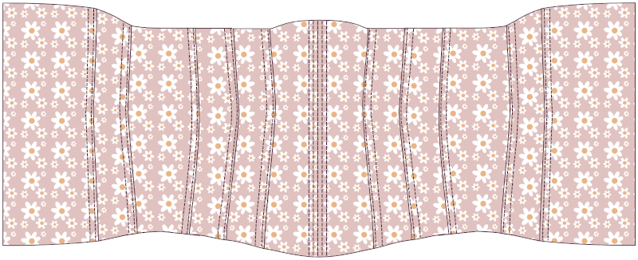

<Note>

#### Il y a plusieurs façons de construire un corset

Ces instructions ne sont qu'une seule façon. Grâce à cette méthode, je recommande d'utiliser une plus grande marge de couture d'au moins 1,5 cm afin que vos canaux de fixation s'intègrent confortablement à l'intérieur de la marge de couture.

Les fabricants de corsets débutants devraient lire les tutoriels écrits par [Sidney Eileen](http://www.sidneyeileen.com), qui montrent plusieurs méthodes de construction différentes. [Foundations Revealed](https://www.foundationsrevealed.com) est un site paywall pour les créateurs de corseaux, avec plusieurs articles exceptionnels gratuits pour les non-membres.

Cathrin a également [cet article informatif sur la création de corsets](https://katafalk.wordpress.com/2009/05/03/how-i-sew-corsets/) sur son blog que vous pourriez trouver utile. Cathrin a également [cet article informatif sur la création de corsets](https://katafalk.wordpress.com/2009/05/03/how-i-sew-corsets/) sur son blog que vous pourriez trouver utile.

</Note>

## Étape 1 : Coudre les canaux de fixation au centre de l'avant

Commencez par les pièces avant centrales. Pour un Cathrin de 11 panneaux, ce sera le Panel 1. Placez le panneau extérieur 1 sur le panneau de base 1, les mauvais côtés ensemble.

Avec une petite largeur de point (je mets la mienne à « 2 »), coudre une ligne en bas du devant central. Coudre ensuite deux canaux de fixation de chaque côté, ce qui laisse un peu d'espace supplémentaire, environ 2 mm, en plus de la largeur de la bonde.

## Étape 2 : Attacher le premier panneau latéral

Prenez la pièce suivante. Pour un Cathrin à 11 panneaux, ce sera le panel 2.

Placez le panneau extérieur 2 sur le panneau extérieur 1, _de bons côtés ensemble_.

Placez le panneau de base 2 sur le panneau de base 1, _de bons côtés ensemble_.

Assurez-vous que les quatre couches de tissu sont parfaitement alignées. Vérifiez à deux reprises que vous n’avez pas mélangé des pièces de motif ou bien que vous ne les avez pas retournés par erreur.

Faites correspondre les quatre couches de tissu à la partie la plus étroite, _de bons côtés ensemble_, et épinglez. Ensuite correspondez au haut et au bas de chaque panneau et à l'épingle. Enfin, épingler le reste du bord en place. Utilisez autant de broches que nécessaire pour vous assurer que les panneaux restent parfaitement alignés.

Coudre la couture.

## Étape 3 : Coudre le canal de fixation

Appuyez sur les deux couches du Panneau 2 loin du centre, en utilisant le fer pour faciliter le matériau où les coutures sont courbes.

Edgestitch droit le long du bord plié, à seulement 1-2mm de la ligne de couture. Coudre lentement et garder un œil sur le piquage pour que la distance soit maintenue même en tout temps. Le but de cette ligne de toppitch est de soulager le stress de la couture de connexion.

Toppoint une autre couture parallèle à la première couture, permettant un peu d'espace supplémentaire, environ 3mm, en plus de la largeur de votre collage.

## Étape 4 : Attacher le panneau suivant

Prenez la pièce suivante. Pour un Cathrin de 11 panneaux, ce sera le Groupe d'étude 3.

Placez le panneau extérieur 3 sur le panneau extérieur 2, _de bons côtés ensemble_.

Placez le panneau de base 3 sur le panneau de base 2, _de bons côtés ensemble_.

Faites correspondre les quatre couches de tissu à la partie la plus étroite, _de bons côtés ensemble_, et épinglez. Ensuite correspondez au haut et au bas de chaque panneau et à l'épingle. Enfin, épingler le reste du bord en place. Utilisez autant de broches que nécessaire pour vous assurer que les panneaux restent parfaitement alignés.

Coudre la couture.

## Étape 5 : Coudre un autre canal de liaison

Appuyez sur les deux couches du Panneau 3 loin du centre, en utilisant le fer pour faciliter le matériau où les coutures sont courbes.

Edgestitch droit le long du bord plié, à seulement 1-2mm de la ligne de couture.

Toppoint une autre couture parallèle à la première couture, permettant un peu d'espace supplémentaire, environ 2mm, en plus de la largeur de votre collage.

Ce nouveau canal de fixation devrait ressembler à celui que vous avez créé pour attacher le panneau 2 au panneau 1.

## Étape 6 : Continuer à attacher les panneaux latéraux

Continuez à attacher des panneaux, en créant un canal de fixation dans chaque couture. Attachez le panneau 4 au panneau, le panneau 5 au panneau 4, et enfin le panneau 6 au panneau 5.

Répétez ces étapes de l'autre côté.

## Étape 7 : Terminer le retour du corset

Avec tous vos panneaux connectés, vous travaillez avec les côtés plats de chaque panneau 6.

Plier la marge de couture des deux pièces à l'intérieur de sorte que la marge de couture soit cachée. Presser à plat, puis au sommet près du bord.

Coudre une autre couture à côté de la couture arêtée, ce qui laisse un peu d'espace supplémentaire, environ 2 mm, en plus de la largeur de la couture.

](step07.png)

Marquez l'emplacement de vos grommets. (Ne les insérez pas encore. Marquez simplement le tissu où vous les placerez et assurez-vous de créer une bande adaptée à la largeur de vos grommets.)

Couture supérieure sur le côté opposé des marquages grommet, puis débranchez et brodez une autre couture parallèle à la couture surpiquée, laissant encore assez d'espace pour le collage.

Répéter de l'autre côté.

## Step 8: Insert boning

Insérez la liaison dans tous les canaux.

## Étape 9 : Lier le haut et le bas

Utilisez du ruban ou du ruban pour lier les bords supérieurs et inférieurs du corset.

## Étape 10: Définir les grommets

Définissez les grommets dans les emplacements que vous avez indiqués précédemment.

## Étape 11: Dresser le corset

C'est terminé !
