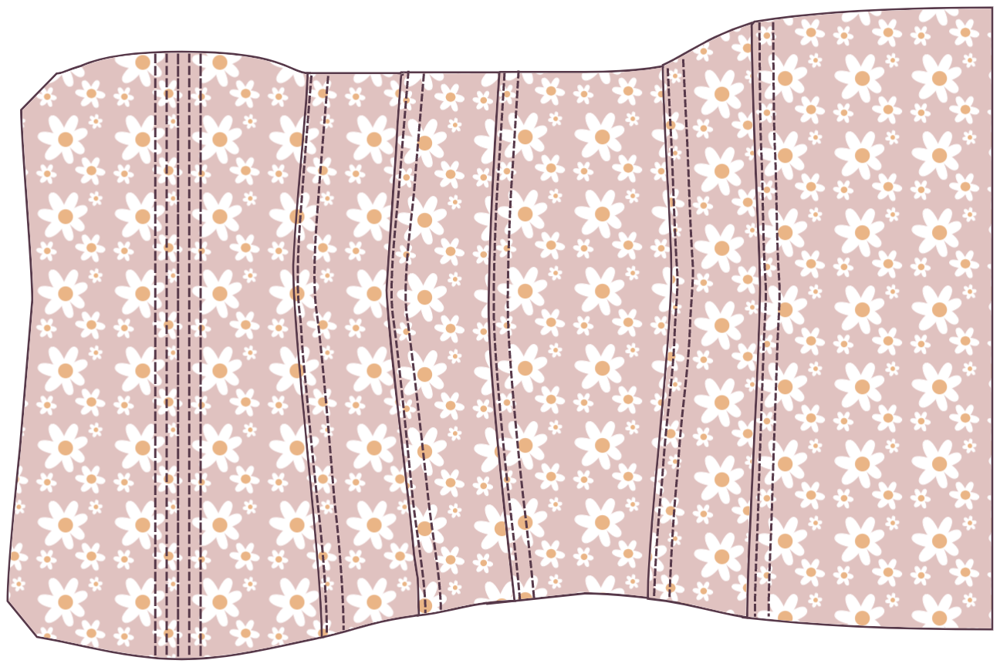
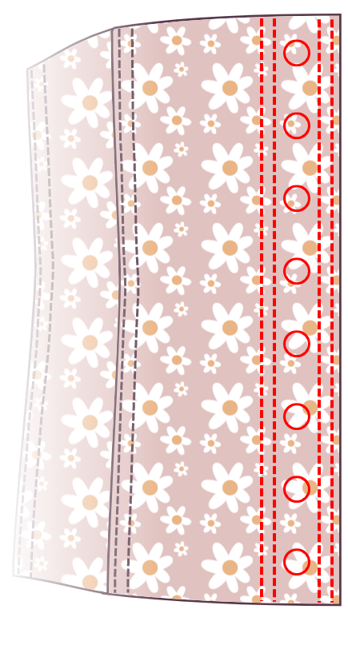

<Note>

#### Існує багато способів виготовлення корсета

Ця інструкція - лише один із способів. У цьому методі я рекомендую використовувати ширший припуск на шов, щонайменше 1,5 см, щоб ваші кісткові канали зручно розмістилися всередині припуску на шов.

Початківцям варто прочитати підручники, написані [Сідні Ейлін] (http://www.sidneyeileen.com), яка демонструє кілька різних методів виготовлення корсетів. [Foundations Revealed] (https://www.foundationsrevealed.com) - це платний сайт для виробників корсетів, з кількома винятковими статтями, безкоштовними для тих, хто не є його членами.

#### Перевірте оригінальний підручник

Цей шаблон базується на [цьому підручнику Катрін Ален](https://katafalk.wordpress.com/2010/06/24/underbust-pattern-tutorial/). У блозі Катрін також є [цей інформативний пост про виготовлення корсетів] (https://katafalk.wordpress.com/2009/05/03/how-i-sew-corsets/), який може бути корисним для вас.

</Note>

## Крок 1: Зшийте кісткові канали по центру спереду

Почніть з центральних передніх частин. Для 11-панельної Катрін це буде панель 1. Покладіть зовнішню панель 1 на основну панель 1, виворітними сторонами разом.

З невеликою шириною стібка (я встановила на "2") прошийте лінію прямо по центру переду. Потім пришийте два канали для кісточок з обох боків, залишивши трохи додаткового простору, приблизно 2 мм, на додаток до ширини кісточки.

## Крок 2: Прикріпіть першу бічну панель

Візьми наступний шматок. Для 11-панельної Катрін це буде панель 2.

Покладіть зовнішню панель 2 на зовнішню панель 1, _лицьовими сторонами разом_.

Покладіть основну панель 2 на основну панель 1, _лицьовими сторонами разом_.

Переконайтеся, що чотири шари тканини ідеально вирівняні. Перевірте, чи не переплутали ви деталі викрійки і чи не перевернули якусь із них помилково.

Складіть чотири шари тканини в найвужчій частині, _лицьовими сторонами разом_і приколіть булавками. Потім зіставте верхню і нижню частини кожної панелі і скріпіть. Нарешті, приколіть решту краю на місце. Використовуйте стільки штифтів, скільки потрібно, щоб переконатися, що панелі залишаються ідеально вирівняними.

Зашийте шов.

## Крок 3: Зшиваємо кістковий канал

Притисніть обидва шари панелі 2 від центру, використовуючи праску, щоб полегшити матеріал в місцях вигину швів.

Прострочіть прямо вздовж підігнутого краю, на відстані 1-2 мм від лінії шва. Шийте повільно і слідкуйте за строчкою, щоб переконатися, що відстань завжди залишається рівною. Мета додавання цієї верхньої строчки - зняти деяке напруження зі з'єднувального шва.

Зверху прострочіть ще один шов паралельно першому шву, залишивши трохи додаткового простору, приблизно 3 мм, на додаток до ширини кісточки.

## Крок 4: Прикріпіть наступну панель

Візьми наступний шматок. Для 11-панельної Катрін це буде панель 3.

Покладіть зовнішню панель 3 на зовнішню панель 2, _лицьовими сторонами разом_.

Покладіть основну панель 3 на основну панель 2, _лицьовими сторонами разом_.

Складіть чотири шари тканини в найвужчій частині, _лицьовими сторонами разом_і приколіть булавками. Потім зіставте верхню і нижню частини кожної панелі і скріпіть. Нарешті, приколіть решту краю на місце. Використовуйте стільки штифтів, скільки потрібно, щоб переконатися, що панелі залишаються ідеально вирівняними.

Зашийте шов.

## Крок 5: Зшийте ще один кістковий канал

Притисніть обидва шари панелі 3 від центру, використовуючи праску, щоб полегшити матеріал в місцях вигину швів.

Прострочіть прямо вздовж підігнутого краю, на відстані 1-2 мм від лінії шва.

Зверху прокладіть ще один шов паралельно першому шву, залишивши трохи додаткового простору, приблизно 2 мм, на додаток до ширини кісточки.

Цей новий канал має виглядати так само, як і той, який ви зробили, приєднавши панель 2 до панелі 1.

## Крок 6: Продовжуйте кріпити бічні панелі

Продовжуйте прикріплювати панелі, створюючи канал для кісткової тканини в кожному шві. Приєднайте Панель 4 до Панелі, Панель 5 до Панелі 4 і, нарешті, Панель 6 до Панелі 5.

Повторіть ці кроки з іншого боку.

## Крок 7: Закінчуємо корсетну спинку

З'єднавши всі панелі, ви працюєте з пласкими сторонами кожної панелі 6.

Складіть припуски обох деталей всередину, щоб припуски швів були приховані. Притисніть, а потім прошийте верхню строчку близько до краю.

Прострочіть ще один шов поруч з окантовочним швом, залишивши трохи додаткового простору, приблизно 2 мм, на додаток до ширини кісточки.

Позначте місця розташування втулок. (Не вставляйте їх поки що. Просто розмітьте на тканині місця, де ви будете їх розміщувати, і переконайтеся, що ви створюєте смугу, яка відповідає ширині ваших люверсів).

Прокладіть верхню строчку на протилежному боці від розмітки ластовиці, потім змістіть і прокладіть ще один шов паралельно верхньому шву, знову ж таки залишаючи достатньо місця для кісточки.

Повторіть з іншого боку.

## Крок 8: Вставте кістки

Вставте кісточки в усі канали.

## Крок 9: Зв'яжіть верх і низ

За допомогою бейки або стрічки скріпіть верхній і нижній краї корсета.

## Крок 10: Встановіть прокладки

Встановіть прокладки в місцях, які ви позначили раніше.

## Крок 11: Зашнуруйте корсет

Тобі кінець!
