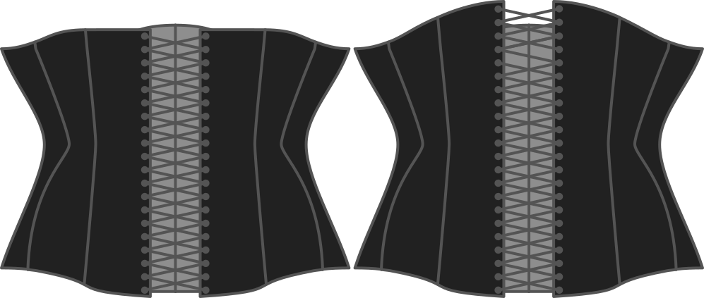

How high do you want the corset to rise at the back, relative to the underbust height?

Zero means that the backline will stay horizontal at the level of your underbust. In other words, the back will be somewhat the same height as your bra strap.

If you increase the back rise, your corset will rise upwards at the back.

> As this is an underbust corset, the back rise is a style choice and won't affect the fit

## Effet de cette option sur le motif

