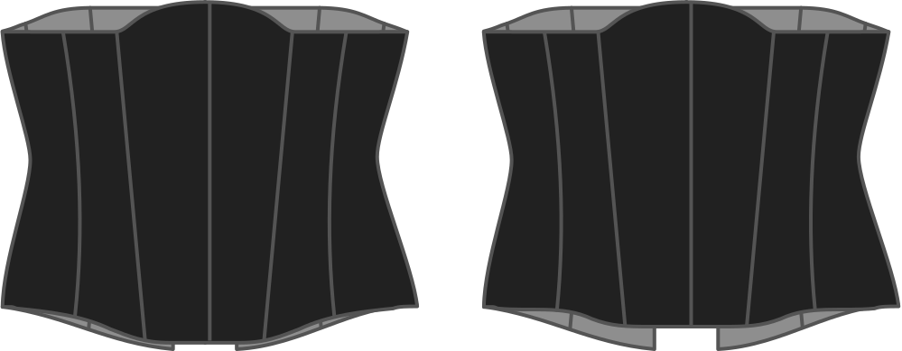

This option determines how far the center front will be lowered at the bottom of your corset.

> Wenn Sie dies zu viel senken, könnte die Sitzung zu einem Thema werden.

## Effekt dieser Option auf das Schnittmuster

