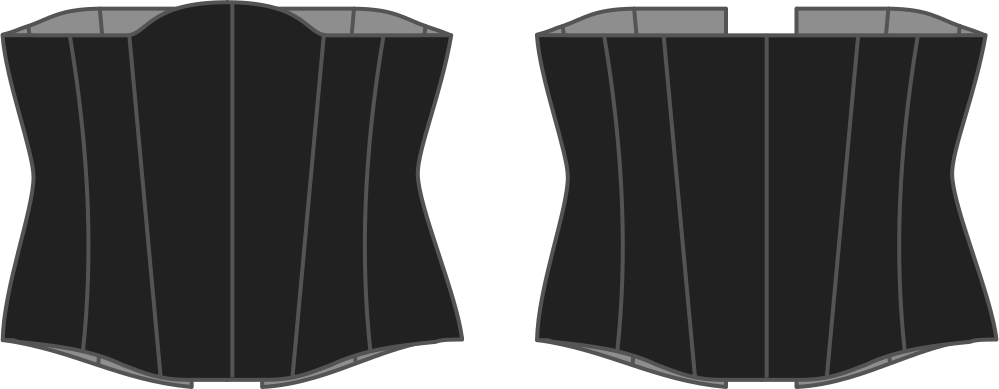

How high do you want the corset to rise up at the center front.

> This rise occurs center front between your breasts. Don't overdo it or the edge of your corset will push into your breasts.

> This option also allows negative values. They will cause the center front to be lowered.

## Effect of this option on the pattern

