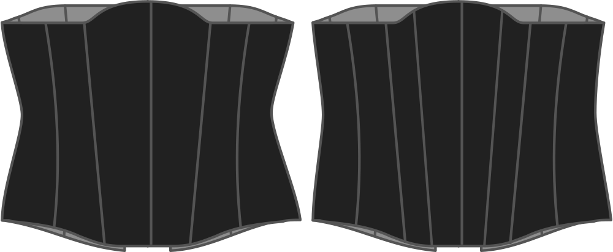

Ця опція визначає, скільки панелей буде використано для виготовлення корсета. У вас є вибір між ними:

- 11 панелей
- 13 панелей

Більша кількість панелей - це трохи більше роботи, але також дозволяє вирівняти різницю між обхватом грудей/талії/стегон за допомогою більшої кількості виточок, що може дати кращі результати.

> Більше кривих = більше панелей

## Вплив цієї опції на шаблон

