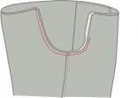
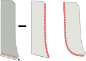
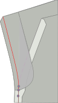
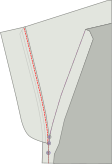
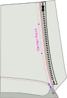
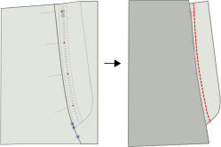
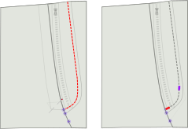

## Schritt 1: Nähe den hinteren Abnäher

Als erstes werden wir den Taillendart auf der Rückseite schließen.

Dazu falten Sie die Rückseite doppelt mit _guten Seiten zusammen_ und stellen Sie sicher, dass beide Seiten des Darts übereinander übereinstimmen.

Nun nähst du den Abnäher zu. Achte darauf, dass du eine kleine Stichlänge verwendest und bis zum Ende des Abnähers nähst, sogar ein paar Stiche über den Stoff hinaus.

<Note>

Deine hinteren Abnäher sollten dieselbe Länge haben. Achte darauf, sie präzise zu nähen.

</Note>

## Schritt 2: Konstruiere die hinteren Taschen

Schau dir [unsere Anleitung für die Doppelpaspeltasche](/docs/sewing/double-welt-pockets/) an, um die hinteren Paspeltaschen zu erstellen.

<Note>

Da es sich dabei um Chinos handelt, kann / sollte man sich um die Weltoffenöffnung herumreißen.
Das ist für Leistentaschen nicht unbedingt erforderlich und wird bei klassischen Hosen in der Regel nicht gemacht (und daher auch nicht in der Anleitung auf
gezeigt), aber es ist ein typisches Finish für Chinos und macht es einfacher, alles an seinem Platz zu halten.

</Note>

### Befestige die hintere Tasche mit der Tasche

Verbinde den hinteren Taschenbesatz mit dem Taschenbeutel, indem du sie mit _gut aufeinander legst_ und entlang der längsten der nicht gebogenen Nähte des Besatzes nähst.

Wenn Sie fertig sind, drücken Sie die Naht auf die Seite der Tasche Tasche.

### Befestige die hintere Tasche

Nähen Sie den Untergrund der Tasche auf die untere Schweißnaht. Drücke es herunter, wenn du fertig bist.

Nähen Sie nun die Oberseite der Tasche mit der Taille ab und nähen Sie sie in der Taille.

### Tasche zurück schließen

Schließen Sie die Beinleiste aus dem Fenster, damit Sie beide Seiten der Tasche schließen können.

<Note>

Stelle sicher, dass du auch die Tasche nach unten schweißen kannst

</Note>

Du solltest die Seiten des Taschenbeutels übersperren/austreten, damit sie nicht wüllen.

<Tip>

Wenn du keine _Overlock/Serger_ hast, kannst du stattdessen immer einen Zick-Zack-Zack-Stich verwenden.

</Tip>

## Schritt 3: Übersperren Sie Vorder- und Rückkanten

Bevor wir weiter gehen, werden wir die Kanten der Vorder- und Rückenplatten der Beine übersichten/verschlossen. Achten Sie darauf, dass Sie auch die Oberseite der Tasche bei der Rückseite der Tasche anfangen.

What we want to to prevent these edges from ravelling after we've completed our trousers, and now is the best time to do so.

## Schritt 4: Erstellen Sie die Vordertasche öffnen

Die vorderen Taschen sind etwas ungewöhnlich, weil sie das Aussehen der klassischen Schlanktaschen haben, aber auf der Seitennaht konstruiert sind.

### Befestigen Sie die Fronttasche mit den Taschentaschen

Wir haben zwei Taschen vor der Tasche zu befestigen, die jeweils zwei Gestelle haben.

Legen Sie sie mit _guten Seiten zusammen_ (\*) und nähen Sie das Gesicht an der Stelle.

<Note>

(\*) Mit einer Tasche ist es nicht so offensichtlich, was die gute Seite sein sollte.

Wollen Sie, dass die gute Seite das ist, was Sie fühlen, wenn Sie Ihre Hand in die Tasche setzen?
Oder wollen Sie, dass es das ist, was Sie sehen, wenn Ihre Hosen auf dem Boden liegen und ihre Innenseite zeigen.

Hier gibt es keine richtige oder falsche Antwort. Sie tun das.

</Note>

### Markieren Sie die Taschenlampe an der Verkleidung der Tasche und Vorder- und Rückenbeinplatten

Auf den Vorder- und Rückenplatten gibt es eine Note, die bis zu dem Punkt anzeigt, an dem die Tasche an der Seitennaht befestigt werden soll.

Achten Sie darauf, diese Nocke sowohl auf die (Kante) Tasche als auch auf das vorderen Hosenbein, da es wichtig ist, dass wir sie passen.

### Die Tasche an der Vorder- und Rückenbeinleiste anheften oder stützen

Sowohl auf der Vorderseite als auch auf der hinteren Beinplatte werden wir die Tasche mit der Seitennaht nähen.

Dies muss jedoch genau sein, so dass Sie wirklich sicherstellen wollen, dass Sie ihn entweder anpinnen oder einfügen.

<Note>

Beginnen Sie mit der Front, denn das ist die einfachere Naht. Sobald du eine Übung hast, kannst du die Rückseite machen

</Note>

### Nähen Sie die Vordertasche

Nähen Sie von der Taille nach rechts bis zur Note, die anzeigt, wo Sie anhalten sollen.

### Drücken Sie die Vordertasche

Drücken Sie nun die Schrägheit der Vordertasche, sowohl auf der Rückseite als auch auf der Vordertafel, so dass es eine scharfe Falte ist.

## Schritt 5: Die Ausgangssperre schließen

### Schließen Sie die vorderen Taschen

Ich empfehle dir dringend, die Tasche zu heften, bevor du diese Naht nähst, damit du sicher sein kannst, dass sie genau sitzt.

Das Schließen des Aussenseams bedeutet, die Vorder- und Rückseite mit guten Seiten zusammenzulegen und die Außennaht zu nähen. Das ist einfach genug an den Beinen, aber oben haben wir unsere Tasche, die die Dinge kompliziert.

### Nähen Sie die Oberseite der Außennaht bis in die obere Schicht der Tasche

Vergewissern Sie sich, dass alles sauber aufeinander abgestimmt ist. Nähen Sie dann von der Oberseite der Taille bis zur Oberstufe (dies ist etwas über einem cm oder einem halben Zoll).

### Nähen Sie den Boden der Außennaht von der unteren Schicht der Tasche

Gehen Sie nun auf die untere Stufe der Taschenschlange, und nähen Sie von dort bis zum unteren Ende der Beine.

### Drücke die äußere Naht geöffnet

Wenn du fertig bist, drücke die Nahtzuweisung entlang des Beines auf. Drücken Sie nicht die Tasche, wir haben das bereits getan.

## Schritt 6: Beende die Tasche vorne

### Nähttasche nach innen

Nachdem unsere Taschenöffnung gebaut und die Außennaht geschlossen ist, sollten wir nun die Tasche fertigen.

Ziehen Sie die Tasche heraus, so dass sie auf der Außenseite des Hosenbeins hängt. Then place both halves together and either use a serger to finish the edge, or sew closely to the edge.

Stellen Sie sicher, dass Sie an dem Punkt ankommen, an dem der untere Teil der äußeren Naht beginnt.

### Beende Tasche Kante

Wenn du fertig bist, kannst du die Tasche zurück zur Innenseite des Hosenbeins drehen.

Unsere Tasche ist jetzt geschlossen, aber wenn wir unsere Hand in sie stecken, können Sie die rohe Kante der Naht zu spüren. Um dies zu vermeiden, stechen Sie am Rand der Tasche entlang und verriegeln Sie in der Nahtzugabe.

<Note>
Wenn Ihre Naht breit ist, sollten Sie sie vielleicht zuerst zurückschneiden.
</Note>

## Schritt 7: Bar-Tack die Tasche öffnen

An der Stelle befindet sich das Bein mit der guten Seite nach oben, um sicherzustellen, dass die Tasche flach und in Richtung der Frontplatte liegt.

Nun oben und unten der Taschenöffnung, legen Sie einen Bar-Tack senkrecht zur Außennaht.

## Schritt 8: Inseam schließen

Mit unserer vorderen Tasche schließen Sie die InNaht beider Beine.

Wenn du fertig bist, drücke die Inseam zu öffnen.

## Schritt 9: Kreuzung schließen

<tip>

Double check that your right and left legs match the pattern markings. The right leg's crotch should extend slightly beyond the left. Refer to the pattern and cut excess on the left leg if necessary.

It can be valuable to mark with chalk or thread mark the **Center Front** on each leg. This will help you make sure the peices are in the right place duing fly construction.

</tip>

Vergewissern Sie sich, dass ein Bein mit der guten Seite gedreht wird, und die andere mit der guten Seite.

Jetzt steckst du das Bein mit der guten Seite nach außen in das Bein mit der guten Seite nach innen. Auf diese Weise haben sie ihre guten Seiten gegeneinander.

Richte die Quernaht aus, indem du an der hinteren Taille beginnst und beide Hälften zusammensteckst, während du dich auf zum Hosenschlitz vorarbeitest. **Stop at the fly notch** and makes sure to back-stitch.

Wenn du fertig bist. Machen Sie es erneut. Die Kreuznaht immer zweimal nähen. Es ist eine der besten Praktiken, die Sie auf eigene Gefahr ignorieren.

<Tip>

Achten Sie besonders darauf, die Nähte sorgfältig auszurichten, bei denen beide Beine ihre Rücken- und Frontplatten miteinander verbunden haben.
Dadurch wird sichergestellt, dass Ihre Quernahtergebnisse mit einem perfekt ausgerichteten _cross_ übereinstimmen, bei dem sich 4 Musterteile an einem einzigen Punkt treffen.

Richtig zu sein ist eines der Dinge, die du am Ende jedes Mal hochschätzst, wenn du diese trägst.

</Tip>

## Schritt 10: Konstruktion des Hosenstalls

### Close the fly extension and serge

Falten Sie die Fliegenverlängerung auf ihrer Faltlinie mit guten Seiten zusammen.

Nähen Sie nun entlang der Unterseite, um die Fliegenverlängerung zu schließen.

Schneiden Sie eine Hälfte des Nahtzuges zurück, um Schüttgut zu entfernen, bevor Sie es gut seitlich ausdrehen und drücken.

#### Bediene die Fliegenverlängerung und fliege nach vorne

Serge (oder Zick-Zack) entlang der offenen Seite der Fliegenverlängerung. Keine Notwendigkeit, die Spitze zu sergen, da die in unserer Taille gefangen werden.

während Sie dabei sind, auch entlang der gesamten Fliegenverkleidungen J-förmige Kante.

### Fliegenanhang anhängen

Sew fly facing to left leg. You will be sewing slightly past the cross seam point, so be careful to keep the right leg seam allowance out of the way and aim to sew directly on top of the cross seam line.

### Finish the fly facing

Trim the fly facing to half of the seam allowance.  
Tuck in the tip of the fly facing and secure it with a few stitches. Edge stitch the fly facing to the seam allowance. Press the seam allowance toward the facing and understitch the facing for a clean finish. Again, keeping the right leg  seam allowance out of the way.

### Edge stitch the zipper to the fly extension

<tip>

**Zipper Length**

It's a good idea to ensure your zipper stop ends before the indicated stitch line on the pattern. This will ensure you don't sew over your zipper stop and reduces tension on the bottom of the fly. If your zipper is too long, you can do a 0 length zig zag stitch to create a new stop (on just the zipper itself).

</tip>

Edge stitch along the left edge of the zipper to the serged edge of the fly extension to hold it in place.

### Top stitch the right leg to the zipper

Start by pressing the right leg seam allowance to the back.

<tip>

Remember that the seam allowance starts slightly right of the center front, the center front is marked in purple in the image, make sure you don't fold along the center front line by mistake.

</tip>

Ensure you place the folded edge of the right leg just left of the zipper teeth to prevent fabric from being caught in the zipper.

Stop sewing at the top 'fly extention' notch, slightly above the cross seam, and be sure to backstitch. If you don't do this you won't be able to keep the extension out of the way when sewing the J-Seam.

### Attach the zipper to the fly facing.

Be careful to align the leg left on the right center front. It can be valuable to pin or baste through the facing and right zide of the zipper tape. (We need to sew the left side of the zipper tape to the left leg). Ensuring everything is lined, sew the fly facing to the left side of the zipper. Try to get close to the zipper, but not too close.

### Nähen Sie die J-Naht der Fliege

<tip>

Use a peice of paper as a guide to sew the J seam, this can be cut from your pattern along the indicated stitch line.

</tip>

Jetzt die so genannte J-Naht der Fliege aufstitten. Achten Sie darauf, die Fliegenverlängerung aus dem Weg zu räumen. Since you didn't sew all the way along the fly extention, you should be able to pin it out of the way.

#### Bar tackt den unteren Rand des Fliegens

Now, bartack the very botton of the J-seam (the horizontal part) but this time make sure to also catch the fly extension. You can choose to add an additional bar tack along the J-Seam as well (shown in purple).

## Schritt 11: Befestige die Gürtelschlaufen

### Konstruiere die Gürtelschlaufen

<Note>

Für die Effizienz werden wir einen langen Streifen Gurtschleifen in 8 Teile zerlegen.

</Note>

Schneide einen Streifen von 80 cm Länge und 2,8 cm Breite zu.

Serge (oder Zickzag) den langen Rand des Streifens auf beiden Seiten.

Falte eine Seite nach innen, und die andere Seite darüber. Drücken Sie dann mit Ihrem Eisen herunter. Das Endergebnis sollte ein langer Streifen etwa 1cm breit sein.

Nähen Sie nun entlang der gesamten Länge des Streifens, riechen Sie in der Mitte. Achten Sie darauf, dafür eine großzügige Heftlänge zu verwenden.

Schneiden Sie schließlich Ihre Längenschleifen in 8 gleiche Teile ab, um 8 Gurtschleifen zu bilden.

### Befestige die Gürtelschlaufen

Wir werden unsere Gürtelschleifen entlang der Taille teilen:

- 2 in der Mitte hinten, die jeweils ein bisschen von der Mitte beiseite gesetzt, so dass es eine kleine Lücke zwischen ihnen.
- 1 über dem Rückendart auf jeder Seite
- 1 an jeder Seite mehr oder weniger wo die Seitennaht die Taille treffen würde, wenn sie gerade nach oben ging
- 1 auf jeder Seite von der Mitte vorne. Nicht zu nah beieinander, so dass es keinen Platz für Gürtelschnallen gibt, aber auch nicht zu weit, so dass es nicht seltsam aussieht

Lege die Gürtelschlaufe an diesen Stellen mit der guten Seite nach unten an (gegen die gute Seite des Hosenstoffs und mit der Oberseite an der Taille ausgerichtet) Nähe sie in der Nahtzugabe der Taille fest und achte darauf, dass sie senkrecht zum Bund liegen.

## Schritt 12: Taillenband anhängen

### Kurvenband anordnen

Wenn Sie eine geradlinige Taille herstellen, springen Sie direkt an die Außenseite des Taillenbandes.

Legen Sie beide Bänder mit guten Seiten zusammen und nähen Sie an der Spitze der Taille (die kürzere Kante).

Schneide die Nahtzugabe des inneren Bunds zurück und bügle alle Nahtzugaben zum inneren Bund hin.

Du kannst deinen zusammengesetzten Bund nun als ein Stück behandeln und wie beim geraden Bund fortfahren.

<Tip>
Um sicherzustellen, dass dein inneres Taillenband nicht aussieht, kannst du _understitch_.
Nähen Sie eine Linie des Nähens auf der Innenbund, in der Nähe der Kante, durch die innere Taille und Nähte (aber nicht der äußere Taillen!).
</Tip>

### Taillenband an die Außenseite anhängen

Legen Sie die Taille mit guten Seiten zusammen entlang der Taille. For the straight waistband, make sure the side with the standard seam allowance is aligned with the waist, and not the side with double seam allowance.

Achten Sie auch darauf, ausreichend Naht über den Anfang und das Ende der Taille zu lassen.

Nähen Sie die gesamte Taille entlang und befestigen Sie das Taillenband und nähen Sie die Gürtelschleifen in einem Schritt.

### Drücke die Taille und falte die Taille

Drücken Sie die Naht, die Sie gerade genäht, drücken Sie die Naht in die Taille.

Nun falten Sie über den Bund in der richtigen Breite und drücken Sie in der Breche.

### Schließen Sie den Start und das Ende der Taille.

Falte den Bund am Anfang und am Ende um, so dass er die guten Seiten zusammen hat.

Nähen Sie nun das Ende mit dem Nähen von oben nach unten zu dem Punkt, an dem die Taillendicke endet.

Schneiden Sie die Naht ein bisschen zurück, damit Sie sie später in die Taille stecken können.

### Taillenband einfügen

Das Taillenband hat hier extra Naht und wir werden das zu unserem Vorteil verwenden.

Legen Sie die Taille in die Falte, die Sie gedrückt haben. Dann nach innen falten Sie die Nahtzuweisung nach innen und sorgen Sie dafür, dass sie ein paar mm über die Taillendicke hinaus laufen lässt.

Du möchtest dies an Ort und Stelle platzieren, so dass es so bleibt, wie du dich um die Taille herum bewegst.

Am Anfang und Ende der Taille müssen Sie noch etwas mehr Nahtzufuhr haben. Nehmen Sie sich einen Moment Zeit, um es richtig zu machen.

### Die Taille schließen

Nun mit der guten Seite nach oben, nähen genau in der Naht, die zuvor genäht wurde (so genannter _Stich im Graben_).

Dies wird die Rückseite des Taillenbands, das wir gemacht haben, um etwas weiter zu verlängern, und die gesamte Nahtzuweisung im Inneren verriegeln.

## Schritt 13: Die Bandschleifen fertigstellen

### Nähen Sie die Gürtelschleifen nach unten um sie breiter zu machen

Am besten machst du die Gürtelschlaufen etwas breiter als den Bund, damit du breitere Gürtel unterbringen kannst.

Dazu lässt du den Bund flach liegen und nähst ihn mit einem Riegel etwa 1,5 cm unterhalb des Bundes fest.

### Nach oben, wieder unten und nach unten nähen

Falten Sie nun die Gürtelschleifen nach oben (verstecken Sie den Bartack, den Sie gerade gemacht haben).

Sie werden über die Oberseite der Taille hinausgehen. Also falten Sie den Überschuss wieder nach unten. Falten Sie ihn nicht über die Taille, sondern verdoppeln Sie ihn auf sich selbst.

Führen Sie nun einen Bartack entlang der Oberseite der Taille, um die Gurtschleife zu verriegeln.

Wenn du fertig bist, drehst du die Rückseite der Gürtelschlaufe vorsichtig nach vorne und schneidest den Überschuss direkt neben dem Riegel ab.

<Note>

Achten Sie darauf, nicht die Vorderseite Ihrer Hose auf die Rückseite zu verdrängen.

Überprüfen Sie doppelt, dass Sie keine zusätzlichen Ebenen unter Ihrer Nadel haben, weil das Entpicken eines Bartacks keine Freude ist.

</Note>

## Schritt 14: Hem die Hosen

Falten Sie die Saumerlaubnis auf halbem Weg nach oben, und drücken Sie sie. Dann falten Sie sie wieder und drücken Sie erneut.

Fertige mit der Hand und blinden Saum deine Hosen.

## Schritt 15: Button auf Knopfloch

Erstelle ein Knopfloch. Entweder von Hand (es lohnt sich zu üben) oder mit einer Maschine.

Schließlich, hängen Sie den Knopf.

Nehmen Sie sich jetzt einen Moment Zeit, um all die harte Arbeit zu schätzen, die Sie geleistet haben. Wir hoffen, dass du viel Nutzen daraus ziehen kannst.
