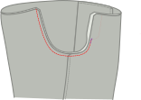
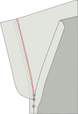
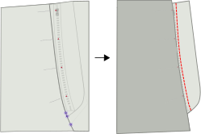
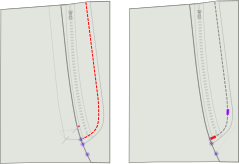

## Paso 1: Cierra el dardo trasero

Lo primero que vamos a hacer es cerrar la densa cintura en el panel trasero.

Para hacerlo, dobla el panel trasero con _lados buenos juntos_ asegurándose de que coincida con ambos lados del dardo.

Ahora cose la pinza para cerrarla, asegurándote de utilizar una longitud de puntada pequeña y de coser hasta el final de la pinza, incluso un par de puntadas fuera de la tela.

<Note>

Sus dardos de espalda deben tener la misma longitud. Asegúrate de coser con precisión.

</Note>

## Paso 2: Construir los bolsillos de respaldo

Sigue [nuestras instrucciones de bolsillo doble](/docs/sewing/double-welt-pockets/) para crear los bolsillos de soldadura trasera.

<Note>

Dado que estos son chinos, usted puede/debe editar en torno a la apertura de la soldadura.
No es estrictamente necesario para los bolsillos ribeteados, y normalmente no se hace en los pantalones clásicos (y por eso no se muestra en
las instrucciones), pero es un acabado muy típico de los chinos, y facilita que todo esté en su sitio.

</Note>

### Adjuntar el bolsillo trasero hacia la bolsa de bolsillo

Únete al bolsillo trasero mirando a la bolsa de bolsillo colocándolos con _buenos lados juntos_ y cosiendo a lo largo de las costuras no curvas de la cara.

Cuando hayas terminado, presiona el permiso de costura al lado de la bolsa de bolsillo.

### Adjuntar la bolsa de bolsillo trasera

Difunde la parte inferior de la bolsa de bolsa al fondo de la soldadura. Presione el botón abajo cuando haya terminado.

Ahora alinea la parte superior de la bolsa de bolsa con la cintura y coser en la costura de la cintura.

### Cerrar el bolsillo de vuelta

Doble el panel de la pierna fuera del camino para que puedas cerrar ambos lados de la bolsa de bolsa.

<Note>

Asegúrate de coser también la bolsa de bolsa

</Note>

Deberías overlock/serge los lados de la bolsa para que no se cuelgan.

<Tip>

Si no tienes un _serger_ siempre puedes usar un zig-zag en su lugar.

</Tip>

## Paso 3: Reemplaza los bordes frontales y traseros

Antes de ir más lejos, vamos a sobrebloquear/servir los bordes de los paneles frontales y traseros de las piernas. Asegúrate de coger la parte superior de la bolsa de bolsa al hacer los paneles traseros.

What we want to to prevent these edges from ravelling after we've completed our trousers, and now is the best time to do so.

## Paso 4: Construir la apertura del bolsillo frontal

Los bolsillos delanteros son un poco inusuales porque tienen la apariencia de los clásicos bolsillos cortados, pero están construidos en la costura lateral.

### Adjuntar las miradas del bolsillo delantero a las bolsas de bolsillo

Tenemos dos bolsas de bolsillo delanteras, que cada una tiene dos piezas de frente para sujetarlas.

Alinear con _lados buenos_ juntos (\*) y coser el revestimiento en su lugar.

<Note>

(\*) Con una bolsa de bolsillo, no es tan obvio cuál debería ser el lado bueno.

Do you want the good side to be what you feel when you put your hand in your pocket?
Or do you want it to be what you see when your trousers lie on the floor with their insides showing.
¿O quieres que sea lo que ves cuando tus pantalones se encuentran en el suelo con su interior mostrando?.

No hay ninguna respuesta correcta o equivocada aquí. Te haces.

</Note>

### Marca el marco del bolsillo en la cara del bolsillo y los paneles de la parte frontal y trasera

Hay una maraña en los paneles de la parte delantera y trasera que indica hasta qué punto el revestimiento del bolsillo debe estar unido a la costura lateral.

Asegúrate de transferir esta muñeca tanto al (borde del pocket hacia el lado como a la pata del pantalón delantero, ya que es importante que los compartimos.

### Anclar o basar el bolsillo en el panel de la pierna frontal y trasera

Tanto en la parte delantera como en el panel de la pierna trasera, vamos a coser el bolsillo de cara a la costura lateral.

Sin embargo, esto tiene que ser preciso, así que realmente quiere asegurarse de que lo pines o lo bastas en su lugar.

<Note>

Comience por el frente, ya que es la costura más fácil. Una vez que tienes alguna práctica, puedes hacer la espalda

</Note>

### Difunde el bolsillo frontal

Diviértete desde la cintura hacia abajo hasta el muelle que indica dónde parar.

### Presione la capa delantera del bolsillo

Ahora presione la cortina del bolsillo delantero, tanto en el panel trasero como en el frontal, para que sea un pliegue afilado.

## Paso 5: Cerrar el exterior

### Cerrar los bolsillos frontales

Te aconsejo encarecidamente que hilvanes el bolsillo cerrado en su sitio antes de coser esta costura para que sepas que es precisa.

Cerrar la costura exterior significa colocar el panel frontal y trasero con buenos lados juntos, y coser la costura exterior. Eso es bastante fácil en las piernas, pero en la parte superior tenemos nuestro bolsillo, lo que complica las cosas.

### Difunde la parte superior de la costura exterior hasta la parte superior de la cortina de bolsillo

Asegúrate de que todo esté bien alineado. Luego, coser desde la parte superior de la cintura hasta la parte superior (esto es algo más de un cm o media pulgada).

### Difunde la parte inferior de la costura externa de la parte inferior de la franja del bolsillo

Ahora muévete a la niebla de fondo de la chispa de bolsillo y coser desde allí hasta el fondo de las piernas.

### Presione la costura externa abierta

Cuando hayas terminado, asegúrate de pulsar la costura abierta a lo largo de la pierna. No presione el bolsillo, ya lo hicimos.

## Paso 6: Termina la bolsa de bolsillo frontal

### Difunde bolsa de bolsa de cerco dentro

Con la apertura de nuestro bolsillo construido y la costura exterior cerrada, ahora deberíamos terminar la bolsa de bolsillo.

Tira la bolsa de bolsa para que se ponga en peligro en el exterior de la pata del pantalón. Then place both halves together and either use a serger to finish the edge, or sew closely to the edge.

Asegúrate de que terminas en el punto donde comienza la parte inferior de la costura externa.

### Finalizar borde de bolsa de bolsa

Cuando hayas terminado, puedes voltear la bolsa de bolsillo hacia el interior de la pata de pantalón.

Nuestra bolsa de bolsillo está ahora cerrada, pero cuando ponemos nuestra mano en ella, usted puede sentir el borde crudo de la costura. Para evitarlo, enganche la parte superior a lo largo del borde de la bolsa de bolsillo, bloqueando en la costura.

<Note>
Si tu franquicia de costura es ancha, tal vez quieras recortarla primero.
</Note>

## Paso 7: Bar-tack la apertura del bolsillo

En el lugar la pierna hacia abajo con el lado bueno, asegurándose de que la bolsa de bolsa esté plana y hacia el panel frontal.

Ahora en la parte superior e inferior de la abertura del bolsillo, coloque un bar-tack perpendicular a la costura exterior.

## Paso 8: Cerrar la entrada

Con nuestros bolsillos delanteros acabados, cierre la costura de ambas piernas.

Cuando hayas terminado, presiona Abrirlo.

## Paso 9: Cerrar el cruce

<tip>

Double check that your right and left legs match the pattern markings. The right leg's crotch should extend slightly beyond the left. Refer to the pattern and cut excess on the left leg if necessary.

It can be valuable to mark with chalk or thread mark the **Center Front** on each leg. This will help you make sure the peices are in the right place duing fly construction.

</tip>

Asegúrate de que una pierna esté girada con el lado bueno, y la otra tiene el lado bueno.

Ahora mete la pierna con el lado bueno hacia fuera dentro de la pierna que tiene el lado bueno hacia dentro. De esta manera, tienen su lado bueno entre sí.

Align the cross seam, starting at the back waist, pinning both halves together as you make your way towards the fly. **Stop at the fly notch** and makes sure to back-stitch.

Cuando haya terminado. Hágalo de nuevo. Siempre coser la costura de la cruz dos veces. Es una de esas mejores prácticas que usted ignora bajo su propio riesgo.

<Tip>

Tenga mucho cuidado de alinear cuidadosamente las costuras donde ambas piernas tienen sus paneles trasero y frontal juntos.
Hacerlo asegurará que los resultados de su costura cruzada con una _cross_ perfectamente alineada, donde 4 partes de patrón se reúnen entre sí en un solo punto.

Conseguirlo bien es una de esas cosas que acabarás cherizando cada vez que las llevas.

</Tip>

## Paso 10: Construir la mosca

### Close the fly extension and serge

Doblar la extensión de la mosca en su línea plegable con buenos lados juntos.

Ahora coser a lo largo del fondo, para cerrar la extensión de la mosca.

Recorre la mitad de la franquicia de costura para quitar el granel antes de girar el lado bueno y presionar.

#### Sirve la extensión de la mosca y mira a la mosca

Serge (o zig-zag) a lo largo del lado abierto de la extensión de la mosca. No hay necesidad de servir la parte superior, ya que eso se verá atrapado en nuestra cintura.

mientras estás en él, también siéntate a lo largo de toda la mosca mirando hacia el borde en forma de J.

### Adjuntar la cara de vuelo

Sew fly facing to left leg. You will be sewing slightly past the cross seam point, so be careful to keep the right leg seam allowance out of the way and aim to sew directly on top of the cross seam line.

### Finish the fly facing

Trim the fly facing to half of the seam allowance.  
Tuck in the tip of the fly facing and secure it with a few stitches. Edge stitch the fly facing to the seam allowance. Press the seam allowance toward the facing and understitch the facing for a clean finish. Again, keeping the right leg  seam allowance out of the way.

### Edge stitch the zipper to the fly extension

<tip>

**Zipper Length**

It's a good idea to ensure your zipper stop ends before the indicated stitch line on the pattern. This will ensure you don't sew over your zipper stop and reduces tension on the bottom of the fly. If your zipper is too long, you can do a 0 length zig zag stitch to create a new stop (on just the zipper itself).

</tip>

Edge stitch along the left edge of the zipper to the serged edge of the fly extension to hold it in place.

### Top stitch the right leg to the zipper

Start by pressing the right leg seam allowance to the back.

<tip>

Remember that the seam allowance starts slightly right of the center front, the center front is marked in purple in the image, make sure you don't fold along the center front line by mistake.

</tip>

Ensure you place the folded edge of the right leg just left of the zipper teeth to prevent fabric from being caught in the zipper.

Stop sewing at the top 'fly extention' notch, slightly above the cross seam, and be sure to backstitch. If you don't do this you won't be able to keep the extension out of the way when sewing the J-Seam.

### Attach the zipper to the fly facing.

Be careful to align the leg left on the right center front. It can be valuable to pin or baste through the facing and right zide of the zipper tape. (We need to sew the left side of the zipper tape to the left leg). Ensuring everything is lined, sew the fly facing to the left side of the zipper. Try to get close to the zipper, but not too close.

### Difunde la costura J de la mosca

<tip>

Use a peice of paper as a guide to sew the J seam, this can be cut from your pattern along the indicated stitch line.

</tip>

Ahora suman la llamada costura J de la mosca. Asegúrese de mantener la extensión de la mosca fuera del camino. Since you didn't sew all the way along the fly extention, you should be able to pin it out of the way.

#### Barra toca la parte inferior de la mosca

Now, bartack the very botton of the J-seam (the horizontal part) but this time make sure to also catch the fly extension. You can choose to add an additional bar tack along the J-Seam as well (shown in purple).

## Paso 11: Adjuntar bucles de cinturón

### Construir los bucles de la cinta

<Note>

Para la eficiencia, contructaremos una larga franja de bucle de cinturón que dividiremos en 8 partes.

</Note>

Corta una tira de 80 cm de largo y 2,8 cm de ancho.

Servir (o zigzag) el borde largo de la tira en ambos lados.

Doblar un lado hacia adentro, y el otro hacia arriba. Luego presiona con tu hierro. El resultado final debe ser una tira larga de aproximadamente 1cm de largo.

Ahora coser a lo largo de toda la longitud de la raya, huele en medio de ella. Asegúrate de usar una longitud de unión generosa para esto.

Por último, cortar los bucles de la correa de longitud en 8 partes iguales para hacer 8 bucles de la cinta.

### Adjuntar bucles de la cinta

Vamos a dividir nuestros bucles de cinturón a lo largo de la cintura:

- 2 en el centro de vuelta, cada uno de ellos apartado un poco del centro, así que hay un pequeño hueco entre ellos.
- 1 sobre el dardo trasero de cada lado
- 1 en cada lado más o menos donde la costura lateral golpearía la cintura si subiera recto
- 1 en cada lado desde el frente central. No está demasiado cerca unos de otros, así que no hay espacio para los cubos de cinta, pero tampoco demasiado lejos, por lo que no parece extraño

Place the belt loop at these places with their good side down (against the good side of the fabric of your trousers, and the top aligned with the waist) Sew this down in the seam allowance of the waist, making sure that they are perpendicular to the waistband.

## Paso 12: Adjuntar la banda de cintura

### Colmenar cintura curvada

Si estás haciendo una cintura recta, sáltate directamente a adjuntar la cintura al exterior.

Coloque ambas cinturones con buenos lados juntos, y coser a lo largo de la parte superior de la cintura (el borde más corto).

Recorta el margen de costura de la cintura interior y presiona todos los márgenes de costura hacia la cintura interior.

Ahora puedes tratar tu cinturilla montada como una sola pieza, y continuar como para la cinturilla recta.

<Tip>
Para asegurarse de que tu pulsera interna no se apaga, puedes _understitch_.
Difunde una línea de cinta en el interior de la cintura, cerca del borde, a través de la cintura interna y las costuras (¡pero no la cintura exterior!).
</Tip>

### Adjuntar la banda de la cintura al exterior

Coloque la cintura con buenos lados junto a la cintura. For the straight waistband, make sure the side with the standard seam allowance is aligned with the waist, and not the side with double seam allowance.

También asegúrese de dejar la costura suficiente más allá del principio y el final de la cintura.

Sufrió a lo largo de toda la cintura, uniendo la cintura y cosiendo los bucles de cintura en una sola vez.

### Presiona la costura de la cintura y dobla la cintura

Presione la costura que acaba de coser, presionando la costura en la cintura.

Ahora llévate sobre la cintura en el ancho correcto y presiona en el pliegue.

### Cierre el inicio y el final de la cintura.

Al principio y al final, dobla la cintura para que tenga los lados buenos juntos.

Ahora coser el extremo cerrado coser arriba abajo hasta el punto en que la costura de cintura termina.

Recorta la costura un poco para que puedas colocarla todo en la cintura más tarde.

### Crea la cintura en su lugar

La cintura tiene permisos de costura extra aquí, y lo vamos a utilizar en nuestra ventaja.

Doblar la cintura en el pliegue que has presionado. Luego en el interior, doblar la costura hacia adentro, asegurándose de dejar correr unos pocos mm más allá de la costura de la cintura.

Quieres derribar esto en su lugar para que se quede mientras te pasas por la cintura.

Al principio y al final de la banda de cintura, usted tendrá que agarrar en más franquicias de costura. Tómese un momento para hacerlo bien.

### Cerrar la cintura

Ahora con el buen lado arriba, coser exactamente en la costura que antes había cosido (así llamado _empate en la zanja_).

Esto cogerá la parte trasera de la cintura que hemos hecho para extenderse un poco más y bloquear toda la costura dentro.

## Paso 13: Finaliza los bucles de la cinta

### Difunde los bucles de la cinta para hacerlos más anchos

Es mejor hacer las trabillas un poco más anchas que la cintura, para acomodar cinturones más anchos.

Para ello, deja que la cintura quede plana y cósela con un remate 1,5 cm más o menos (media pulgada) por debajo de la cintura.

### Doble hacia arriba, abajo de nuevo, y coser

Ahora dobla el cinturón hacia arriba (ocultando el bartack que acabas de hacer).

Se extenderán más allá de la parte superior de la cintura. Así que doblémonos el exceso otra vez. No lo pliegues por encima o alrededor de la cintura, sino que lo doblen sobre sí mismo.

Ahora haz un trozo a lo largo de la parte superior de la cintura para bloquear el ciclo de la cinta en su lugar.

Cuando hayas terminado, retuerce con cuidado la parte trasera de la trabilla hacia delante y corta el sobrante justo al lado de la trabilla.

<Note>

Ten cuidado de no echar la parte delantera de tus pantalones a la espalda.

Comprueba que no tienes capas extra debajo de tu aguja porque descoger un bartack no es una alegría.

</Note>

## Paso 14: Hem los pantalones

Doblar la franquicia a mitad de camino, y prensa. Luego llévalos de nuevo, y pulsa de nuevo.

Finaliza a mano y ciega tus pantalones.

## Paso 15: Botón en el botón

Crear un agujero de botón. O a mano (vale la pena practicar) o con una máquina.

Finalmente, añada el botón.

Ahora tómate un momento para apreciar todo el trabajo duro que has hecho. Esperamos que les saques mucho partido.
