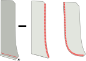
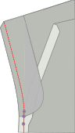

## Étape 1 : Fermer les pinces du dos

La première chose que nous allons faire est de fermer la pince sur le panneau arrière.

Pour cela, pliez le panneau arrière double _endroit contre endroit_ en s'assurant de faire correspondre les deux côtés de la pince.

Maintenant coudre la pince, assurez-vous d'utiliser un point court, et de coudre jusqu'à la fin de la pince, même quelques points en dehors du tissu.

<Note>

Vos pinces de dos doivent avoir la même longueur. Assurez-vous de les coudre avec précision.

</Note>

## Étape 2 : Construire les poches arrière

Suivez [nos instructions](/docs/sewing/double-welt-pockets/) pour créer les poches passepoilées.

<Note>

Comme il s'agit de chinos, vous pouvez/devriez surpiquer autour de l'ouverture.
Ce n'est pas strictement nécessaire pour les poches passepoilées, et généralement pas fait sur un pantalon classique (et donc ne devrait pas dans les instructions) mais c'est une fin très typique pour les chinos, et facilite le maintien de tout en place.

</Note>

### Attacher la poche arrière face au fond de poche

Joignez la poche arrière face au fond de poche en les plaçant _endroit contre endroit_ et en cousant le long des coutures les plus longues de la face non incurvée.

Lorsque vous avez terminé, pressez sur le côté du fond de poche.

### Attacher le fond de poche arrière

Coudre le bas du fond de poche au rabat du bas. Pressez dessus lorsque vous avez terminé.

Alignez maintenant le dessus du fond de poche avec la taille et cousez-le dans la marge de couture de la taille.

### Fermer l'arriere de poche

Repliez le panneau de la jambe hors du chemin de couture pour pouvoir fermer les deux côtés du fond de poche.

<Note>

Assurez-vous également de coudre la poche sur le fond de poche

</Note>

Vous devriez surjeter les côtés du fond de poche pour qu'ils ne s'effilochentpas.

<Tip>

Si vous n'avez pas de surjeteuse vous pouvez toujours utiliser un point zig-zag à la place.

</Tip>

## Étape 3 : Surjetez les bords avant et arrière

Avant d'aller plus loin, nous surjeter les bords des panneaux avant et arrière des jambes. Assurez-vous également de prendre le dessus du fond de poche lorsque vous faites les panneaux arrière.

Ce que nous voulons empêcher ces bords de s'effilocher une fois que nous avons terminé notre pantalon. Maintenant c'est le meilleur moment pour le faire.

## Étape 4 : Construire l'ouverture de la poche avant

Les poches avant sont un peu inhabituelles parce qu'elles ont l'apparence de poches inclinées classiques, mais sont construites sur la couture latérale.

### Fixer les parements de la poche avant aux poches

Nous avons deux fonds de poche avant, qui ont chacun deux pièces de parement pour les attacher.

Alignez-les _endroit contre endroit_ (\*) et cousez le parement.

<Note>

(\*) Avec un fond de poche, il n'est pas si évident de savoir quel devrait être l'endroit.

Voulez-vous que l'endroit soit ce que vous touchez lorsque vous mettez votre main dans votre poche ?
Ou vous voulez que ce soit ce que vous voyez quand votre pantalon est allongé sur le sol avec leur intérieur ouvert.

Il n'y a pas de bonne ou mauvaise réponse ici. Faites comme vous voulez.

</Note>

### Marquer le cran de poche sur le parement de la poche et sur les panneaux de la jambe avant et arrière

Il y a un cran sur les panneaux des jambes avant et arrière qui indique l'alignement de la poche avec la couture latérale.

Assurez-vous de marquer ce cran à la fois sur le bord de la parementure et sur la jambe du pantalon avant, car il est important qu'ils soient alignés.

### Épingler ou batir la poche sur le panneau avant et arrière de la jambe

À l'avant et à l'arrière, nous allons coudre le parement à la couture latérale.

Cependant, cela doit être précis, donc vous voulez vraiment vous assurer que vous l'épinglez ou que vous le bâtissez.

<Note>

Commencez avec l'avant, c'est la couture la plus facile. Une fois que vous avez un peu d'entraînement, vous pouvez faire l'arrière.

</Note>

### Coudre la poche avant

Coudre de la taille vers le bas à droite jusqu'au cran qui indique où s'arrêter.

### Repassez la poche avant

Repassez maintenant les bords de la poche avant, tant sur le panneau arrière que sur le panneau avant, de sorte que le pli soit net.

## Étape 5 : Fermer la couture extérieure

### Bâtissez les poches avant fermées

Je vous conseille fortement de bâtir la fermeture de poche en place avant de coudre pour que vous sachiez qu'elle est précise.

Fermer la couture extérieure veut dire placer le panneau avant et arrière endroit contre endroit, et coudre la couture extérieure. C'est assez facile aux jambes, mais en haut nous avons la poche, ce qui complique les choses.

### Coudre le haut de la couture extérieure jusqu'au cran supérieure de la poche

Assurez-vous que tout est bien aligné. Coudre ensuite du haut de la taille jusqu'au cran supérieur (soit un peu plus d'un cm ou un demi pouce).

### Coudre le bas de la couture extérieure depuis le cran inférieur de la poche

Déplacez maintenant à l'encoche inférieure de la tige de poche, et cousez à partir de là jusqu'au bas des jambes.

### Repassez sur la couture extérieure ouverte

Lorsque vous avez terminé, assurez-vous de repasser la marge de couture ouverte le long de la jambe. Ne repassez pas sur la poche, nous l'avons déjà fait.

## Étape 6 : Terminer le fond de poche avant

### Coudre le fond de poche à l'intérieur

Avec notre ouverture de poche réalisée et couture extérieure fermée, nous devrions maintenant finir le fond de poche.

Sortez le fond de poche pour qu'il se prolonge à l'extérieur de la jambe de pantalon. Placez ensuite les deux moitiés ensemble et soit utilisez une surjeteuse pour finir le bord, soit cousez près du bord.

Assurez-vous de finir le point où la couture des jambes se termine.

### Terminer les bords des poches

Lorsque vous avez terminé, vous pouvez retourner le fond de poche à l'intérieur de la jambe du pantalon.

Notre fond de poche est maintenant fermé, mais lorsque nous y mettons la main, vous pouvez sentir le bord brut de la couture. Pour éviter cela, piquez le long du bord du fond de poche pour l'enfermer dans la marge de couture (façon couture anglaise).

<Note>
Si votre marge de couture est large, vous pourriez vouloir la recouper en premier.
</Note>

## Étape 7 : Renfort de l'ouverture de poche

Placez la jambe vers le bas avec l'endroit vers le haut, en s'assurant que le fond de poche est à plat et vers le panneau avant.

Maintenant en haut et en bas de la poche, placez un point d'arrêt (bourdon) perpendiculaire à la couture extérieure.

## Étape 8 : Fermer la couture intérieure

Une fois les poches avant terminées, fermez la couture des deux jambes.

Lorsque vous avez terminé, ouvrez la couture au fer.

## Étape 9 : Fermer la fourche

<tip>

Vérifie deux fois que tes jambes droite et gauche correspondent aux marques du patron. L'entrejambe de la jambe droite doit dépasser légèrement de la gauche. Reporte-toi au patron et coupe l'excédent sur la jambe gauche si nécessaire.

Il peut être précieux de marquer à la craie ou au fil l'**avant central** de chaque jambe. This will help you make sure the pieces are in the right place during fly construction.

</tip>

Assurez-vous qu'une jambe est retournée avec le bon côté dehors, et l'autre a le bon côté dedans.

Maintenant passez la jambe avec l'endroit à l'intérieur de la jambe qui a l'endroit dedans. De cette façon, elles sont endroit contre endroit.

Alignez la couture de fourche, à partir de la taille arrière, en fixant les deux moitiés ensemble pendant que vous vous dirigez vers la braguette. **Arrête-toi à l'encoche de la braguette** et assure-toi de faire un point arrière.

Quand vous avez terminé. Faites-le à nouveau. Coudre toujours la couture de fourche deux fois. C'est l'une de ces bonnes pratiques que vous ignorerez à vos propres risques.

<Tip>

Faites très attention à aligner soigneusement les coutures entre les panneaux arrières et les avants.
Ce faisant, vous assurerez que vos résultats de couture de fourche sont parfaitement alignés avec une _croix_ où 4 parties du patron se rencontreront en un seul point.

C'est une de ces choses que vous finirez par adorer chaque fois que vous les porterez.

</Tip>

## Étape 10: Construire la braguette

### Ferme la rallonge de la braguette et fais une surpiqûre

Repliez le rallonge de la mouche sur sa ligne de pliage avec de bons côtés ensemble.

Maintenant coudre le long du fond, pour fermer l'extension de la mouche.

Garnir la moitié de la marge de couture pour retirer en vrac avant de la retirer et de la presser sur le bon côté.

#### Serger l'extension de la mouche et faire face

Serge (ou zig-zag) le long du côté ouvert de l'extension de la mouche. Pas besoin de serrer le dessus car cela se fera prendre dans notre ceinture.

pendant que vous y êtes, aussi serez-vous le long de la totalité de la mouche face aux bords en forme de J.

### Fixer la face de la mouche

Couds le revers de la braguette à la jambe gauche. Tu vas coudre légèrement au-delà du point de couture transversale, alors fais attention à ne pas gêner le surplus de couture de la jambe droite et vise à coudre directement sur la ligne de couture transversale.

### Finis la face de la mouche

Coupe le parement de la braguette à la moitié de la marge de couture.  
Rentre la pointe de la braguette et fixe-la avec quelques points de couture. Couds le bord de la braguette jusqu'à la marge de couture. Repasse le surplus de couture vers le parement et sous-pique le parement pour une finition propre. Encore une fois, en gardant le surplus de couture de la jambe droite à l'écart.

### Couds la fermeture à glissière à l'extension de la braguette.

<tip>

**Longueur de la fermeture éclair**

Il est bon de s'assurer que ton arrêt de fermeture éclair se termine avant la ligne de points indiquée sur le modèle. Cela te permettra de ne pas coudre par-dessus ton arrêt de fermeture éclair et de réduire la tension sur le bas de la braguette. Si ta fermeture éclair est trop longue, tu peux faire un point zig zag de longueur 0 pour créer une nouvelle butée (uniquement sur la fermeture éclair elle-même).

</tip>

Fais un point de bordure le long du bord gauche de la fermeture à glissière jusqu'au bord surpiqué de l'extension de braguette pour la maintenir en place.

### Couds la jambe droite à la fermeture à glissière.

Commence par repasser le surplus de couture de la jambe droite sur l'arrière.

<tip>

N'oublie pas que la marge de couture commence légèrement à droite du devant central, le devant central est marqué en violet sur l'image, assure-toi de ne pas plier le long de la ligne du devant central par erreur.

</tip>

Veille à placer le bord plié de la jambe droite juste à gauche des dents de la fermeture éclair pour éviter que le tissu ne se prenne dans la fermeture.

Stop sewing at the top 'fly extension' notch, slightly above the cross seam, and be sure to backstitch. Si tu ne le fais pas, tu ne pourras pas maintenir l'extension hors du chemin lorsque tu couds la couture en J.

### Attache la fermeture à glissière au parement de la braguette.

Fais attention à aligner la jambe gauche sur le centre droit avant. It can be valuable to pin or baste through the facing and right side of the zipper tape. (Nous devons coudre le côté gauche de la bande de fermeture éclair à la jambe gauche). En t'assurant que tout est doublé, couds le parement de la braguette sur le côté gauche de la fermeture à glissière. Essaie de t'approcher de la fermeture éclair, mais pas trop.

### Coudre la couture J-de la mouche

<tip>

Use a piece of paper as a guide to sew the J seam, this can be cut from your pattern along the indicated stitch line.

</tip>

Désormais, renverser la soi-disant couture J-de la mouche. Assurez-vous de ne pas prendre le contrôle de l'extension du vol. Since you didn't sew all the way along the fly extension, you should be able to pin it out of the way.

#### Tape le bas de la mouche

Now, bartack the very bottom of the J-seam (the horizontal part) but this time make sure to also catch the fly extension. Tu peux aussi choisir d'ajouter un point d'arrêt supplémentaire le long du joint en J (illustré en violet).

## Étape 11 : Fixer les boucles de ceinture

### Construire les boucles de ceinture

<Note>

For efficiency, we will construct one long strip of belt loop that we'll divide into 8 parts.

</Note>

Couper une bande de 80 cm de long (32 po) et de 2,8 cm de large (1 1/8 po).

Serge (ou zigzag) le bord long de la bande des deux côtés.

Plier un côté à l'intérieur, et l'autre côté dessus. Ensuite appuyez sur votre fer à repasser. Le résultat final devrait être une bande longue d'environ 1 cm de large.

Maintenant coudre sur toute la longueur de la bande, piquer au milieu de celle-ci. Assurez-vous d'utiliser une longueur de point généreuse pour cela.

Enfin, coupez votre bande de courroies de longueur en 8 parties égales pour faire 8 boucles de courroie.

### Attacher les boucles de ceinture

Nous allons diviser nos boucles de ceinture le long de la taille :

- 2 au centre arrière, chacun mis de côté un peu du centre donc il y a un petit écart entre eux.
- 1 au-dessus du dard arrière de chaque côté
- 1 de chaque côté plus ou moins où la couture latérale frapperait la taille si elle était droite vers le haut
- 1 de chaque côté à partir du centre devant. Pas trop près les uns des autres donc il n'y a pas de place pour les boucles de ceinture, mais pas trop loin non plus, donc ça ne semble pas bizarre

Place the belt loop at these places with their good side down (against the good side of the fabric of your trousers, and the top aligned with the waist) Sew this down in the seam allowance of the waist, making sure that they are perpendicular to the waistband.

## Étape 12 : Attacher la bande de taille

### Assembler une bande de taille courbée

Si vous faites une ceinture droite, glissez directement pour attacher la ceinture à l'extérieur.

Placez les deux bandes de taille avec de bons côtés ensemble, et cousez le long du haut de la ceinture (le bord plus court).

Coupez le surplus de couture de la ceinture intérieure et repassez tous les surplus de couture vers la ceinture intérieure.

Vous pouvez maintenant considérer votre ceinture assemblée comme une seule pièce et continuer comme pour la ceinture droite.

<Tip>
Pour vous assurer que la taille de votre ceinture intérieure ne fait pas de dérapage, vous pouvez _understitch_.
Coudre une ligne de couture sur la ceinture intérieure, près du bord, à travers la ceinture intérieure et les coutures (mais pas la ceinture!).
</Tip>

### Attacher la bande de taille à l'extérieur

Placez la ceinture avec de bons côtés le long de la taille. For the straight waistband, make sure the side with the standard seam allowance is aligned with the waist, and not the side with double seam allowance.

Also make sure to leave sufficient seam allowance beyond the start and end of the waistband.

Coudre le long de l'intégralité de la taille, attacher la bande de la taille et coudre les boucles de la ceinture en une seule fois.

### Appuyez sur la couture de la ceinture et pliez la ceinture

Appuyez sur la couture que vous venez de coudre en pressant la couture dans la ceinture.

Pliez maintenant la ceinture à la bonne largeur et appuyez dans le creux.

### Fermer le début et la fin de la ceinture.

Au début et à la fin, pliez la ceinture de façon à ce que les bons côtés soient réunis.

Maintenant coudre la fin fermée par la couture de haut en bas au point où se termine la couture de la ceinture.

Coupez un peu la couture afin de pouvoir la glisser plus tard dans la ceinture.

### Déposer la ceinture de taille en place

La ceinture a une marge de couture supplémentaire ici, et nous allons l'utiliser à notre avantage.

Pliez la ceinture dans le pli que vous avez pressé. Puis à l'intérieur, plissez la marge de couture à l'intérieur, en veillant à la laisser courir quelques mm au-delà de la couture de la ceinture.

Vous voulez badigeonner ceci en place pour qu'il reste mis au fur et à mesure que vous faites votre chemin autour de la ceinture.

Au début et à la fin de la ceinture, vous devrez ajouter une marge de couture. Prenez un moment pour y parvenir.

### Coudre la ceinture

Maintenant avec le bon côté vers le haut, coudre exactement dans la couture qui a été cousue avant (appelé _point dans le fossé_).

Cela accrochera l'arrière de la ceinture que nous avons fait pour aller un peu plus loin, et verrouille toute la marge de couture à l'intérieur.

## Étape 13: Finaliser les boucles de ceinture

### Coudre les boucles de la ceinture pour les agrandir

It's best to make the belt loops a bit wider than the waistband, to accommodate wider belts.

Pour ce faire, mettez la ceinture à plat et cousez-la avec un point d'arrêt situé à environ 1,5 cm (un demi pouce) sous la ceinture.

### Pliez vers le haut, vers le bas, et coudez vers le bas

Maintenant pliez la ceinture vers le haut (cachant l'écorce que vous venez de faire).

Ils s'étendront au-delà du haut de la ceinture. Repliez l'excès à nouveau. Ne la pliez pas sur la ceinture, mais pliez-la sur elle-même.

Maintenant, faites un bartack le long du haut de la ceinture pour verrouiller la boucle de la ceinture.

Lorsque vous avez terminé, tordez soigneusement l'arrière de la boucle de ceinture sur le devant et coupez l'excédent juste à côté de la boucle.

<Note>

Faites attention à ne pas abîmer le devant de votre pantalon vers le dos.

Vérifiez à deux reprises que vous n'avez pas de calques supplémentaires sous votre aiguille car désélectionner un écorchon n'est pas une joie.

</Note>

## Étape 14 : Entailler le pantalon

Plier la marge d'ourlet à mi-chemin et presser. Puis pliez-les à nouveau et appuyez à nouveau.

Finalisez votre pantalon à la main et à l'ourlet aveugle.

## Étape 15 : Bouton sur trou de bouton

Créer un trou de bouton. Soit à la main (cela vaut la peine d'être pratiqué) soit avec une machine.

Enfin, attachez le bouton.

Prenez maintenant un moment pour apprécier tout le travail acharné que vous avez fait. Nous espérons que vous en ferez bon usage.
