## Stap 1: Sluit de neep op de rug

First thing we're going to do is close the waist dart on the back panel.

To do so, fold the back panel double with _good sides together_ making sure to match both sides of the dart on top of each other.

Now sew the dart close, making sure to use a small stitch length, and to sew all the way to the end of the dart, even a couple of stitches off the fabric.

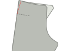

<Note>

Je achterste nepen moeten even lang zijn. Let op dat je ze precies stikt.

</Note>

## Stap 2: Maak de achterzakken

Follow [our double welt pocket instructions](/docs/sewing/double-welt-pockets/) to create the back welt pockets.

<Note>

Omdat dit chino's zijn, kan je niet /should edgestitch rond de paspelopening.
It's not strictly required for welt pockets, and typically not done on classic trousers (and thus not shown in
the instructions) but it's a very typical finish for chinos, and makes it easier to keep everything in place.

</Note>

### Bevestig het beleg van de achterzak aan het zakdeel

Join the back pocket facing to the pocket bag by placing them with _good sides together_ and sewing along the longest of the non-curved seams of the facing.

When you're done, press the seam allowance to the side of the pocket bag.

### Bevestig het achterzakdeel

Sew the bottom of the pocket bag to the bottom welt. Press it down when done.

Now align the top of the pocket bag with the waist and sew it down in the waist's seam allowance.

### Sluit het zakdeel

Fold the leg panel out of the way so you can close both sides of the pocket bag.

<Note>

Stik de paspels ook vast aan het zakdeel

</Note>

You should overlock/serge the sides of the pocketbag so they don't ravel.

<Tip>

Als je geen _serger_ hebt, kun je in plaats daarvan een zigzagsteek gebruiken.

</Tip>

## Stap 3: Overlock de voor- en achterkanten

Before we go any further, we'll overlock/serge the edges of the front and back panels of the legs. Make sure to also catch the top of the pocket bag when doing the back panels.

What we want to to prevent these edges from ravelling after we've completed our trousers, and now is the best time to do so.

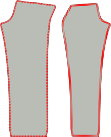

## Stap 4: Maak de zakopening

The front pockets are a little unusual because they have the appearance of classic slanted pockets, but are constructed on the side seam.

### Bevestig de belanden van de steekzak aan de zakdelen

We have two front pocket bags, that each have two pieces of facing to attach to them.

Align them with _good sides together_ (\*) and sew the facing in place.

<Note>

(\*) Met een zakdeel is het niet zo duidelijk wat de goede kant zou moeten zijn.

Wil je dat de goede kant is wat je voelt als je je hand in je zak stopt?
Of wilt u dat het is wat u ziet wanneer uw broek op de vloer ligt en hun ingewanden laten zien.

Er is hier geen juist of verkeerd antwoord. Jullie doen jullie.

</Note>

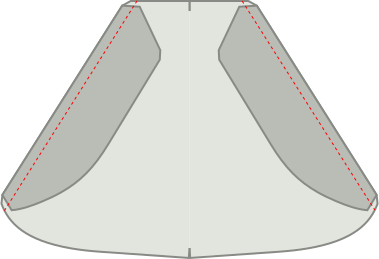

### Markeer het zakmerkteken op de voor- en achterste delen van de zak

There's a notch on both front and back leg panels that indicates up to what point the pocket facing should be attached to the side seam.

Make sure to transfer this notch to both the (edge of the) pocket facing and the front trouser leg, since it's important we match them.

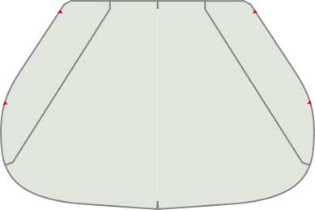

### Speld of geef de zak op het voor- en achterste deel

Both on the front and the back leg panel, we're going to sew the pocket facing to the side seam.

However, this needs to be precise, so you really want to make sure you either pin or baste it in place.

<Note>

Begin met de voorkant, want dat is de makkelijkste naad. Zodra je een oefening hebt, kan je de rug doen

</Note>

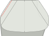

### Stik de voorzak vast

Sew from the waist down right until the notch that indicates where to stop.

### Strijk de voorste steekzak

Now press the slant of the front pocket, both on the back and front panel, so that it's a sharp crease.

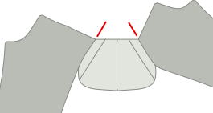

## Stap 5: Sluit de buitennaad

### Drieg de voorzakken dicht

I strongly advise you to baste the pocket shut/in place before sewing this seam so that you know it's precise.

Closing the outseam means to place front and back panel with good sides together, and sew the outer seam. That's easy enough at the legs, but at the top we have our pocket, which complicates things.

### Stik de bovenrand van de buitenste naad tot het bovenste merkteken van de zakopening

Make sure everything is neatly aligned. Then sew from the top of the waist down to the top notch (this is just over a cm or half an inch).

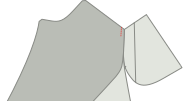

### Stik de onderkant van de buitenste naad vanaf het onderste merkteken van de zakopening

Now move to the bottom notch of the pocket slant, and sew from there all the way to the bottom of the legs.

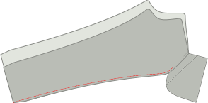

### Strijk de buitenste naad open

When you're done, make sure to press the seam allowance open along the leg. Don't press the pocket, we already did that.

## Stap 6: Werk het voorste zakdeel af

### Stik zakdeel dicht bij binnenzijde

With our pocket opening constructed and outer seam closed, we should now finish the pocket bag.

Pull the pocket bag out so that it dangles on the outside of the trouser leg. Then place both halves together and either use a serger to finish the edge, or sew closely to the edge.

Make sure you end up at the point where the bottom part of the outer seam starts.

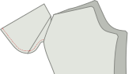

### Werk de rand van het zakdeel af

When you're done, you can flip the pocket bag back to the inside of the trouser leg.

Our pocket bag is now closed, but when we put our hand in it, you can feel the raw edge of the seam allowance. To avoid that, topstitch along the edge of the pocket bag, locking in the seam allowance.

<Note>
Als je naadwaarde breed is, zou je hem eerst terug kunnen bijknippen.
</Note>

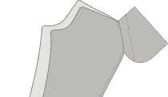

## Stap 7: Bevestig de zakopening

At the place the leg down with the good side up, making sure the pocket bag lies flat and towards the front panel.

Now at the top and bottom of the pocket opening, place a bar-tack perpendicular to the outer seam.

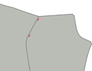

## Stap 8: Sluit de binnennaad

With our front pockets finished, close the inseam of both legs.

When you're done, press open the inseam.

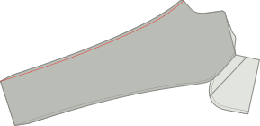

## Stap 9: Sluit de kruisnaad

Make sure one leg is turned with the good side out, and the other has the good side in.

Now tuck the leg with the good side out inside the leg that has the good side in. This way, they have their good sides against each other.

Align the cross seam, starting at the back waist, pinning both halves together as you make your way towards the fly. Stop at the lowest fly notch.

When you're done. Do it again. Always sew the cross seam twice. It's one of those best practices you ignore at your own peril.

<Tip>

Let op dat de naden waarbij de achterpanden aan beide broekspijpen en voorpanden aan elkaar bevestigd zijn, zorgvuldig op elkaar worden afgestemd.
Dit zorgt ervoor dat de kruisnaadresultaten perfect zijn uitgelijnd _kruis_ waar 4 patroondelen elkaar op één punt ontmoeten.

Het goed doen is een van die dingen die je uiteindelijk altijd zal koesteren wanneer je dit draagt.

</Tip>

## Stap 10: Maak de gulp

### Sluit gulp extensie

Fold the fly extension on its fold line with good sides together.

Now sew along the bottom, to close the fly extension.

Trim back one half of the seam allowance to remove bulk before turning it good side out and pressing.

### Serveer de vliegextensie en vlieg met beleg

Serge (or zig-zag) along the open side of the fly extension. No need to serge the top as that will get caught in our waistband.

while you're at it, also serge along the entirety of the fly facings J-shaped edge.

### Knip de extra naadwaarde aan het linkervoorpand weg

There's extra seam allowance that runs along the fly. We only need this on the right leg panel. Cut it away on the left panel so you're left with the regular seam allowance only.

### Bevestig het gulpbeleg

Sew the fly facing to the left front. Place them with good sides together, aligning the top.

### Trek in de punt van de gulp

Fold the bottom of the fly facing seam allowance inwards and secure with a few stitches.

### Stik de gulp naar de naad door

Sew the fly facing to the seam allowance. Make sure to leave the front panel out of it.

### Strijk de kruisnaad, guld en de gulpdeel

Press open the cross seam. Press the fly facing to the side.

Then, fold over the extra seam allowance on the right front leg and press it down.

### Drieg de rits naar de gulp extensie

Place the zipper along the (slightly curved) edge of the fly extension.

Now sew along the edge. No need to get close to the zipper, just sew along the edge to hold them in place.

### Bevestig de rits aan de gulp

Now place the right front leg's fly with the extra seam allowance that you folded back on top of the zip.

Use a zipper foot edge-stitch the folded-over edge along the zipper edge.

<Tip>

Misschien wil je dit eerst driegen om ervoor te zorgen dat het aardig parallel is met de rits. Sluiten, maar niet te dichtbij.

</Tip>

### Stik de rits aan de gulpbeleg

Now sew the other side of the zipper to the fly facing. Make sure to align it properly so that when the trousers are closed, the zip is hidden.

### Werk de kruisnaad af

Sew the last bit of the cross seam up to the highest fly notch.

### Stik de J-naad van de gulp

Now topstitch the so-called J-seam of the fly. Make sure to keep the fly extension out of the way.

### Balk de onderkant van de gulp aan

Now bartack the very botton of the J-seam (the horizontal part) but this time make sure to also catch the fly extension.

## Stap 11: Bevestig de riemlusjes

### Bouw de riemlusjes

<Note>

Voor de efficiëntie, zullen we een lange strook riem herhalen die we in 8 delen zullen verdelen.

</Note>

Cut a strip 80cm long (32 inch) and 2.8cm wide (1 1/8 inch).

Serge (or zigzag) the long edge of the strip on both sides.

Fold one side inwards, and the other side over it. Then press down with your iron. The end result should be a long strip about 1cm wide.

Now sew along the entire length of the strip, smack in the middle of it. Make sure to use a generous stitch length for this.

Finally, cut your length belt loops strip into 8 equal parts to make 8 belt loops.

### Bevestig de riemlusjes

We're going to divide our belt loops along the waist:

- 2 aan de middenrug, elke zet een beetje apart van het midden, dus er is een kleine opening tussen hen.
- 1 boven de achterste neep op elke zijde
- 1 aan elke kant min of meer waar de zijnaad de taille zou raken als het recht omhoog zou gaan
- 1 op elke kant van het middenvoorpand. Niet te dicht bij elkaar dus er is geen plaats voor gordels, maar ook niet te ver dus het ziet er niet raar uit

Place the belt loop at these places with their good side down (against the good side of the fabric of your trousers, and the top aligned with the waist) Sew this down in the seam allowance of the waist, making sure that they are perpendicular to the waistband.

## Stap 12: Bevestig de tailleband

### Montagegebogen tailleband

If you're making a straight waistband, skip directly to attaching the waistband to the outside.

Place both waistbands with good sides together, and sew along the top of the waistband (the shorter edge).

Trim the seam allowance of the inner waistband, and press all seam allowances towards the inner waistband.

You can now treat your assembled waistband as one piece, and continue as for the straight waistband.

<Tip>
Om ervoor te zorgen dat de tailleband van je innerlijke tailleband niet knippert, kun je _onderstik_.
Stik een lijn van stiksel aan de binnenkant van de tailleband, dicht bij de rand, door de binnenste tailleband en naadvogels (maar niet de buitenste tailleband!).
</Tip>

### Bevestig de tailleband aan de buitenkant

Place the waistband with good sides together along the waist. For the straight waistband, make sure the side with the standard seam allowance is aligned with the waist, and not the side with double seam allowance.

Also make sure to leave suffucient seam allowance beyond the start and end of the waistband.

Sew along the entirety of the waist, attaching the waist band and sewing down the belt loops in one go.

### Strijk de naad van de tailleband en plooi de tailleband

Press the seam you just sewed, pressing the seam allowance up into the waistband.

Now fold over the waistband at the correct width and press in the crease.

### Sluit het begin en einde van de tailleband.

At the start and end, fold the waistband over so it has its good sides together.

Now sew the end shut by sewing top to bottom to just the point where the waistband seam ends.

Trim back the seam allowance a bit so you can tuck it all into the waistband later.

### Drieg de tailleband vast

The waistband has extra seam allowance here, and we're going to use that to our advantage.

Fold the waistband in the fold you pressed. Then on the inside, fold the seam allowance inwards, making sure to let it run a few mm beyond the waistband seam.

You want to baste this in place so it stays put as you make your way around the waistband.

At the start and end of the waistband, you'll need to tuck in some more seam allowance. Take a moment to get it right.

### Stik de tailleband dicht

Now with the good side up, sew exactly in the seam that was sewn before (so called _stitch in the ditch_).

This will catch the back of the waistband which we've made to extend slightly further, and lock all the seam allowance inside.

## Stap 13: Voltooi de riemlusjes

### Stik de riemlusjes vast om ze breder te maken

It's best to make the belt loops a bit wider than the waistband, to accomodate wider belts.

For this, let the waistband lie flat, and sew it down with a bartack 1.5cm or so (half an inch) below the waistband.

### Plooi omhoog, neer en stik vast

Now fold the belt loops upwards (hiding the bartack you just did).

They'll extend beyond the top of the waistband. So fold the excess down again. Don't fold it over/around the waistband, but fold it double on itself.

Now do a bartack along the top of the waistband to lock the belt loop in place.

When you're done, carefully twist the back of the beltloop to the front and cut off the excess right next to the bartack.

<Note>

Wees voorzichtig om de voorkant van je broek niet achteraan te slaan.

Dubbel check je met geen extra lagen onder je naald omdat het geen vreugde is om een stack los te maken.

</Note>

## Stap 14: Zoom de broek

Fold the hem allowance halfway up, and press. Then fold them again, and press again.

Finalize by hand and blind hem your trousers.

## Stap 15: Knop op het knoopsgat

Create a buttonhole. Either by hand (it's worth practicing) or with a machine.

Finally, attach the button.

Now take a moment to appreciate all the hard work you did. We hope you'll get a lot of use out of these.
