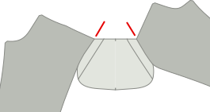

## Крок 1: Закрийте задню виточку

Перше, що ми зробимо, це закриємо талію на задньому полотнищі.

Для цього складіть задню панель вдвічі лицьовими _сторонами разом,_ переконавшись, що обидві сторони виточки накладені одна на одну.

Тепер зашийте виточку, використовуючи невелику довжину стібка, і прошийте до кінця виточки, навіть на кілька стібків від тканини.

<Note>

Виточки на спині повинні бути однакової довжини. Переконайтеся, що вони рівно пришиті.

</Note>

## Крок 2: Конструюємо задні кишені

Дотримуйтесь [наших інструкцій по створенню кишень з подвійним швом](/docs/sewing/double-welt-pockets/) , щоб створити задні кишені з подвійним швом.

<Note>

Оскільки це брюки-чинос, ви можете/повинні прострочити кант навколо отвору для шва.
Він не є обов'язковим для прорізних кишень, і зазвичай не робиться на класичних брюках (і тому не показаний в інструкції
), але це дуже типова обробка для чінос, яка дозволяє легше тримати все на місці.

</Note>

### Прикріпіть задню кишеню лицьовою стороною до кишенькової сумки

Пришийте обшивку задньої кишені до сумки-кишені, поклавши їх _лицьовими боками разом_ і зшивши вздовж найдовшого з незагнутих швів обшивки.

Закінчивши, притисніть припуск на шов до бокової сторони кишенькової сумки.

### Прикріпіть сумку до задньої кишені

Пришийте дно кишенькової сумки до нижнього шва. Натисніть на нього, коли закінчите.

Тепер сумістіть верхню частину кишенькової сумки з талією і пришийте її до припуску на шов талії.

### Закрийте кишеню назад

Відкиньте панель для ніг, щоб можна було закрити обидві сторони кишенькової сумки.

<Note>

Не забудьте також зшити шви кишень на сумці-кишені

</Note>

Щоб боки кишенькової сумки не бовталися, їх слід обробити оверлоком/строчити, щоб вони не задиралися.

<Tip>

Якщо у вас немає "сергера", ви завжди можете використати зигзагоподібну строчку.

</Tip>

## Крок 3: Обробіть оверлоком передній і задній краї

Перш ніж ми продовжимо, ми обробимо оверлоком/строчкою краї передньої та задньої панелей ніжок. Не забудьте також зачепити верх кишенькової сумки, коли будете робити задні панелі.

What we want to to prevent these edges from ravelling after we've completed our trousers, and now is the best time to do so.

## Крок 4: Побудуйте отвір передньої кишені

Передні кишені дещо незвичні, адже вони мають вигляд класичних косих кишень, але виконані в боковому шві.

### Прикріпіть обшивки передніх кишень до кишенькових сумок

У нас є дві передні кишенькові сумки, кожна з яких має по два шматки облицювання, щоб прикріпити до них.

Вирівняйте їх _лицьовими сторонами разом_ (\*) і пришийте обшивку на місце.

<Note>

(\*) З кишеньковою сумкою не так очевидно, якою має бути хороша сторона.

Ви хочете, щоб гарною стороною було те, що ви відчуваєте, коли опускаєте руку в кишеню?
Або ви хочете, щоб це було те, що ви бачите, коли ваші штани лежать на підлозі з вивернутими нутрощами.

Тут немає правильної чи неправильної відповіді. Ти - це ти.

</Note>

### Розмітьте виїмку кишені на обшивці кишені, а також на передній і задній панелях ніжок

На передніх і задніх панелях штанин є надсічка, яка вказує, до якої точки обшивка кишені повинна бути пришита до бокового шва.

Не забудьте перенести цю надсічку на лицьовий бік кишені і на передню штанину, оскільки важливо, щоб вони збігалися.

### Прикріпіть кишеню до передньої та задньої панелі ніжки

Як на передній, так і на задній частині штанин пришиваємо кишеню лицьовим боком до бокового шва.

Однак, це має бути точно, тому вам дійсно потрібно переконатися, що ви приколюєте або приклеюєте його на місце.

<Note>

Почніть з лицьового боку, оскільки це найпростіший шов. Після того, як ви трохи попрактикуєтесь, ви можете робити спину

</Note>

### Пришийте передню кишеню на місце

Шийте від талії вниз до надсічки, яка вказує, де зупинитися.

### Притисніть передню кишеню по косій лінії

Тепер притисніть скіс передньої кишені, як на задній, так і на передній панелі, так, щоб вийшла гостра складка.

## Крок 5: Зашийте виворітний шов

### Застебніть передні кишені

Я наполегливо раджу вам прострочити кишеню перед тим, як пришивати цей шов, щоб бути впевненими, що він буде точним.

Закриття виворітного шва означає, що передню і задню панелі потрібно скласти лицьовими сторонами один до одного і зшити зовнішній шов. В ногах це досить легко, але вгорі у нас є кишеня, що ускладнює справу.

### Зшийте верхній край зовнішнього шва до верхньої надсічки косої кишені

Переконайтеся, що все акуратно вирівняно. Потім прошийте від верхньої частини талії до верхньої надсічки (це трохи більше см або півдюйма).

### Зшийте низ зовнішнього шва від нижнього зрізу косої кишені

Тепер перейдіть до нижнього зрізу косої кишені і прошийте від нього до низу штанин.

### Розправте зовнішній шов

Закінчивши, не забудьте розпрасувати припуск на шов уздовж штанини. Не натискайте на кишеню, ми це вже робили.

## Крок 6: Закінчіть передню кишеню сумки

### Зшийте кишенькову сумку навиворіт

Зробивши отвір кишені і закривши зовнішній шов, ми повинні закінчити роботу над сумкою-кишенею.

Витягніть кишенькову сумку так, щоб вона звисала з зовнішньої сторони штанини. Потім складіть обидві половинки разом і або за допомогою сержечки обробіть край, або зшийте впритул до краю.

Переконайтеся, що ви дійшли до точки, де починається нижня частина зовнішнього шва.

### Обробіть край кишенькової сумки

Коли ви закінчите, ви можете перевернути кишенькову сумку назад на внутрішню сторону штанини.

Наша кишенькова сумка тепер закрита, але коли ми засовуємо в неї руку, можна відчути необроблений край припуску на шов. Щоб уникнути цього, прострочіть верхню строчку по краю кишенькової сумки, зафіксувавши припуск на шов.

<Note>
Якщо припуск на шов широкий, спочатку обріжте його назад.
</Note>

## Крок 7: Закріпіть отвір кишені планками

Покладіть ногу вниз лицьовою стороною догори, переконавшись, що кишенькова сумка лежить рівно і спрямована до передньої панелі.

Тепер зверху і знизу отвору кишені прикріпіть планку-закріпку перпендикулярно до зовнішнього шва.

## Крок 8: Зашийте шов

Коли передні кишені готові, закриваємо зшивання обох штанин.

Закінчивши, розправте шов.

## Крок 9: Закрийте поперечний шов

Переконайтеся, що одна нога повернута гарною стороною назовні, а інша - гарною стороною всередину.

Тепер заправте ногу виворітною стороною всередину ноги, яка знаходиться виворітною стороною всередину. Таким чином, вони мають свої позитивні сторони один проти одного.

Вирівняйте поперечний шов, починаючи з задньої частини талії, приколіть обидві половинки разом, просуваючись до ширінки. Зупиніться на найнижчій надсічці.

Коли закінчиш. Зроби ще раз. Завжди прошивайте поперечний шов двічі. Це одна з тих найкращих практик, яку ви ігноруєте на свій страх і ризик.

<Tip>

Зверніть особливу увагу на ретельне вирівнювання швів, де обидві ніжки з'єднуються задньою і передньою панелями.
Це забезпечить вам ідеально вирівняний поперечний шов, де 4 частини деталі перетинаються в одній точці.

Правильно підібраний розмір - це одна з тих речей, які ви будете цінувати кожного разу, коли вдягатимете їх.

</Tip>

## Крок 10: Сконструюйте мушку

### Закрийте подовжувач мушки

Складіть подовжувач мушки по лінії згину лицьовими сторонами разом.

Тепер прошийте по низу, щоб закрити розширення мушки.

Обріжте половину припуску на шов, щоб прибрати зайве, а потім виверніть на виворітний бік і припрасуйте.

### Обробіть подовжувач мушки та облицювання мушки

Серпантин (або зигзаг) вздовж відкритої сторони розвороту мушки. Не потрібно застібати верхню частину, оскільки вона буде зачіпатися за пояс.

також прострочіть по всій ширині кокетки J-подібну кромку.

### Зріжте зайвий припуск на ліву штанину спереду

Додатковий припуск на шов, що проходить вздовж ширинки. Нам це потрібно тільки на правій панелі для ніг. Відріжте його на лівій панелі так, щоб залишився лише припуск на звичайний шов.

### Прикріпіть лицьову сторону мушки

Мушку пришийте лицьовим боком до лівого лицьового боку. Покладіть їх добрими сторонами один до одного, вирівнявши верхню частину.

### Заправте кінчик мушки лицьовою стороною

Загніть нижній край мушки лицьовим боком всередину і закріпіть кількома стібками.

### Крайню строчку пришийте до ширинки лицьовим боком до припуску на шов

Пришийте мушку лицьовим боком до припусків на шви. Переконайтеся, що передня панель не задіяна.

### Припрасуйте поперечний шов, лицьову сторону мушки і край мушки

Розправте поперечний шов. Притисніть ширинку лицьовою стороною вбік.

Потім відверніть додатковий припуск на правій передній штанині і припрасуйте.

### Пришийте застібку-блискавку до подовжувача мушки

Помістіть блискавку вздовж (злегка вигнутого) краю розширювача ширинки.

Тепер прошийте по краю. Не потрібно наближатися до блискавки, просто прошийте по краю, щоб утримати її на місці.

### Прикріпіть блискавку до ширінки

Тепер прикладіть ширинку правої передньої штанини з додатковим припуском, який ви відвернули, до застібки-блискавки.

За допомогою лапки для застібки-блискавки прострочіть підвернутий край уздовж краю застібки-блискавки.

<Tip>

Можливо, ви захочете спочатку пришити її, щоб переконатися, що вона паралельна застібці-блискавці. Близько, але не надто близько.

</Tip>

### Пришийте застібку-блискавку до вивороту мушки

Тепер пришийте іншу сторону застібки-блискавки до лицьового боку мушки. Переконайтеся, що вирівняли її правильно, щоб коли штани закриті, застібка-блискавка була прихована.

### Виконайте поперечний шов

Пришийте останній шматок поперечного шва до найвищої надсічки.

### Зшийте J-образний шов ширінки

Тепер прострочіть так званий J-образний шов ширинки. Переконайтеся, що подовжувач мушки не заважає.

### Закріпіть нижню частину мушки

Тепер припрасуйте саму гудзик J-образного шва (горизонтальну частину), але цього разу не забудьте також прихопити подовжувач мушки.

## Крок 11: Прикріпіть петлі для ременя

### Створіть петлі для ременя

<Note>

Для ефективності ми сконструюємо одну довгу смужку ремінної петлі, яку розділимо на 8 частин.

</Note>

Відріжте смужку довжиною 80 см (32 дюйми) і шириною 2,8 см (1 1/8 дюйма).

Застрочіть (або зробіть зигзаг) довгий край смужки з обох боків.

Складіть одну сторону всередину, а іншу - поверх неї. Потім притисніть праскою. В результаті повинна вийти довга смужка шириною близько 1 см.

Тепер прошийте по всій довжині смужки, прострочіть посередині. Переконайтеся, що ви використовуєте достатню довжину стібка для цього.

Нарешті, розріжте смужку для поясних петель потрібної довжини на 8 рівних частин, щоб вийшло 8 поясних петель.

### Прикріпіть петлі для ременя

Ділимо петлі ременя вздовж талії:

- 2 по центру ззаду, кожна з них трохи відсунута від центру, щоб між ними був невеликий проміжок.
- 1 над задньою виточкою з кожного боку
- по 1 з кожного боку більш-менш там, де бічний шов досягав би талії, якби він йшов прямо вгору
- По 1 з кожного боку від центру спереду. Не надто близько один до одного, щоб не було місця для пряжок, але й не надто далеко, щоб це не виглядало дивно

Place the belt loop at these places with their good side down (against the good side of the fabric of your trousers, and the top aligned with the waist) Sew this down in the seam allowance of the waist, making sure that they are perpendicular to the waistband.

## Крок 12: Прикріпіть пояс

### Зберіть вигнутий пояс

Якщо ви робите прямий пояс, переходьте безпосередньо до пришивання пояса назовні.

Складіть обидва пояси лицьовими сторонами разом і зшийте по верхній частині пояса (по коротшому краю).

Обріжте припуски швів внутрішнього пояса і припрасуйте всі припуски швів до внутрішнього пояса.

Тепер ви можете розглядати зібраний пояс як єдине ціле і продовжити роботу, як з прямим поясом.

<Tip>
Щоб переконатися, що внутрішній пояс не визирає назовні, ви можете "підшити" його.
Прокладіть строчку на внутрішньому поясі, ближче до краю, через внутрішній пояс і шви припусків (але не через зовнішній пояс!).
</Tip>

### Прикріпіть поясний ремінь назовні

Покладіть пояс виворітними сторонами разом уздовж талії. Для прямого пояса переконайтеся, що сторона зі стандартним припуском на шов суміщена з талією, а не сторона з подвійним припуском на шов.

Також не забудьте залишити достатній припуск на шви за межами початку і кінця пояса.

Прошийте по всій довжині талії, прикріпивши пояс і пришивши петлі для ременя за один прийом.

### Притисніть поясний шов і складіть пояс

Притисніть шов, який ви щойно прошили, вдавлюючи припуск на шов вгору в пояс.

Тепер перегніть пояс на потрібну ширину і притисніть в складку.

### Закрийте початок і кінець пояса.

На початку і в кінці складіть пояс так, щоб він був виворітними сторонами один до одного.

Тепер зашийте кінець, прошиваючи зверху вниз до місця, де закінчується шов на поясі.

Трохи обріжте припуски на шви, щоб потім можна було заправити все це в пояс.

### Закріпіть пояс на місці

Пояс має додаткові припуски на шви, і ми використаємо це на нашу користь.

Складіть пояс у згин, який ви натиснули. Потім з внутрішньої сторони підігніть припуски шва всередину, переконавшись, що вони на кілька мм виходять за межі шва на поясі.

Вам потрібно приклеїти його на місце, щоб він залишався на місці, коли ви будете обходити навколо пояса.

На початку і в кінці пояса потрібно заправити ще трохи припусків на шви. Витратьте хвилинку, щоб зробити це правильно.

### Пришийте пояс щільно

Тепер виворітною стороною догори прошийте точно по тому шву, який був прошитий раніше (так званий _стібок у кюветі_).

Це зафіксує задню частину пояса, яку ми зробили трохи довшою, і зафіксує всі припуски швів всередині.

## Крок 13: Завершуємо петлі для ременя

### Зшийте петлі для ременя, щоб вони стали ширшими

Краще зробити петлі для ременя трохи ширшими, ніж для пояса, щоб можна було вдягати ширші ремені.

Для цього нехай пояс лежить рівно, і пришийте його на 1,5 см (півдюйма) нижче пояса.

### Складіть вгору, знову вниз і зшийте

Тепер складіть петлі ременя вгору (ховаючи щойно зроблену застібку).

Вони будуть виходити за верхню частину пояса. Складіть надлишки ще раз. Не складайте його через/навколо пояса, а складіть удвічі на собі.

Тепер зробіть закріпку вздовж верхньої частини пояса, щоб зафіксувати петлю пояса на місці.

Закінчивши, обережно виверніть петлю на лицьову сторону і відріжте надлишок прямо біля спинки.

<Note>

Будьте обережні, щоб не заправити передню частину штанів в задню.

Перевірте, чи немає зайвих шарів під голкою, тому що відколупувати закріплювач не дуже приємно.

</Note>

## Крок 14: Підшийте штани

Припуск на підгин складіть наполовину і припрасуйте. Потім знову складіть їх і натисніть ще раз.

Закінчіть вручну і підшийте штани потайним швом.

## Крок 15: Ґудзик у петлі

Зробіть петлю для ґудзика. Або вручну (варто потренуватися), або за допомогою машини.

Нарешті, прикріпіть ґудзик.

А тепер знайдіть хвилинку, щоб оцінити всю важку роботу, яку ви виконали. Ми сподіваємося, що вони стануть вам у пригоді.
