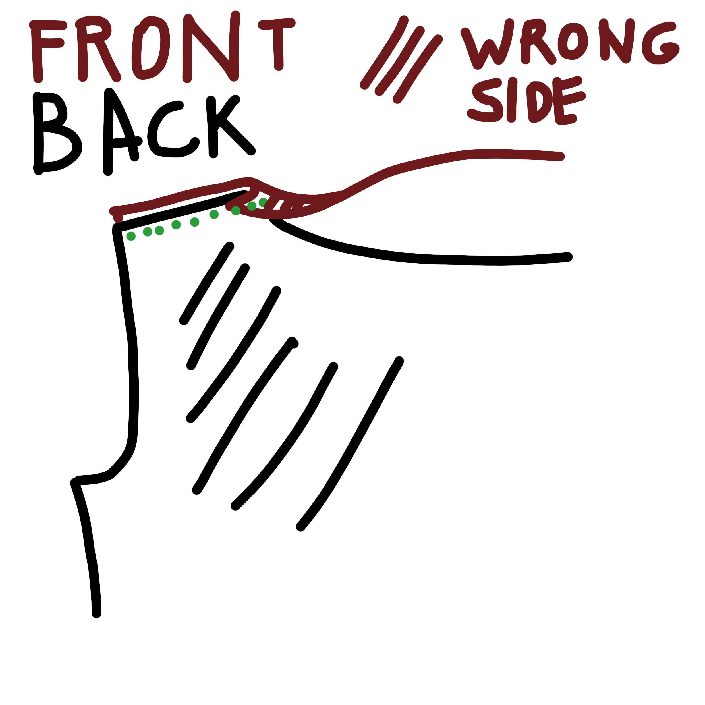

### Schritt 1: Versäubern der Nackennaht

- Schneide einen 3cm breiten Streifen in der Länge deiner Nackenlinie aus dem Shirtstoff zu.
- Bügle diesen auf der Längsseite ca. 1cm um.

<Tip>

Schneide den Streifen bei gewebten Stoffen als Schrägband zu.  
Schneide den Streifen bei gestrickten Stoffen (Jersey) so zu, dass sich der Streifen längs stärker dehnen lässt.

</Tip>

- Leg den Streifen _rechts auf rechts_ mit der ungebügelten Seite an die Nackenlinie.
- Näh den Streifen fest und versäubere die Kante.
- Klapp den Streifen über die Naht und _steppe_ diesen fest.

### Schritt 2: Schulternähte

- Versäubere die Kante des Ausschnitts je nach Stoffeigenschaften (wenn er nicht ausfranst, kannst du ihn einfach so lassen).
- Leg die Schulternähte vom vorderen und hinteren Stoffteil _rechts auf rechts_ aufeinander.
- Falte die Nahtzugabe des Ausschnitts über die linke Seite des Rückenteils.

<Note>

Wenn du einen sehr leichten Webstoff benutzt, kannst du diese Kante zusätzlich falten, sodass ein schmaler doppelter Saum entsteht (eventuell vorher bügeln).

</Note>

- Achte beim Zusammennähen der Schultern darauf, die offene Kante der Nackennaht in der Falte festzunähen.
- Wende das Shirt und bügle die Naht flach.

### Schritt 3: Ausschnitt versäubern

- Bügle den Saum, der durch die Falten an den Schultern entstanden ist, gleichmäßig um und steppe ihn knappkantig ab.

### Schritt 4: Ärmel annähen

Der Ärmel wird flach eingesetzt, das heißt, dass zuerst das Armloch genäht wird und danach der Ärmel und die Seitennaht in einem Zug geschlossen werden.

- Stecke den Ärmel _rechts auf rechts_ an das Armloch und achte auf die Markierungen.
- Wenn nötig, kann der Ärmel etwas eingehalten werden, sodass die Markierungen genau aufeinander liegen.
- Zusammennähen, versäubern und bügeln.
- Das Gleiche beim zweiten Ärmel wiederholen.

### Schritt 5: Seitennaht und Ärmel schließen

- Steck Vorder- und Rückenteil _rechts auf rechts_ zusammen und achte darauf, dass die Armlöcher genau aufeinander liegen.
- Zusammennähen, versäubern und bügeln.

### Schritt 6: Saum

- Versäubere die Ärmel und den Saum je nach Stoffeigenschaften.

<Note>

Das kann entweder ein klassischer Saum sein, bei dem der Stoff zweimal umgeklappt und abgesteppt wird. Der Stoff kann aber auch mit einer Overlock oder einem Zickzackstich versäubert werden und nur einmal umgeklappt und festgesteppt werden. Bei Stoffen, die nicht fransen kann die Kante auch einfach nur umgeklappt und festgenäht werden.

</Note>

### Schritt 7: Viel Spaß mit deinem neuen Shirt!

Fertig! Viel Spaß mit deinem neuen Shirt!
