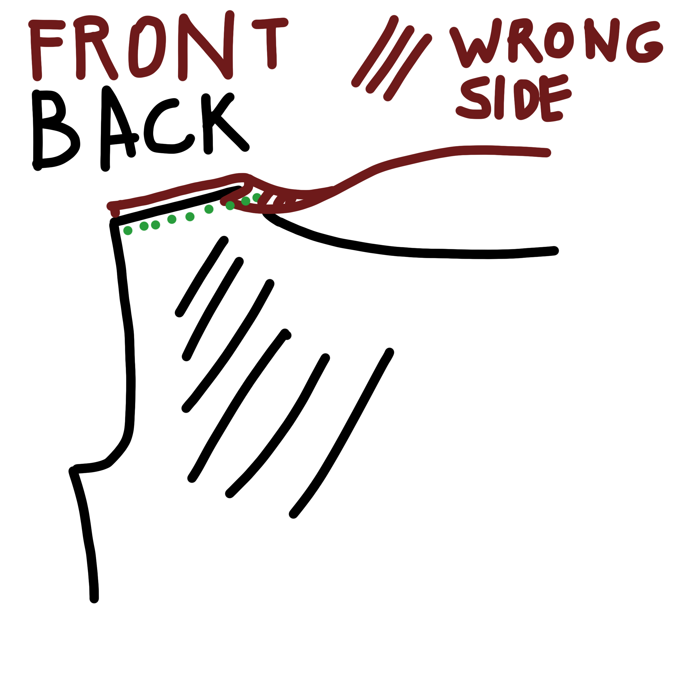

### Крок 1: Закінчіть виріз горловини спинки

- Виріжте смужку основної тканини довжиною до вирізу на спині і шириною близько 3 см.
- Притисніть складку до цієї смужки, на відстані 1 см від краю.

<Tip>

Для тканої тканини зробіть цю смужку зі зміщеним зрізом.  
Для трикотажного полотна зробіть смужку, розтягнувши тканину вздовж довгого краю.

</Tip>

- За допомогою _лицьовими боками разом_ сумістіть непідвернутий край смужки з вирізом горловини спинки.
- Пришийте планку до вирізу горловини спинки і обробіть шов.
- Відверніть смужку на виворітний бік тканини і _верхню строчку_ вздовж складеного краю, щоб утримати її на місці.

### Крок 2: Зшийте плечові шви

- Обробіть необроблений край на передньому вирізі горловини так, як вам підходить ваша тканина (якщо вона не обсипається, можете залишити його необробленим).
- Склавши _лицьовими сторонами разом_, накладіть передню частину на спинку, сумістивши плечові шви.
- Припуски шва горловини переду відверніть на виворітний бік спинки.

<Note>

Якщо у вас легка тканина, ви можете скласти цей край ще раз, щоб він утворив вузьку подвійну підшивку (можна спочатку притиснути ці складки).

</Note>

- Зшийте плечовий шов, загорнувши необроблений край вирізу горловини спинки в складку.
- Поверніться на правий бік і натисніть.

### Крок 3: Обробіть передній виріз горловини

- Притисніть підгин, що утворився в тканині від складок, які ви зробили в плечовому шві, коли закрили плече, і прострочіть впритул до краю.

### Крок 4: Прикріпіть рукава

Рукав буде вшитий плазом, тобто спочатку буде зшитий шов пройми, а потім рукав і боковий шов будуть закриті за один прохід.

- Склавши _лицьовими боками разом_, сумістивши надсічки, приколіть головку рукава вздовж пройми.
- Якщо необхідно, послабте головку рукава вгорі, між надрізами.
- Прошийте, обробіть і притисніть шов.
- Повторіть для іншого рукава.

### Крок 5: Зашийте боковий і рукавний шви

- Склавши _лицьовими сторонами разом_ приколіть передню частину до спинки вздовж рукавних і бокових швів, сумістивши шви пройм.
- Прошийте, обробіть і притисніть шов.

### Крок 6: Підшивання

- Обробіть рукава і нижні зрізи так, щоб вони гармоніювали з обраною вами тканиною.

<Note>

Знову ж таки, це може означати підгинання подолу вдвічі і _підшивання_, обробку необробленого краю сервером
або зигзагоподібною строчкою і підгинання вдвічі або залишення краю необробленим, підгинання вдвічі і
обрізку впритул до строчки.

</Note>

### Крок 7: Насолоджуйтесь!

Ви закінчили! А тепер насолоджуйтеся своїм новим топом!
