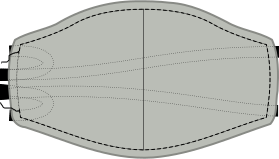

### Schritt 1: Füge die Mittelnaht zusammen

Join the curved seam that is center of our mask by placing the _good sides together_ and sewing them in place.

<Note>Wiederhole diesen Schritt sowohl für den äußeren Hauptstoff als auch für den inneren Futterstoff.</Note>

### Schritt 2 (optional): Die Mittelnaht bügeln

<Note>

Dieser Schritt hat keinen funktionellen Wert, er wird deine Maske nur besser aussehen lassen.
Wenn dir das also nicht allzu viel ausmacht, kannst du es gerne überspringen.

</Note>

Press the seam allowance on the center seam open so the seam lies nice and flat.

As this is a curved seam, it won't lay flat. But you can approach it with your iron from one side, then do the second half from the other side. Alternatively, you can use a tailor's ham or cushion to press.

<Note>Wiederhole diesen Schritt sowohl für den äußeren Hauptstoff als auch für den inneren Futterstoff.</Note>

### Schritt 3: Nähe den äußeren an den inneren Stoff und befestige die Bänder

Nun werden wir den inneren (Futter) an den äußeren (Haupt) Stoff nähen und die Bänder in einem Schritt anbringen.

- Lege deinen Futterstoff mit der guten Seite nach oben vor dich hin.
- Lege dann zwei Bänder an den Ecken einer Seite (in unserem Beispiel rechts) so an, dass sie ein wenig aus der Maske herausragen, das Band aber nach innen verläuft.
- Lege nun den Hauptstoff mit der guten Seiten nach unten darauf. Du solltest nun beide Schichten deiner Maske übereinander haben mit den _rechten Seiten zusammen_ und zwei Bänder, die zwischen ihnen eingeklemmt sind
- Pinne alle Schichten und Bänder aneinander, um sie an Ort und Stelle zu halten
- Jetzt mache das Gleiche auf der anderen Seite

<Tip>

Wenn du etwas Übung bekommst, wirst du feststellen, dass du dies nicht feststecken musst und die Bänder einfach einführen kannst, wenn du dich einer Ecke näherst.

</Tip>

Now sew around the mask, making sure to leave one side open so we can turn the mask inside-out later.

<Warning>

Achte darauf, dass sich keine Bänder in der Naht verfangen, außer dort, wo du das willst.
Führe sie entweder durch die Öffnung, die du auf einer Seite lässt, oder bündel sie zwischen den Masken deiner Ebene, um sie aus dem Weg zu halten.

</Warning>

### Schritt 4: Drehe die Maske von innen nach außen

Actually, your mask is inside-out now, so turning it inside out will mean we get it outside-out, or regular.

Just reach in through the side your left open and carefully pull the mask through to turn it.

### Schritt 5 (optional): Die Maske bügeln

<Note>

Dieser Schritt hat wenig funktionalen Wert, er wird deine Maske nur besser aussehen lassen.
Wenn dir das also nicht allzu viel ausmacht, kannst du es gerne überspringen.

</Note>

Now that the mask is as it should be, it's time to press it. Bevor du dies tust, stelle sicher, dass du die Nahtzugabe der Seite faltest, die wir nach innen offen gelassen haben, so dass wir sie flach drücken, als ob sie genäht wäre.

### Schritt 6: Schließe die offene Seite der Maske und nähe an der Kante um den Rand herum

Now it's time to close the side of our mask the we left open to turn it inside out.

Wir werden nicht nur die Öffnung verschließen, sondern auch die gesamte Maske mit Kantenstichen versehen, um unserer Maske eine zusätzliche Stabilität zu verleihen und das Futter im hinteren Bereich zu erhalten.

Make sure the open side is folded neatly inside, then edge-stitch around the entire mask.

### Schritt 7: Trage deine Maske oder nähe einen ganzen Stapel

That's it, you're done! You can now wear your mask.

Even better, make a bunch so you can give others masks too.
