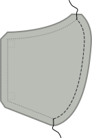

### Schritt 1: Füge die Mittelnaht zusammen

Füge die gekrümmte Naht, die die Mitte unserer Maske bildet, zusammen, indem du die _guten Seiten_ zusammenlegst und vernähst.

<Note>Wiederhole diesen Schritt sowohl für den äußeren Hauptstoff als auch für den inneren Futterstoff.</Note>

### Schritt 2 (optional): Die Mittelnaht bügeln

<Note>

Dieser Schritt hat keinen funktionellen Wert, er wird deine Maske nur besser aussehen lassen.
Wenn dir das also nicht allzu viel ausmacht, kannst du es gerne überspringen.

</Note>

Bügel die Nahtzugabe an der Mittelnaht auf, so dass die Naht schön flach liegt.

Da es sich um eine gekrümmte Naht handelt, wird sie nicht flach liegen. Aber du kannst dich mit deinem Bügeleisen von der einen Seite her nähern und dann die zweite Hälfte von der anderen Seite machen. Alternativ kannst du zum Bügeln ein Bügelei oder ein Kissen verwenden.

<Note>Wiederhole diesen Schritt sowohl für den äußeren Hauptstoff als auch für den inneren Futterstoff.</Note>

### Schritt 3: Nähe den äußeren an den inneren Stoff und befestige die Bänder

Nun werden wir den inneren (Futter) an den äußeren (Haupt) Stoff nähen und die Bänder in einem Schritt anbringen.

- Lege deinen Futterstoff mit der guten Seite nach oben vor dich hin.
- Lege dann zwei Bänder an den Ecken einer Seite (in unserem Beispiel rechts) so an, dass sie ein wenig aus der Maske herausragen, das Band aber nach innen verläuft.
- Lege nun den Hauptstoff mit der guten Seiten nach unten darauf. Du solltest nun beide Schichten deiner Maske übereinander haben mit den _rechten Seiten zusammen_ und zwei Bänder, die zwischen ihnen eingeklemmt sind
- Pinne alle Schichten und Bänder aneinander, um sie an Ort und Stelle zu halten
- Jetzt mache das Gleiche auf der anderen Seite

<Tip>

Wenn du etwas Übung bekommst, wirst du feststellen, dass du dies nicht feststecken musst und die Bänder einfach einführen kannst, wenn du dich einer Ecke näherst.

</Tip>

Nähe nun um die Maske herum und achte darauf, eine Seite offen zu lassen, damit wir die Maske später von innen nach außen drehen können.

<Warning>

Achte darauf, dass sich keine Bänder in der Naht verfangen, außer dort, wo du das willst.
Führe sie entweder durch die Öffnung, die du auf einer Seite lässt, oder bündel sie zwischen den Masken deiner Ebene, um sie aus dem Weg zu halten.

</Warning>

### Schritt 4: Drehe die Maske von innen nach außen

Eigentlich ist deine Maske jetzt von innen nach außen gedreht. Wenn wir sie also von innen nach außen drehen, erhalten sie das äußere nach außen, oder normal.

Greife einfach durch die linke Seite hinein und ziehe die Maske vorsichtig durch, um sie zu drehen.

### Schritt 5 (optional): Die Maske bügeln

<Note>

Dieser Schritt hat wenig funktionalen Wert, er wird deine Maske nur besser aussehen lassen.
Wenn dir das also nicht allzu viel ausmacht, kannst du es gerne überspringen.

</Note>

Nun, da die Maske so ist, wie sie sein sollte, ist es an der Zeit, sie zu bügeln. Bevor du dies tust, stelle sicher, dass du die Nahtzugabe der Seite faltest, die wir nach innen offen gelassen haben, so dass wir sie flach drücken, als ob sie genäht wäre.

### Schritt 6: Schließe die offene Seite der Maske und nähe an der Kante um den Rand herum

Jetzt ist es an der Zeit, die Seite unserer Maske zu schließen, die wir offen gelassen haben, um sie von innen nach außen zu drehen.

Wir werden nicht nur die Öffnung verschließen, sondern auch die gesamte Maske mit Kantenstichen versehen, um unserer Maske eine zusätzliche Stabilität zu verleihen und das Futter im hinteren Bereich zu erhalten.

Achte darauf, dass die offene Seite ordentlich nach innen gefaltet wird, und nähe dann um die gesamte Maske herum.

### Schritt 7: Trage deine Maske oder nähe einen ganzen Stapel

Das war's, du bist fertig! Du kannst jetzt deine Maske tragen.

Noch besser: Mache ein paar mehr, damit du anderen auch Masken geben kannst.
