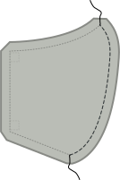
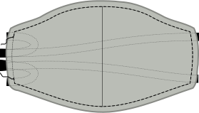
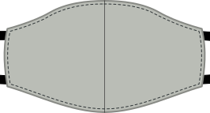

- - -
title: "Florence face mask: Sewing Instructions"
- - -

### Stap 1: Sluit de midden naad

Join the curved seam that is center of our mask by placing the _good sides together_ and sewing them in place.

<Note>Herhaal deze stap voor zowel de (buiten) stof als voor de voering.</Note>

### Stap 2 (optioneel): Strijk de middennaad

<Note>

Deze stap heeft geen functionele waarde, het zal je masker er alleen maar beter uitzien.
Dus als je daar niet te veel over doet, kan je het overslaan.

</Note>

Press the seam allowance on the center seam open so the seam lies nice and flat.

As this is a curved seam, it won't lay flat. But you can approach it with your iron from one side, then do the second half from the other side. Alternatively, you can use a tailor's ham or cushion to press.

<Note>Herhaal deze stap voor zowel de (buiten) stof als voor de voering.</Note>

### Stap 3: Stik de buitenste aan de binnenstof en bevestig lintjes

Now we will sew the inner (lining) fabric to the outer (main) fabric, and attach the ribbons all in one step.

- Leg je voering naar beneden met de goede kant omhoog.
- Plaats dan twee linten in de hoeken van één kant (rechts in ons voorbeeld) zodat ze een beetje uit het mouw pieken. maar het lint breidt zich naar binnen uit.
- Leg nu de hoofdstof bovenop met de goede kant stad. You should now have both layers of your mask on top of each other with _good sides together_ and two ribbons sandwiched between them
- Speld door linten en lagen om ze op hun plaats te houden
- Doe nu hetzelfde aan de andere kant

<Tip>

Als je wat oefening krijgt, je zult zien dat je dit niet hoeft te spelden en kan gewoon de
linten invoegen terwijl je een hoek nadert.

</Tip>

Now sew around the mask, making sure to leave one side open so we can turn the mask inside-out later.

<Warning>

Let op dat je geen linten in de naad vangt, behalve waar je ze wil.
Bewijs hen door de opening die u aan één kant verlaat of stel ze tussen
de maskers van je laag om ze buiten de weg te houden.

</Warning>

### Step 4: Draai het masker binnenstebuiten

Actually, your mask is inside-out now, so turning it inside out will mean we get it outside-out, or regular.

Just reach in through the side your left open and carefully pull the mask through to turn it.

### Stap 5 (optioneel): Druk op het masker

<Note>

Deze stap heeft weinig functionele waarde, het zal je masker er alleen maar beter uitzien.
Dus als je daar niet te veel over doet, kan je het overslaan.

</Note>

Now that the mask is as it should be, it's time to press it. Before doing so, make sure to fold the seam allowance of the side we left open inwards, so that we press it flat as if it was sewn.

### Stap 6: Sluit de zijkant van het masker, en skik helemaal rondom

Now it's time to close the side of our mask the we left open to turn it inside out.

We are not merely going to close the opening, but also edge-stitch around the entire mask to give our mask some extra stability, and keep the lining at the back.

Make sure the open side is folded neatly inside, then edge-stitch around the entire mask.

### Stap 7: Draag je masker of maak een stelletje

That's it, you're done! You can now wear your mask.

Even better, make a bunch so you can give others masks too.
