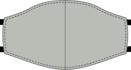

### Step 1: Join center seam

Join the curved seam that is center of our mask by placing the _good sides together_ and sewing them in place.

<Note>Repeat this step for both the outer (main) fabric, and the inner (lining) fabric.</Note>

### Step 2 (optional): Press the center seam

<Note>

This step has no functional value, it will only make your mask look better.
So if you're not too bothered about that, feel free to skip it.

</Note>

Press the seam allowance on the center seam open so the seam lies nice and flat.

As this is a curved seam, it won't lay flat. But you can approach it with your iron from one side, then do the second half from the other side. Alternatively, you can use a tailor's ham or cushion to press.

<Note>Repeat this step for both the outer (main) fabric, and the inner (lining) fabric.</Note>

### Step 3: Sew the outer to the inner fabric and attach ribbons

Now we will sew the inner (lining) fabric to the outer (main) fabric, and attach the ribbons all in one step.

- Place your lining fabric down with the good side up.
- Then, place two ribbons on the corners of one side (right in our example) so that they peak out just a bit from the mask, but the ribbon extends inwards.
- Now place the main fabric on top of this with the good side town. You should now have both layers of your mask on top of each other with _good sides together_ and two ribbons sandwiched between them
- Pin through ribbons and layers to keep them in place
- Now do the same on the other side

<Tip>

As you get some practice, you will find you don't need to pin this and can just insert the
ribbons as you approach a corner.

</Tip>

Now sew around the mask, making sure to leave one side open so we can turn the mask inside-out later.

<Warning>

Be careful not to catch any of the ribbons in the seam apart from where you want them to.
Either guide them through the opening you leave on one side, or bunch them up in between
the masks of your layer to keep them out of the way.

</Warning>

### Step 4: Turn the mask inside-out

Actually, your mask is inside-out now, so turning it inside out will mean we get it outside-out, or regular.

Just reach in through the side your left open and carefully pull the mask through to turn it.

### Step 5 (optional): Press the mask

<Note>

This step has little functional value, it will only make your mask look better.
So if you're not too bothered about that, feel free to skip it.

</Note>

Now that the mask is as it should be, it's time to press it. Before doing so, make sure to fold the seam allowance of the side we left open inwards, so that we press it flat as if it was sewn.

### Step 6: Close open side of the mask and edge-stitch around the edge

Now it's time to close the side of our mask the we left open to turn it inside out.

We are not merely going to close the opening, but also edge-stitch around the entire mask to give our mask some extra stability, and keep the lining at the back.

Make sure the open side is folded neatly inside, then edge-stitch around the entire mask.

### Step 7: Wear your mask or make a bunch

That's it, you're done! You can now wear your mask.

Even better, make a bunch so you can give others masks too.
