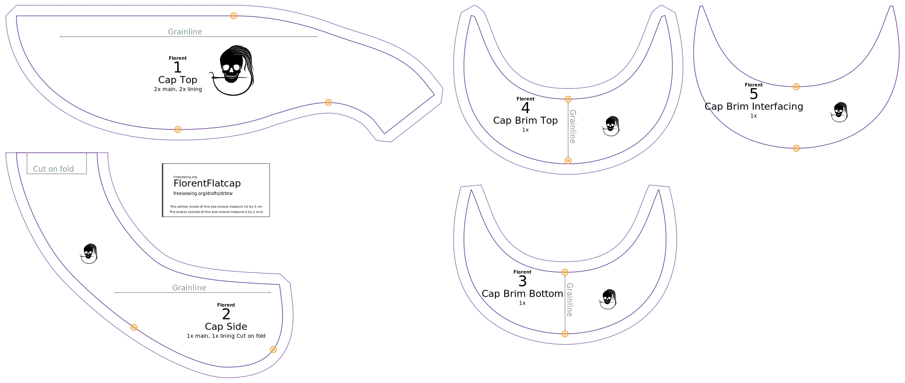

Selon la quantité de tissu disponible, il est possible de couper deux parties supérieures ou latérales, d'où les instructions sur le patron lui-même. Attention : Le motif inclut les limites de couture sur la partie supérieure donc si vous le coupez sur pli, ne les incluez pas !

La partie inférieure du bord est insérée, tandis que la partie supérieure du bord est décalée de sorte que la couture tombe « sous le bord du bord ». Gardez cela à l'esprit lorsque vous coupez les pièces et marquez-les en conséquence, afin que vous ne finissiez pas avec la couture au-dessus du bord (je ne veux pas vous forcer à ce choix de conception, Je voudrais simplement souligner la différence entre les parties afin que vous en soyez conscient et que vous agissiez en conséquence).

- **Tissu principal**
  - Coupez **1 haut** sur le pli mais n'incluez pas la marge de couture du centre, ou **2 haut** avec la marge de couture du centre.
  - Coupez **1 côté** sur le pli ou **2 côté**.
  - Couper **1 bord dessus**.
  - Coupez **1 bord au bas**.
- **Tissu de doublure**
  - Coupez **1 haut** sur le pli mais n'incluez pas la marge de couture, ou **2 haut** avec la marge de couture au centre.
  - Coupez **1 côté** sur le pli ou **2 côté**.
- **Plastique**
  - Coupez **1 bord en interface**. Collez la partie du motif en plastique, ne coupez pas les entailles dans le plastique, mais vous pouvez le marquer (graver, ou avec un marqueur permanent peut-être). Vous ne voulez pas vraiment de tranchant tranchant, alors assurez-vous que tout est lisse et arrondi un peu (surtout sur les côtés pointus).

Une disposition typique de Florent ressemble à ceci:

