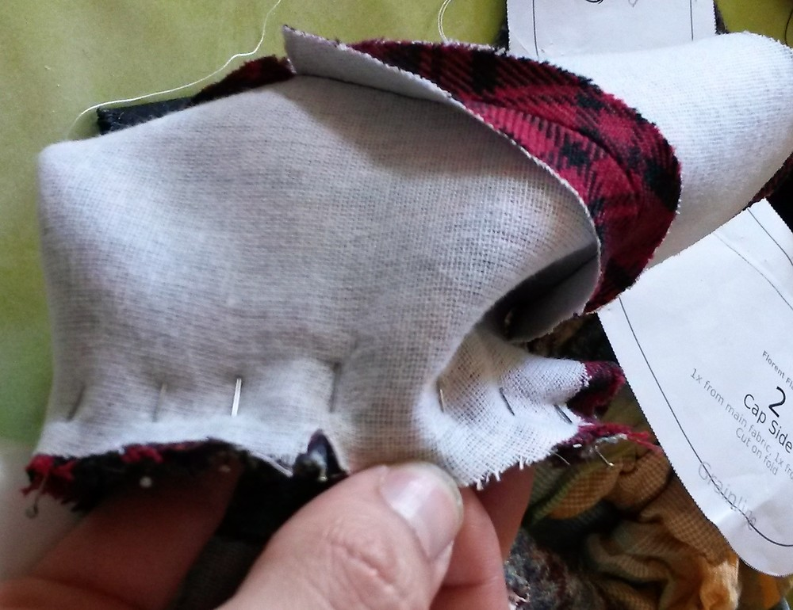
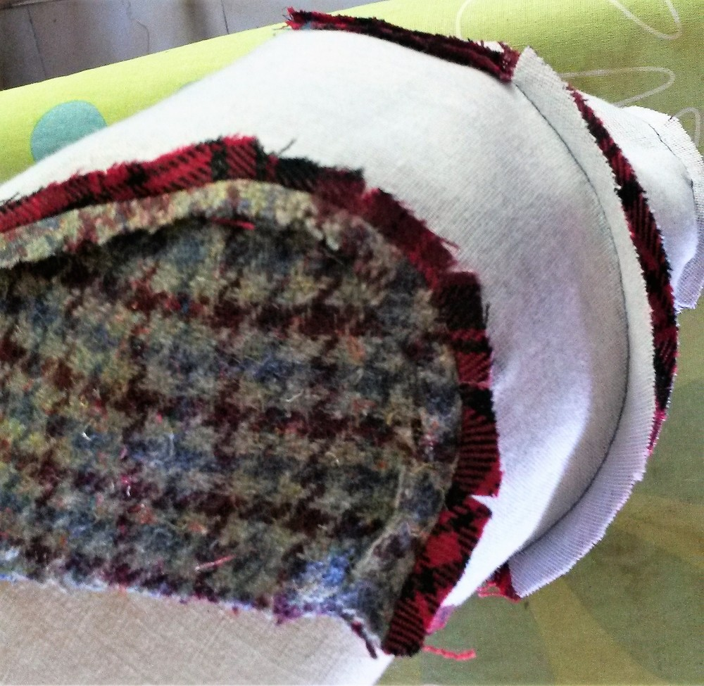
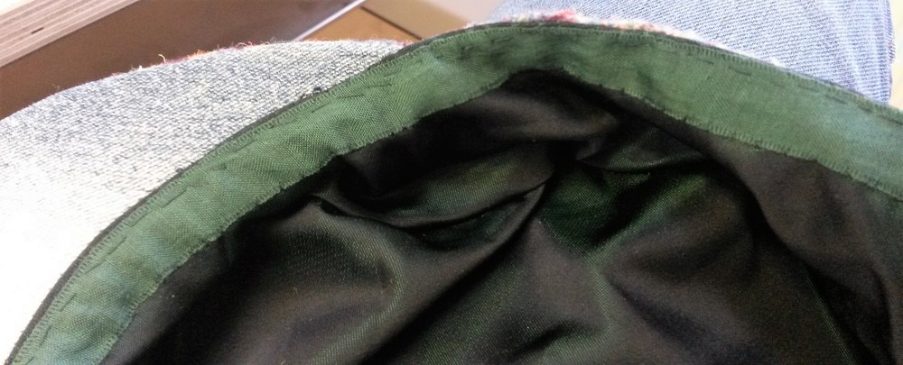
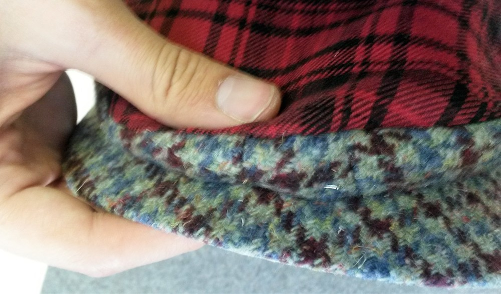

### Schritt 1: Sicherungsschnittstelle

Abhängig von deinem Stoffgewicht solltest du alle deine wichtigsten Stoffteile verschmelzen Unabhängig von der Stoffdicke deines Stoffes, Sie sollten erwägen, die Seiten Ihrer Brimteile zu verstärken (wo die Nockenmarke ist). Dadurch wird verhindert, dass die spitzenden Enden des Kunststoffteils außerhalb der Deckel auf diesem Bereich stecken

### Schritt 2: Schließen des Rückendarts

#### Version mit Oberteil geschnitten auf Falte

Sie sollten den oberen Rand des Rückens auf der falschen Seite des Stoffes markieren, damit Sie wissen, wo Sie Ihre Naht beenden sollen

Es gibt mehrere Tricks zum Nähen von Darts, hier ist, wie ich es mache (ich denke, es wird als "Balancing the dart" bezeichnet): bereiten Sie ein zweigeteiltes Rechteck des Stoffes vor, den Sie nähen und platzieren Sie es unter den Punkt Ihrer zukünftigen Dart. Nähen Sie den Dart von unten ab und nähen Sie nach dem oberen Dart weiter ein paar Nähte. Hinterlassen Sie einen guten Faden um einen Knoten von Hand herzustellen.

Wo das Rechteck des Stoffes beginnt, schneiden Sie die Nahtzugabe, die gegen dieses Rechteck ist, bis zur Naht, so dass die Naht vor dem Rechteck geöffnet werden kann. Auf dem Gebiet, in dem der Dart mit dem Rechteck genäht ist, Eisen beide Nahtzustände auf der einen Seite und das gefaltete Rechteck auf der anderen Seite. Schichten Sie die Kanten des Rechtecks ein. Der Rand gegen den Hauptstoff ist breiter, der oben ist kleiner

#### Version mit dem oberen Teil zweimal geschnitten

Dieser Dart ist geradliniger vorwärts, da die Naht kontinuierlich ist. Nähen Sie die Naht ganz einfach

#### Die Naht Bügeln

Möglicherweise müssen Sie die Nahtzuweisung streichen, um sie flach zu drücken. Benutzen Sie einen Schneider oder etwas unten abgerundet, um Ihnen zu helfen, die Naht offen zu drücken, während Sie die schöne Form, die Sie gerade erstellt haben, behalten.

#### Obere Nähung

Je nach dem gewünschten Stil können Sie alle Nähte (per Maschine per Hand) aufnähen. Allerdings wird die vordere Brim Naht ein wenig kompliziert mit der Maschine zu tun (aber nicht unmöglich). Jedenfalls habe ich das hier gestellt und werde Sie nach jedem Schritt nicht daran erinnern, aber im Grunde genommen der Prozess wäre: Stitch, Eisen, Topstitch, Wiederholen im nächsten Schritt.

### Schritt 3: Optional: Beide Seitenteile verbinden.

Dies gilt nur, wenn Sie zwei Teile für das Seitenteil schneiden. Es ist eine geradlinige Naht. nicht viel darüber zu sagen. Eisen Sie die Nahtflache, mit den Nahtzugaben geöffnet.

### Schritt 4: Schließe dich oben an die Seite

Warnung: Es werden mehrere Pins involviert sein. Lege die Noten fest und fixiere die Teile zusammen, damit dieses abgerundete Teil gut befestigt ist.

 

Für die Nähung, ich neige dazu, von der Mitte vorne, eine Hälfte, und dann wieder starten zurück von der Mitte vorne, um die andere Hälfte zu tun (der **Seitenteil** ist oben für beide Sticke). So dass, wenn meine Maschine das untere Gewebe verschiebt, es wäre eine "symmetrische Schicht" auf beiden Seiten. Bewegen Sie die Nahtzugeständnisse bei Bedarf auf die Kurve, Vielleicht möchten Sie die Nahtzuweisung des Seitenteils abschneiden und einknicken, um den Bügelprozess zu unterstützen.

### Schritt 5: Die glänzende äußere Naht.

Die Nocken ausrichten und den oberen und unteren Teil anpinnen. Technisch gesehen hat der untere Teil eine kürzere Nahtlänge, daher müssen Sie ihn vielleicht so ausdehnen, dass die Nahtzuschläge erfüllt werden. In der Praxis ist der Stoff in der Regel so dehnbar, dass der Längenunterschied erleichtert werden kann. Eisen beides Nahtmenge gegen **Unterer Teil**

### Schritt 6: Einfügen des Kunststoffteils

Das Kunststoffteil wird dann in den Schweif eingefügt, wobei darauf geachtet wird, dass die Naht flach am **unteren Teil** bleibt. Sie nähen dann den Stirn geschlossen, halten die Teile fest und gut gespannt.

### Schritt 7: Das Stichen der Brille zur Kappe nähen

Legen Sie die Stirn und nähen Sie den Stiel an die Kappe. Achten Sie darauf, nicht auf den Kunststoff zu nähen. Es könnte einfacher sein, wenn Sie den Arm Ihrer Maschine "frei"

### Schritt 8: Bereiten Sie das Futter vor

Im Grunde genommen wiederholen Sie die Schritte 2, 3 und 4 mit der Verkleidung **oben** und **Seitenteile**. Dies wäre auch ein guter Zeitpunkt, um ein Etikett auf dem **oberen Teil** des Futters zu sticken, wenn Sie in diese Art von Dingen stecken.

### Schritt 9: Join Futter zu Hauptstoff.

Drehen Sie das Futter nach draußen und platzieren Sie das Hauptgewebe darin (gute Seite gegen gute Seite). Pin und Stich von einem Ende des Schwefels bis zum anderen Ende des Schwefels (wobei die Schweißnaht offen bleibt).

Vergessen Sie nicht, diesen Stich gut zu tacken, da er ein wenig strecken wird, wenn wir die Kappe "draußen" drehen. Drehen Sie die Kappe nach draußen, so dass die gute Seite draußen ist. Auf dem Felsen das Futter an der Stelle kleben und mit der Hand nähen, um die anderen Nähte zu verbergen, die bereits auf der Naht sind. 

### Schritt 10: Obere Nähung am unteren Rand der Kappe

Es ist eine gute Idee, die untere Naht der Kappe nach oben zu sticken, damit das Futter innen bleibt. Um eine bessere Kontrolle zu haben, brauche ich es normalerweise zuerst, so dass die Kante scharf ist. 

### Schritt 11: Das Band

Form einer Schleife mit dem Klebeband so dass der Umfang der Schleife mit dem gemessenen Kopfumfang des Trägers der Kappe übereinstimmt. Das beste Ergebnis wird erzielt, wenn Sie das Klebeband während Sie es umwickeln um den Kopf des zukünftigen Besitzers der Kappe. Sobald die Schleife geschlossen ist, können Sie sie sogar noch einmal überprüfen und fragen, ob diese Passform für den Träger in Ordnung ist.

Schneiden Sie die Enden des Bandes in einer Pfeil-Form ab, um zu verhindern, dass es ausweicht. 

Das Band mit zwei Pins teilen

Klebeband anheben: Die beiden Pins werden verwendet, um das Klebeband gleichmäßig auf beiden Seiten zu verteilen. Platzieren Sie einen Pin auf der Rückseite und den anderen auf der Vorderseite. Da die Strümpfe an Ort gehalten wird, kann sie nicht viel gestreckt werden, so dass das Klebeband in diesem Bereich "normal" für den restlichen Teil musst du den Stoff entlang des Bands erleichtern. Ich empfehle, das Klebeband auf beiden Kanten des Klebebandes zu nähen

### Schritt 12: Nähen Sie die Seite zum Schweif

Wir sind fast fertig, und der letzte Schritt wird sein, die Brillenspitze an die Vorderseite der Kappe zu befestigen. Nähen Sie den beiden Teil von außen in Position, drehen Sie die Kappe auf der Außenseite und nähen Sie beide Teile mehrmals zusammen.

 

