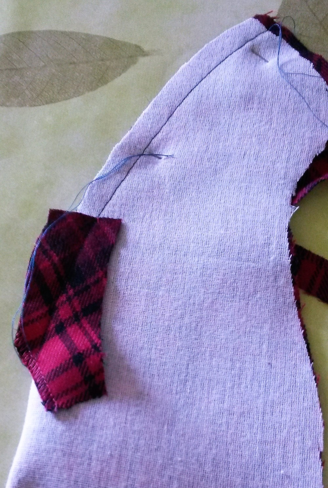
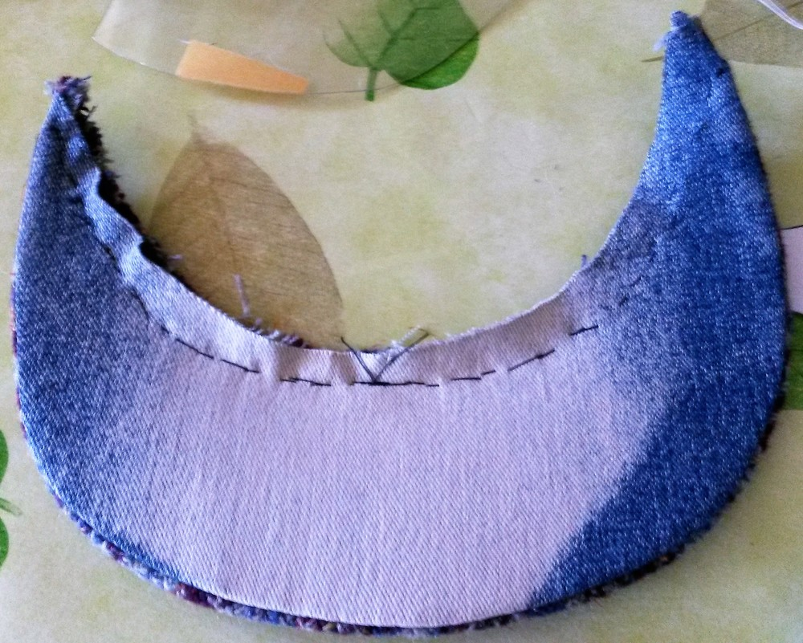

### Étape 1 : Thermocoller l'entoilage

Selon le poids de votre tissu, vous voudrez peut-être fusionner toutes vos pièces de tissu principales Peu importe l'épaisseur de votre tissu, vous devriez envisager de renforcer les côtés de vos rebords (où se trouve la marque Encoch). Cela aidera à prévenir les extrémités pointues de la pièce en plastique à sortir du capuchon sur cette zone

### Étape 2 : Fermeture de la fléchette arrière

#### Version avec pièce supérieure coupée sur plis

Vous devriez marquer le dessus du dard sur le mauvais côté du tissu afin de savoir où terminer votre couture

Il y a plusieurs astuces pour coudre des fléchettes, Voici comment je le fais (je pense que c'est ce qu'on appelle "balancer le dart"): préparez un rectangle de coupe de biais du même tissu que vous allez broder et le placer sous le point de votre future fléchette. Faire piquer le dard en partant du bas et continuer à broder quelques fois après la broderie supérieure. Laissez une bonne longueur de fil pour faire un nœud à la main.

Lorsque le rectangle de tissu commence, coupez la marge de couture qui est contre ce rectangle, jusqu'à la couture de sorte que la couture puisse être remontée à plat avant le rectangle . Sur la zone où la fléchette est cousue avec le rectangle, repasser les deux coutures d'un côté et le rectangle plié de l'autre côté. Coupez les bords du rectangle. Le bord contre le tissu principal est plus large, celui ci-dessus est plus petit

#### Version avec la partie supérieure coupée deux fois

Ce dart est plus droit vers l'avant puisque la couture est continue. Collez simplement la couture tout au long du chemin

#### Repousser la couture

Il se peut que vous deviez enfoncer la marge de couture pour la presser à plat. Utilisez un Ham tailleur ou quelque chose d'arrondi sous pour vous aider à appuyer sur la couture ouverte tout en gardant la belle forme que vous venez de créer.

#### Ajustement du plus haut

Selon le style que vous voulez obtenir, vous pouvez broder toutes vos coutures (par machine à la main). Cependant, la couture avant sera un peu difficile à faire avec la machine (mais pas impossible). Quoi qu'il en soit, je l'ai mis ici et je ne vous le rappellerai pas après chaque étape, mais en gros, le processus serait: Stitch, Fer, Point supérieur, Répéter à l'étape suivante.

### Étape 3 : Optionnel: Rejoignez les deux parties latérales.

Cela ne s'applique que si vous coupez deux parties pour la partie latérale. C'est une couture droite. rien à dire à ce sujet. Repasser la couture à plat, avec les autorisations de couture ouvertes.

### Étape 4 : Rejoignez le haut sur le côté

Attention : Il y aura plusieurs épingles impliquées Alignez les encoches et épinglez les pièces ensemble afin que cette partie arrondie soit bien tenue.

 

Pour la broderie, j'ai tendance à commencer par le devant central, à faire une moitié, puis à recommencer de l'avant du centre pour faire l'autre moitié (la partie **du côté** est au-dessus pour les deux mailles). Ainsi, si ma machine déplace le tissu inférieur, ce serait un "décalage symétrique" des deux côtés. Couper les autorisations de couture si nécessaire, sur la courbe, vous voudrez peut-être couper la marge de couture de la partie latérale et l'entailler pour faciliter le processus de repassage.

### Étape 5 : La couture extérieure du bord.

Alignez les encoches et épinglez les parties supérieures et inférieures. Techniquement, la partie inférieure a une longueur de couture plus courte, donc vous devrez peut-être l'étirer pour que les coutures se rencontrent. Dans la pratique, le tissu est généralement assez extensif pour faciliter la différence de longueur. Allocation de la couture au fer contre la **partie inférieure**

### Étape 6 : Insertion de la pièce plastique

La partie en plastique est ensuite insérée à l'intérieur du rebord, en veillant à garder la marge de couture à plat sur la partie **du bas**. Vous coupez ensuite le bord à la main fermé, en gardant les pièces en place et bien tendues.

### Étape 7 : Ajuster le bord au bouchon

Alignez les encoches et coupez le bord sur le capuchon. Faites attention à ne pas piquer sur le plastique. Cela pourrait être plus facile si vous libérez le bras de votre machine

### Étape 8: Préparez la ligne

Répétez les étapes 2, 3 et 4 avec les parties **supérieures** et **latérales**. Ce serait également un bon moment pour broder une étiquette sur la **partie supérieure** de la doublure si vous êtes dans ce genre de choses.

### Étape 9 : Attachez la doublure au tissu principal.

Tournez la doublure à l'extérieur et placez le tissu principal dans lui (bon côté contre le bon côté). Épingler et coudre d'une extrémité du bord à l'autre extrémité du bord (laissant la couture du bord ouverte).

N'oubliez pas d'appuyer sur ce point assez bien car il aura un peu d'élasticité quand nous retournerons le bouchon "à l'extérieur". Retournez le bouchon à l'extérieur, de sorte que le bon côté est à l'extérieur. Sur la zone de Brim, bâtissez la doublure en place et coudez la à la main de façon à masquer les autres points qui sont déjà sur la couture. 

### Étape 10 : Ajuster le bas du bouchon

C'est une bonne idée de surpiquer la couture du fond du bouchon de sorte que la doublure reste à l'intérieur. Pour avoir un meilleur contrôle, je le baste habituellement en premier, de sorte que le bord est tranchant. 

### Étape 11 : Le ruban

Formez une boucle avec le ruban pour que la circonférence de la boucle corresponde à la circonférence de tête mesurée du porteur de la casquette. Le meilleur résultat est obtenu lorsque vous épinglez le ruban pendant que vous l'enveloppez autour de la tête du futur propriétaire de la casquette. Une fois que la boucle est fermée, vous pouvez même la vérifier et demander si cet ajustement est correct pour le porteur.

Couper les extrémités du ruban en forme de flèche pour ne pas le sauter. 

Diviser la bande en deux avec deux broches

Épingler le ruban en place : Les deux broches sont utilisées pour distribuer le ruban sur les deux côtés. Placez une broche au dos et l'autre à l'avant. Comme le bord est maintenu en place, il ne peut pas être beaucoup étiré, alors épinglez le ruban dans cette zone "normalement" Pour la partie restante, vous pourriez avoir besoin de faciliter le tissu le long du ruban. Je recommande de broder à la main le ruban en place, sur les deux bords du ruban

### Étape 12 : broyer le côté au bord

Nous sommes presque terminés, et la dernière étape sera de fixer le dessus du bord à l'avant du corps de la casquette. Épingler les deux parties en position de l'extérieur, tourner le bouchon sur le côté de la doublure et coudre les deux parties plusieurs fois.

 

