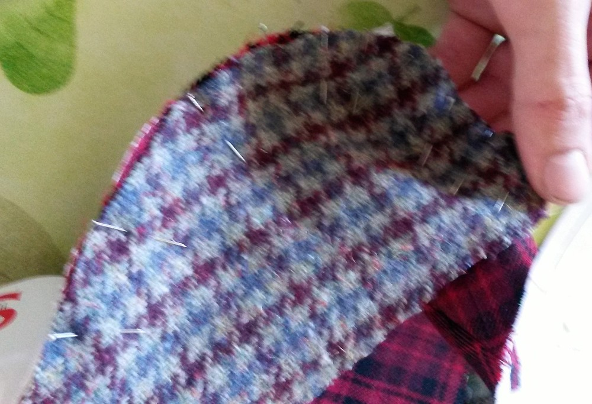
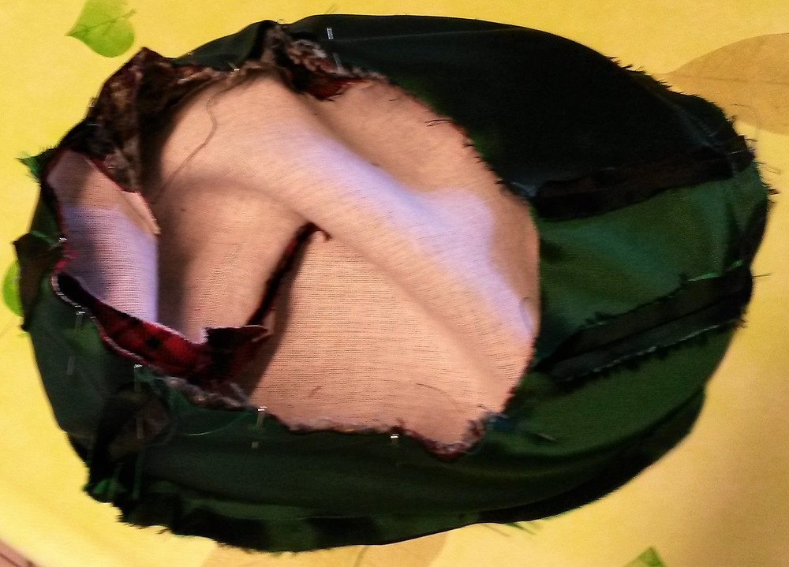
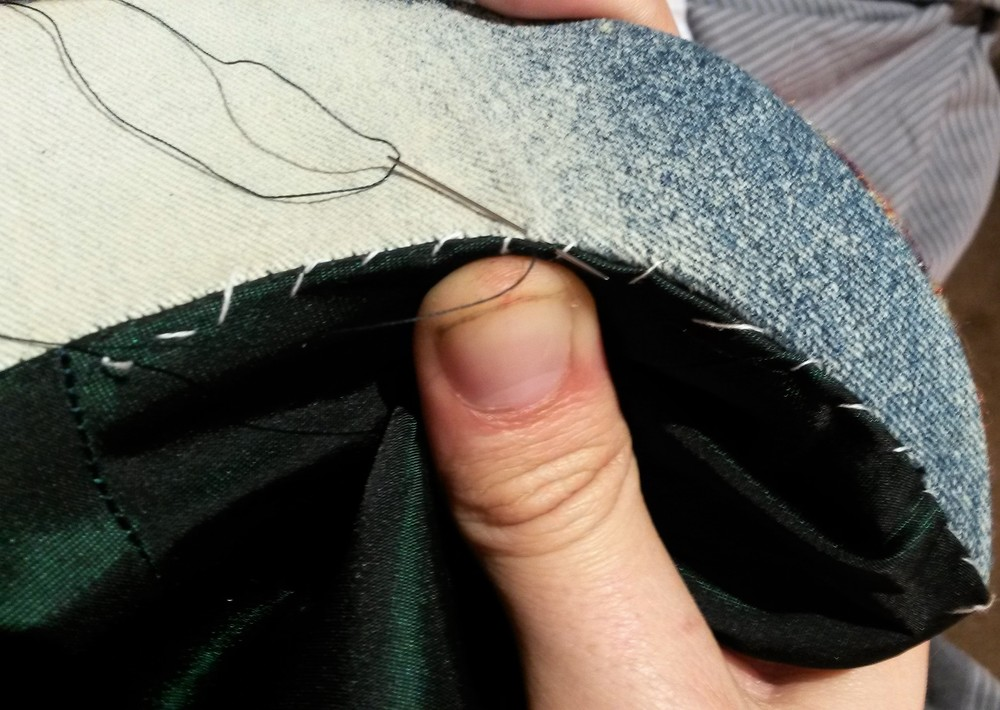
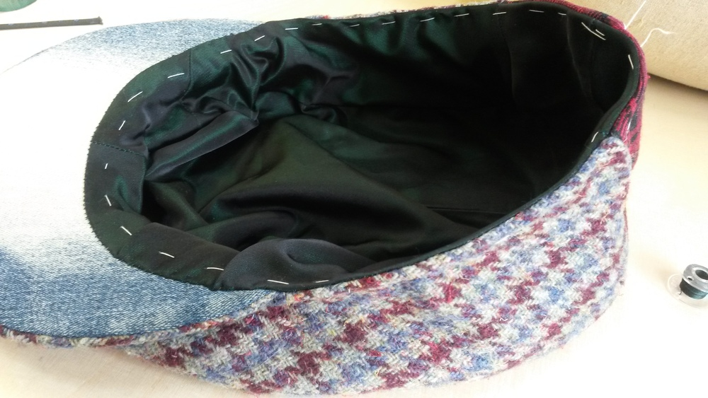
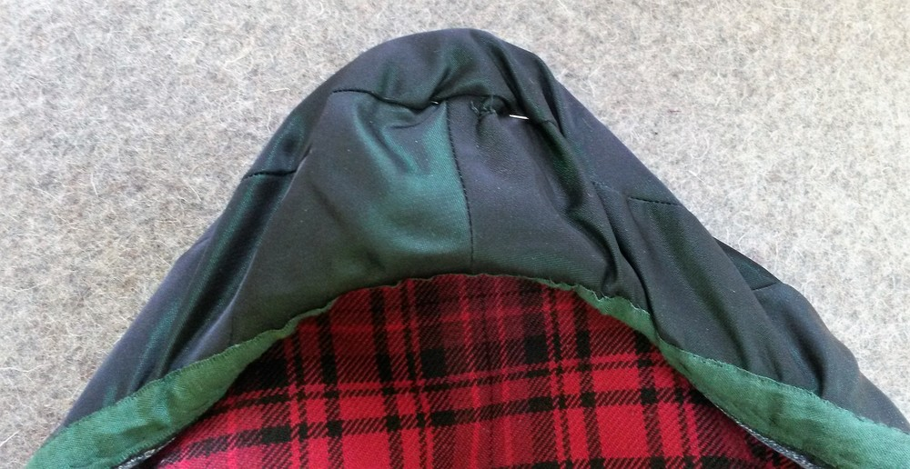

### Крок 1: Взаємодія запобіжників

Залежно від ваги тканини, можливо, ви захочете з'єднати всі основні деталі Незалежно від товщини тканини, вам слід подумати про посилення боків деталей бортиків (там, де є позначка для надсічки). Це допоможе запобігти висовуванню гострих кінців пластикової частини за межі ковпачка на цій ділянці

### Крок 2: Закриття задньої виточки

#### Версія з верхньою частиною, вирізаною на згині

На виворітному боці тканини слід позначити верхню частину задньої виточки, щоб знати, де закінчувати шов

Існує кілька хитрощів для пошиття виточок, ось як я це роблю (здається, це називається "балансування виточки"): підготуйте вирізаний по косій прямокутник з тієї ж тканини, яку ви збираєтеся зшивати, і покладіть його під точку майбутньої виточки. Прострочіть виточку, починаючи знизу, і продовжуйте строчити через кілька стібків після верхньої виточки. Залиште достатню довжину нитки, щоб зробити вузол вручну.

Там, де починається прямокутник тканини, зріжте припуск на шов, який знаходиться проти цього прямокутника, до шва, щоб шов можна було розпрасувати перед прямокутником. На ділянці зшивання виточки з прямокутником запрасуйте обидва припуски шва з одного боку, а складений прямокутник - з іншого. Складіть краї прямокутника. Край біля основної тканини ширший, а той, що зверху, менший

#### Версія з верхньою частиною, розрізаною двічі

Ця витачка більш пряма, оскільки шов суцільний. Просто прострочіть шов до кінця

#### Прасування шва

Можливо, вам доведеться надрізати припуск на шов, щоб притиснути його рівно. Використовуйте кравецьку шинку або щось заокруглене знизу, щоб допомогти вам розпрасувати шов, зберігши при цьому гарну форму, яку ви щойно створили.

#### Верхня строчка

Залежно від стилю, якого ви хочете досягти, ви можете прострочити всі шви (на машині або вручну). Однак, передній крайовий шов буде трохи складніше виконати на машині (але не неможливо). У будь-якому випадку, я розмістила це тут і не буду нагадувати вам про це після кожного кроку, але в принципі, процес буде таким: Зшивання, прасування, верхній стібок, повторення на наступному кроці.

### Крок 3: Необов'язково: З'єднайте обидві бічні частини.

Це стосується лише тих випадків, коли ви вирізаєте дві деталі для бокової частини. Це прямий шов. Нічого особливого про це сказати. Запрасуйте шов плазом, з відкритими припусками.

### Крок 4: Приєднайте верхню частину до бокової

Warning: There will be quite a few pins involved Align the notches and pin the parts together so that this rounded part is held well in place.

 

Для зшивання я зазвичай починаю від центру спереду, роблю одну половину, а потім починаю знову, назад від центру спереду, щоб зробити другу половину (бічна частина **** знаходиться зверху для обох стібків). Таким чином, якщо моя машина зсуне нижню тканину, це буде "симетричний зсув" з обох боків. Припуски швів сколіть там, де це необхідно, на вигині, можливо, ви захочете обрізати припуски швів бічної частини і надсікти їх, щоб полегшити процес прасування.

### Крок 5: Зовнішній шов крайки.

Вирівняйте надрізи і скріпіть верхню і нижню частини булавками. Технічно, нижня частина має меншу довжину шва, тому, можливо, вам доведеться розтягнути її так, щоб припуски на шви збіглися. На практиці тканина зазвичай досить еластична, тому різницю в довжині можна згладити. Припуски обох швів припрасувати до **Нижню частину**

### Крок 6: Вставляємо пластикову частину

Потім пластикова частина вставляється всередину бортика, намагаючись, щоб припуск на шов був рівним на **Нижній частині**. Потім ви вручну зшиваєте бортик, утримуючи деталі на місці і добре натягуючи їх.

### Крок 7: Пришивання бортиків до кепки

Вирівняйте надсічки і пришийте бортик до кепки. Будьте обережні, щоб не прошити пластик. Буде простіше, якщо ви "звільните" руку вашої машини

### Крок 8: Підготуйте підкладку

По суті, повторіть кроки 2, 3 і 4 з підкладкою **верхньої частини** і **бічних частин**. Це також гарний час, щоб пришити етикетку на **верхній частині** підкладки, якщо ви любите такі речі.

### Крок 9: Приєднайте підкладку до основної тканини.

Виверніть підкладку назовні і покладіть на неї основну тканину (лицьовим боком до лицьового боку). Приколіть і прострочіть від одного кінця крайки до іншого (залишаючи шов крайки відкритим).

Не забудьте добре закріпити цей шов, оскільки він розтягнеться, коли ми будемо вивертати кепку "назовні". Виверніть кришечку назовні так, щоб лицьова сторона була зовні. На ділянці краю приметайте підкладку і пришийте вручну до краю так, щоб приховати інші стібки, які вже є на припусках шва. 

### Крок 10: Зшиваємо верхній шов з нижнім краєм кепки

Нижній шов кепки бажано прострочити так, щоб підкладка залишилася всередині. Щоб мати кращий контроль, я зазвичай спочатку змащую його, щоб край був гострим. 

### Крок 11: Стрічка

Сформуйте петлю зі стрічки так, щоб окружність петлі збігалася з виміряною окружністю голови власника кепки. Найкращий результат досягається, коли ви приколюєте стрічку, коли обертаєте її навколо голови майбутнього власника кепки. Після того, як петля буде закрита, ви навіть можете перевірити її ще раз і запитати, чи підходить вона користувачеві.

Trim the ends of the tape in an arrow shape to keep it from poking out. 

Розділіть стрічку навпіл за допомогою двох шпильок

Закріпіть стрічку на місці: Дві шпильки використовуються для рівномірного розподілу стрічки з обох боків. Закріпіть одну шпильку ззаду, а іншу спереду. Оскільки бортик утримується на місці, його не можна сильно розтягнути, тому приколіть стрічку в цій ділянці "нормально" На решті частини вам, можливо, доведеться послабити тканину вздовж стрічки. Я рекомендую прошити стрічку вручну на місці, з обох країв стрічки

### Крок 12: Зшийте бічну частину до краю

Ми майже закінчили, і останнім кроком буде прикріплення верхівки до передньої частини корпусу кепки. Приколіть обидві частини ззовні, виверніть кепку на підкладковий бік і прострочіть обидві частини разом кілька разів.

 

