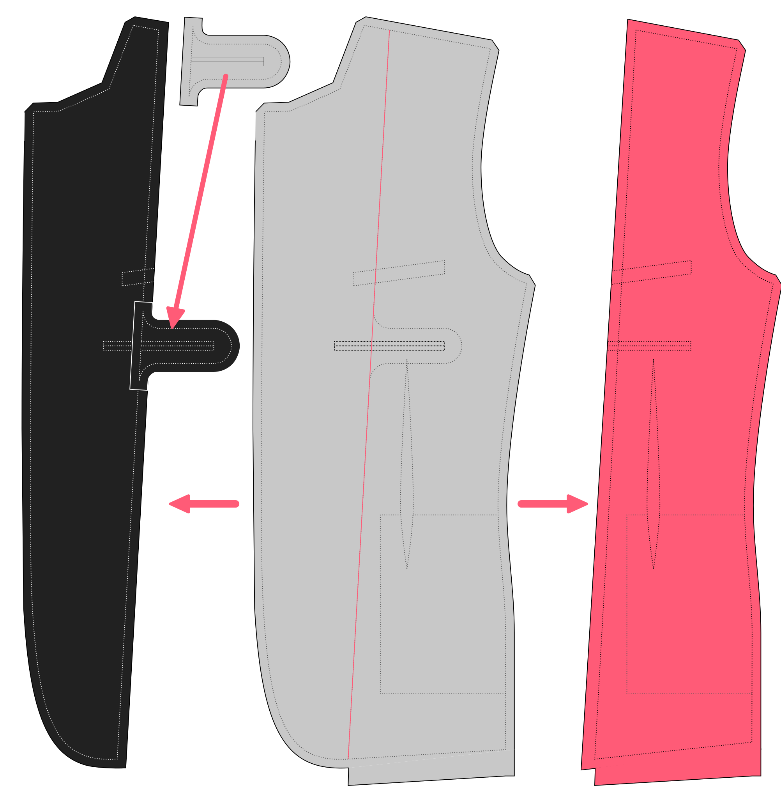

- **Tela principal**
  - Cortar **2 frentes** (parte 1)
  - Corta **2 fachadas frontales** (busca el límite de fachada/revestimiento en la parte delantera)
  - Corta **2 backs** (parte 2)
  - Corta **2 lados** (parte 3)
  - Corta **2 mangas superiores** (parte 4)
  - Corta **2 mangas bajas** (parte 5)
  - Cortar **1 collar** (parte 6)
  - Cortar **1 collarstand** (parte 8)
  - Corta **2 bolsillos** (parte 9)
  - Corta **1 soldado de bolsillo de cofre** (parte 10)
- **tela de revestimiento**
  - Cortar **2 frentes** (parte 1)
  - Corta **2 forrajes frontales** (busca el límite de fachada/forro en la parte frontal y no te olvides de conectar la extensión interior de cara al bolsillo)
  - Corta **2 backs** (parte 2)
  - Corta **2 lados** (parte 3)
  - Corta **2 mangas** (parte 4) Nota: A algunas personas les gusta usar un revestimiento diferente para las mangas
  - Corta **2 mangas bajas** (parte 5) Nota: A algunas personas les gusta usar un revestimiento diferente para las mangas
  - Cut **2 chest pocket bags** (part 11)
  - Corta **2 soldaduras internas de bolsillo**
  - Corta **2 bolsas de bolsillos interiores** (parte 13)
- **Lona**
  - Cortar **2 frentes** en el sesgo (parte 1) Nota: No incluir el permiso de costura
  - Corta **2 piezas de cofre** con parcialidad. Busque la indicación en la parte delantera. Nota: No incluir permisos de costura
- **Tejido bajo cuello**
  - Cut **2 undercollars** (part 7)

<Note>

###### ¿Los lados buenos juntos, o coinciden con patrones precisos?

Cuando cortas dos, puedes cortarlos [buenos lados juntos](/docs/cowing/good-sides-juntos).
Sin embargo, al trabajar con tejido con un patrón, prefiero cortarlos individualmente para controlar finamente la coincidencia de patrones.

Cuando los cortes individualmente, recuerda que necesitan ser imágenes espejo unos de otros. Así que voltee su patrón o su tela al cortar el segundo.

</Note>

<Warning>

###### Cutting caveats

- The chest piece is marked on the front.
- No incluir la franquicia de costura al cortar el lienzo y cortarlo en el prejuicio.
- El frontal y el revestimiento están marcados en la parte delantera. Dividieron la parte frontal en dos a lo largo de la línea límite. Puede cortar la parte delantera a lo largo de esa línea después de cortar la parte delantera de la tela principal. The inner pocket extension for the facing is printed separately, and you can tape it back in its place after cutting the pattern piece. **No olvide añadir permisos de costura tanto para el rostro como para el revestimiento de esta costura límite**.

</Warning>
