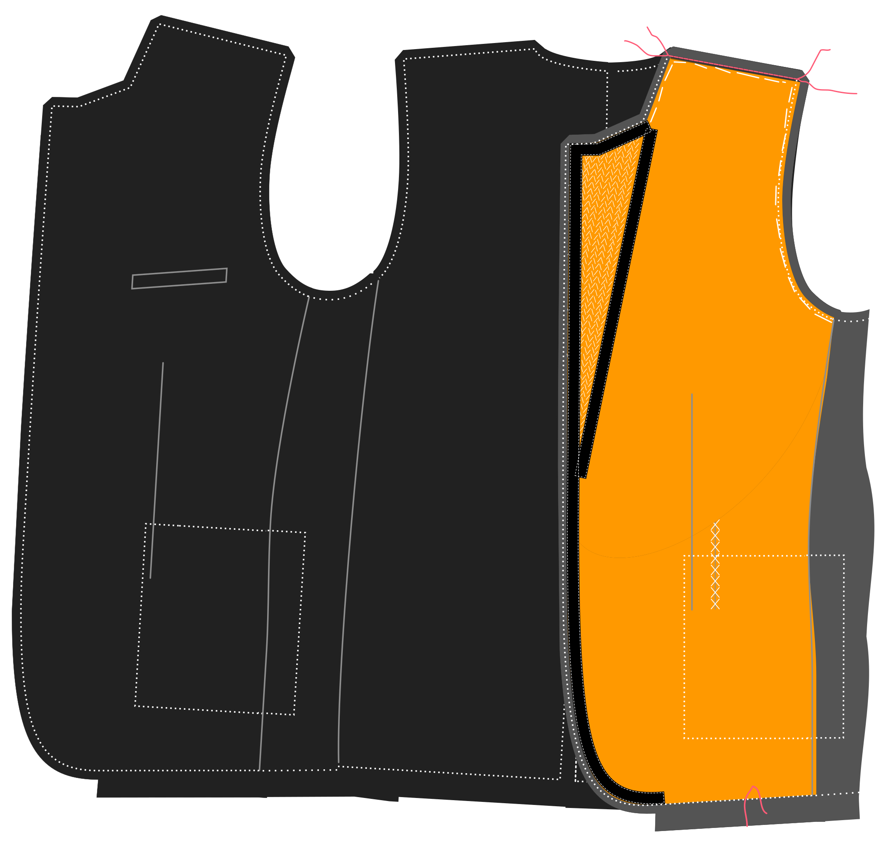

- - -
title: "Jaeger jacket: Sewing Instructions"
- - -

<Note>

###### La documentación de Jaeger está en construcción

Esta documentación aún no está terminada.

</Note>

## Construcción

### Cerrar los dardos frontales

#### Doble doble

Doblar el doble de la parte frontal con los lados buenos y fijarlo hacia abajo para que el pliegue esté bien en el centro del dart delantero.

#### Dientes dardos

Mantenga el dardo delantero cerca, cuidándose de tener la parada de dardos en la parte superior correcta. El fondo no es tan importante, ya que estará cubierto por los bolsillos. Pero el extremo superior del dardo será claramente visible, así que por favor asegúrese de que termine a la misma altura en ambos lados.

#### Cortar y pulsar

Una vez que los dardos delanteros están cerrados, cortar abre el dardo en la espalda. No podrás cortarlo hasta el extremo, pero está bien. Pulse abrir los dardos donde se cortan y pulse el resto hacia el lado. Tenga cuidado de sólo pulsar desde la parte trasera. Presionar desde la parte delantera probablemente marque su tejido.

### Construye el bolsillo

#### Aplicar interfaz fusible

Aplique un pedazo rectangular de intersección ligero fusible alrededor de la zona del bolsillo para que se extienda unos pocos cm en todas las direcciones.

> ##### No estamos usando fusible en todo el frente
> 
> Los escudos son típicamente hechos de telas algo más pesadas. That, and the fact that I prefer to use canvas rather than fusible interfacing, means that I don't interface the front with fusible.

#### Marca el contorno de la soldadura del cofre, marca los extremos de la línea superior

With the fusible in place, thread a needle and baste around the chest pocket to transfer the markings to the good side of the fabric.

Este pocket difiere de un bolsillo de soldadura tradicional. La soldadura se extiende por encima de la apertura del bolsillo. Esto oculta la bolsa de bolsillo sin la necesidad de fachadas. La parte superior de la abertura es también más pequeña que la soldada, permitiéndote deslizar la abertura.

En la línea superior de su bolsillo de soldadura, marque 0,5cm hacia adentro desde las esquinas de la línea superior.

> Estos puntos son notches en la parte frontal de tu patrón.

#### Plegar, prensar y coser las costuras de la soldadura

Doblar la soldadura con los lados buenos juntos, y cerrar los lados (coser las costuras laterales).

#### Recortar las costuras, girar y presionar

Recorte las franquicias de costura en los lados y sobre todo limite la franquicia de costura hacia la esquina para evitar el granel.

Vuelve hacia adentro para que el lado bueno esté fuera y prensa.

> Ten cuidado de no sobreprender ya que estarás presionando desde el buen lado de la tela.

#### Elimina la línea inferior de la soldadura para que sepa dónde coser

Elimine una guía en la parte inferior de la soldadura para marcar el límite de las franquicias de soldadura/costura. Esta será la línea a coser más adelante.

#### Difundir la soldadura al frente

Coloque la soldadura en el lado delantero bueno con el lado doblado hacia abajo, y coser hasta el fondo. Asegúrate de detenerte y empezar exactamente al borde de la línea que based.

#### Difunde la bolsa de bolsillo de cofre al frente

Coloque la bolsa de bolsa en la parte delantera. La parte delantera con buena cara arriba, pero la bolsa de bolsa con mala cara arriba. Asegúrate de tener el lado más largo de la bolsa de bolsillo en el lado más alto del bolsillo de pecho.

> Sólo los pockets de cofres trillados tienen un lado más alto e inferior.

Diviértase en su lugar en la línea superior. Remember this should be shorter than the bottom row of stitches to attach the welt, since you marked 0.5cm inwards from the corners.

> Como el bolsillo de espalda es típicamente un tejido deslizante, probablemente querrás anclar o bastar esto en su lugar antes de coser.

#### Corta la apertura del bolsillo de cofre, gire y presione

 Ahora cortar abrir su soldadura en medio de ambas costuras. No cortes al borde, pero crea una forma trianngular allí.

Invierte la bolsa de bolsillo y soltarse en la parte trasera pasando ambos a través de la apertura que acabas de crear.

Consigue todo para poner agradable y plana, y prensa.

Ahora, traiga la soldadura sólo al frente y consiga que se acoja agradable y plana. Presione de nuevo desde la parte posterior.

> Resista el deseo de presionar esto desde el frente.

#### Termina el bolsillo

On the backside, fold the pocket bag double and sew it to the pocket welt below the existing seamline of the welt.

Hile una aguja y termine a mano el cofre cosiendo cosiendo los lados de la soldadura al panel frontal (no deje que sus stitches se muestren en el frente).

Por último, cierre la bolsa de bolsa cosiendo los costados. Haga esto colocando la parte delantera hacia abajo con el lado bueno hacia arriba. Luego doblar sobre cada lado y coser la bolsa de bolsillo. Al coser estos lados, asegúrese de atrapar esas pequeñas piezas triangulares de la abertura. Esto reforzará la apertura del bolsillo.

Borra el bolsillo cerrado mientras contructamos la chaqueta.

### Prepara los frentes

Cortar la pieza delantera en un lienzo ligero y flexible colocado sobre la inclinación. Cortar todo el frente.

Cortar el dardo delantero y cerrarlo con una stitch zig-zag, asegurándose de no dejar que el lienzo se superponga.

Corta el pedazo del lienzo del pecho. Alinear a lo largo de la línea de rollos y bastarla en su lugar en la parte delantera del lienzo.

> La pieza del cofre está marcada en la parte frontal de tu patrón.

#### Bastar lienzo en los frentes

Ahora golpea el lienzo delantero y la pieza de pecho en tu frente. Tenga en cuenta que el lienzo no tiene permisos de costura.

> Baste it a bit inwards from the seam line so you can fold it away when sewing these seams later.  
> You don't want your canvas to get caught in the seams.

#### Une tus lámparas

Es hora de sentirse como un verdadero tailor, y apilar esos lapeles.

Make sure to make the stitches a bit smaller towards the lapel tip, to make sure it lies flat against the chest, curling a bit inward instead of outward.

> If you're not sure how to pad-stitch the lapels, [let us know](https://discord.freesewing.org/) and we'll make an attempt to document it.

#### Toca el borde del lapel y la línea de rollo

Ahora vamos a coser a mano a lo largo de los bordes de lapel del frente, y a lo largo de la línea de rollo. Esto también asegurará el lienzo al frente aquí y allá.

Ten en cuenta que:

- La cinta a lo largo de la línea de rollo debe colocarse dentro de la línea de rollo.
- La cinta a lo largo de la línea de rollo debe ser aproximadamente medio centímetro más corta que la distancia que se recorre. La ligera tensión que esto crea ayuda al lapel a rodar bien y al contorno al cuerpo.
- La cinta a lo largo del borde del lapel debe colocarse dentro de la línea de costura

> ##### No coser a través de tu tela
> 
> While sewing the tape to your front, avoid pushing your needle all the way through your fabric so that your stitches will show on the front.
> 
> Al mismo tiempo, tampoco debería asegurar la cinta sólo a su lienzo. Instead, you should try to catch a few threads of your fabric on every stitch, so that the tape is secured in place, yet the stitches don't show at the front.
> 
> Esto es menos un problema por encima del punto de ruptura de su lapel donde la tela estará en la parte trasera del lapel.

### Cerrar el cuerpo

#### Cerrar costuras laterales

Place your front with the good side up, and your side on it with the good side down. Align the front/side seams, pin them in place if you feel like it, and sew them togther.

Place this down with the good side up, and place your back on top with the good side down. Align the back/side seams, pin them in place if you feel like it, and sew them togther.

> Asegúrese de que el lienzo no sea capturado en la costura.

> ##### Nota para los ventiladores de coser
> 
> Si tiene una doble ventana, esta costura contendrá la ventana.
> 
> Pase la parte descendente de la costura lateral/trasera y la parte lateral que forma la ventana. No coser a la baja después de eso.

#### Cerrar la costura trasera

Alando sus dos medias chaquetas con los lados buenos juntos, y cerrar la costura de espalda.

<Note>

##### Nota para los ventiladores de coser

Si tienes una sola ventana, esta costura contendrá la ventana.

Difunde la parte descendente de la costura trasera y la parte lateral que forma la ventana.
No coser a la baja después de eso.

</Note>

#### Cerrar las costuras del hombro

Alinear las costuras del hombro con los lados buenos juntos, y coser juntos.

Asegúrese de que el lienzo no sea capturado en la costura.

<Note>

##### Alinear las escaleras del hombro

Asegúrate de alinear cuidadosamente los hombros basándose en las escaleras.
Debido a la diferente forma de los paneles traseros y frontales en el lado del cuello,
el borde de la tela se ve diferente. Así que alinear esos bordes no te dará
lo que necesitas.

Así que asegúrese de alinear las notas. Para eso están ahí.

</Note>

### Make the collar
In order to look real crisp, the collar should be symetrical on both sides. About 5mm difference is already visible to a collar, so the more precise you do these steps, the better.

### Add markings to both collars
But both collars on top of each other, baste the corners together and cut the basting. Then use a marking pencil or some chalk to mark the edges of the collar. Measure 2 times to make sure the remaining collars and the location of the corners are 100% identical on both corners 

#### Add interfacing or canvas to the outside collar stand and under collar
Either use a fusable interfacing, or, if you want to be hardcore use a horsehair canvas. Stich it to the outside collor stand using the same technique as when adding canvas to the lapel. 

#### Sew the outside collarstand to the under collar, and add to jacket
Make sure the outside collarstand and under collar are alligend and sew together Sew the outside collarstand+undercollar to the neckline of the jacket Give small cuts in the fabric around the neckline to give it more ease Cut the seam allowance in the corners diagonally for a better fit

### Mangas
Sew the uppersleeve to the undersleeve untill the split

#### Create the split at the eng of the sleeve

Sew the other side of the sleeves Turn the sleeves with the good side out Add the sleeves to the jacket

### Inside pocket
<note>
The inside pocket is a double welt pocket. Which is the same as the front pockets but without a cover.
Please see images at the front pockets for details
</note>

Locate the position of the pocket on the left inner lining with basting Add some fusible interfacting around the area Draw the pocket on the interfacing. Add the  welts to the upper and lower side of the pocket Sew the welts on the line on both sides of the pocket. Make use the welts end exactly on top of eachother. Cut the pocket entrance to about 1 or 2 cm from the end. Cut the last part diagonally so you get a fish bone fcut Turn the welts inside out, baste and press Turn the triangles inside out, baste and press Sew around the pocket to put everything in place Take the pocketbag, sew it to the lower welt and the other part to the upper welt (See: chest pocket)

### Terminal
Sew the lining back seam untill the split Sew the figure seams in the front parts Add the whole lining together (front, side, back) Add the from lining to the front facing. LEave about 5cm open from the bottom Close the shoulders Add the inside collar stand to the uppercollar and add to the lining jacket Make small cuts in the neckline and the corners Add upper to lower sleeves Add sleeves to lining jacket

### Close it up
But the jacket + lining jackets on top of each other with the good sides. Sew around the collar and continue all the way to the front facing Turn the jacket right side out Fold the sleeves in place (make sure they are not turned!!) Add the sleeves lining to the sleeves split Make sure the collars are straight on top of each other (they allign) and add the seam allowences to each other by hand. Add in a few places front SA to lining SA by hand from the inside of the jacket Create the backsplit and manually add the lining to the main fabric Add buttonholes and buttons

