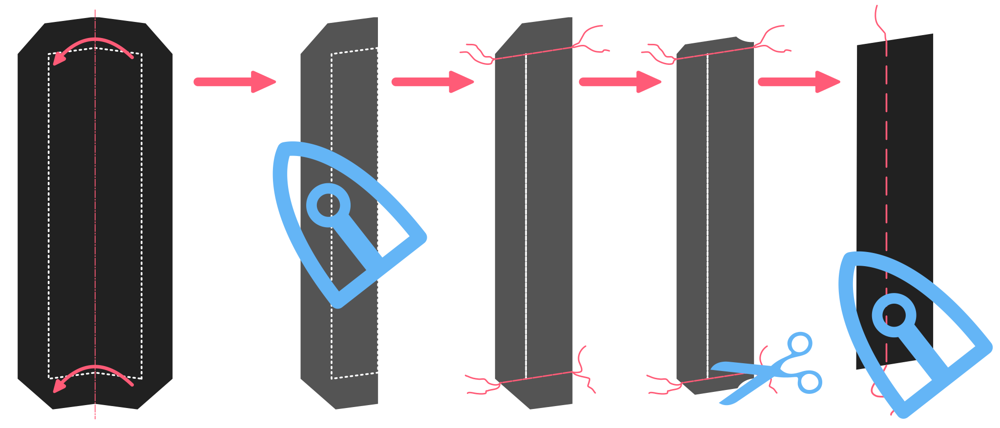

<Note>

###### Документація по Jaeger знаходиться на стадії розробки

Ця документація ще не закінчена.

</Note>

## Пошив

### Закрийте передні виточки

#### Скласти вдвічі

Складіть передню подвійну складку лицьовими боками разом і приколіть так, щоб згин був акуратно посередині передньої виточки.

#### Зшийте виточки

Зашийте передню виточку, стежачи за тим, щоб вона зупинилася на правильному верхньому кінці. Дно не настільки важливе, оскільки воно буде закрите кишенями. Але верхній кінець виточки буде добре видно, тому, будь ласка, переконайтеся, що вона закінчується на однаковій висоті з обох боків.

#### Розріжте і натисніть

Після того, як передні виточки закриті, розріжте виточку ззаду. Ви не зможете розрізати його до самого кінчика, але це не страшно. Розпрасуйте виточки там, де вони розрізані, а решту притисніть убік. Намагайтеся натискати тільки зі зворотного боку. Натискання спереду, швидше за все, залишить на тканині сліди.

### Конструюємо нагрудну кишеню

#### Застосовуйте плавкий інтерфейс

Нанесіть прямокутний шматок світлого легкоплавкого інтерфейсу навколо нагрудної кишені так, щоб він виходив на кілька сантиметрів в усі боки.

> ##### Ми не використовуємо плавкі матеріали на всій передній панелі
> 
> Спортивні пальта, як правило, виготовляються з дещо важчих тканин. Це, а також той факт, що я віддаю перевагу використанню полотна, а не фьюзингу, означає, що я не інтерфейсую передню частину за допомогою фьюзингу.

#### Приметайте контур нагрудного шва, позначте кінцеві точки верхньої лінії

With the fusible in place, thread a needle and baste around the chest pocket to transfer the markings to the good side of the fabric.

Ця кишеня відрізняється від традиційної прорізної кишені. Шов виходить над отвором кишені. Таким чином, кишенькова сумка ховається без необхідності облицювання. Верхня частина отвору також менша за шов, що дає змогу зашити його потайним швом.

На верхній лінії пришивної кишені відмітьте 0,5 см всередину від кутів верхньої лінії.

> Ці точки - надсічки на лицьовій частині вашої викрійки.

#### Складіть, притисніть і зшийте бічні шви шва

Складіть виворіт вдвічі лицьовими сторонами разом і закрийте бокові сторони (зшийте бокові шви).

#### Припуски швів обрізати, відвернути і припрасувати

Обріжте припуски на шви з боків і особливо обмежте припуски на кути, щоб уникнути об'ємності.

Виверніть навиворіт так, щоб лицьова сторона була назовні, і притисніть.

> Будьте обережні, щоб не натиснути занадто сильно, оскільки ви будете притискати з виворітного боку тканини.

#### Намітьте нижню лінію шва, щоб знати, де прошивати

Прикріпіть направляючу строчку внизу шва, щоб позначити межу шва і припусків на шви. Це буде лінія, по якій ми будемо прошивати пізніше.

#### Пришийте шов до лицьового боку

Покладіть виворітний бік лицьовим боком до лицьового боку зігнутим боком донизу і пришийте до лінії низу. Переконайтеся, що ви зупиняєтесь і починаєте точно на краю лінії, яку ви проклали.

#### Пришийте нагрудну кишеню сумки спереду

Покладіть кишенькову сумку лицьовою стороною вниз. Спереду лицьовим боком догори, а кишенькова сумка - лицьовим боком донизу. Переконайтеся, що найдовша сторона сумки для нагрудної кишені знаходиться на найвищій стороні нагрудної кишені.

> Тільки косі нагрудні кишені мають верхню і нижню сторони.

Пришийте його на місці вздовж верхньої лінії. Пам'ятайте, що вона повинна бути коротшою, ніж нижній ряд стібків для закріплення шва, оскільки ви відмітили 0,5 см всередину від кутів.

> Оскільки задня частина кишені, як правило, є слизькою тканиною, перед пришиванням її краще приколоти або закріпити шпилькою.

#### Розріжте отвір нагрудної кишені, поверніть і притисніть

 Тепер розріжте ваш шов посередині обох швів. Не обрізайте до краю, а створіть там трикутну форму.

Переверніть кишенькову сумку і пришийте до вивороту, протягнувши обидві частини через отвір, який ви щойно створили.

Розкладіть все рівно і притисніть.

Тепер виведіть шов тільки спереду і зробіть так, щоб він лежав красиво і рівно. Натисніть ще раз ззаду.

> Не піддавайтеся бажанню натиснути на нього спереду.

#### Закінчіть нагрудну кишеню

On the backside, fold the pocket bag double and sew it to the pocket welt below the existing seamline of the welt.

Протягніть голку і вручну обробіть нагрудну кишеню, пришивши бокові сторони шва до передньої панелі (не допускайте, щоб шви були видні спереду).

Нарешті, закрийте сумку-кишеню, зшивши бокові сторони. Зробіть це, поклавши лицьовою стороною донизу, а виворітною - догори. Потім складіть з обох боків і зшийте сумку-кишеню. Під час зшивання цих боковин не забудьте захопити трикутні маленькі шматочки отвору. Це зміцнить отвір кишені.

Зшийте нагрудну кишеню, поки ми конструюємо піджак.

### Підготуйте фронти

Виріжте передню частину полотна з легкого та еластичного полотна, покладеного на косуху. Виріжте всю передню частину.

Виріжте передню виточку і закрийте її зигзагоподібною строчкою, стежачи за тим, щоб полотно не накладалося один на одного.

Виріжте шматок полотна для грудей. Вирівняйте його вздовж лінії рулону і приклейте на передню частину полотна.

> Деталь грудей позначена на передній частині вашої викрійки.

#### Наклейте полотно на лицьові сторони

Тепер приметайте переднє полотнище і деталь грудей до лицьової сторони. Майте на увазі, що полотно не має припусків на шви.

> Приметайте його трохи всередину від лінії шва, щоб потім можна було відігнути, коли будете прошивати ці шви.  
> Ви ж не хочете, щоб полотно застрягло у швах.

#### Зшийте лацкани подушечками пальців

Час відчути себе справжнім кравцем і пришити лацкани.

Make sure to make the stitches a bit smaller towards the lapel tip, to make sure it lies flat against the chest, curling a bit inward instead of outward.

> If you're not sure how to pad-stitch the lapels, [let us know](https://discord.freesewing.org/) and we'll make an attempt to document it.

#### Заклейте скотчем край лацкана і лінію підвороту

Тепер ми пришиваємо кравецьку тасьму по краях лацканів переду і по лінії рулону вручну. Це також закріпить полотно спереду тут і там.

Майте це на увазі:

- Стрічка вздовж лінії рулону повинна бути розміщена всередині лінії рулону.
- Стрічка вздовж лінії рулону повинна бути приблизно на півсантиметра коротшою, ніж відстань, яку вона охоплює. Невеликий натяг, який при цьому створюється, допомагає лацкану гарно згортатися і прилягати до тіла.
- Стрічка по краю лацкана повинна бути розміщена всередині лінії шва

> ##### Не прошивайте тканину наскрізь
> 
> While sewing the tape to your front, avoid pushing your needle all the way through your fabric so that your stitches will show on the front.
> 
> У той же час, не варто закріплювати стрічку лише на полотні. Замість цього спробуйте захопити кілька ниток вашої тканини на кожному стібку, щоб стрічка була закріплена на місці, але при цьому стібки не були помітні спереду.
> 
> Це менш актуально вище точки згину лацкана, де тканина буде на зворотному боці лацкана.

### Закрийте тіло.

#### Зашийте бокові шви

Покладіть лицьову сторону лицьовим боком догори, а виворітну сторону - лицьовим боком донизу.  
Вирівняйте лицьовий і боковий шви, приколіть їх, якщо хочете, і зшийте разом.

Покладіть його вниз лицьовою стороною догори, а зверху покладіть спинку лицьовою стороною донизу.  
Вирівняйте шви спинки і боків, за бажанням приколіть їх і зшийте разом.

> Переконайтеся, що полотно не застрягло у шві.

> ##### Вказівки щодо вшивання вентиляційних отворів
> 
> Якщо у вас подвійний вентиляційний отвір, цей шов буде містити вентиляційний отвір.
> 
> Зшийте нижню частину бокового/заднього шва і бокову частину, що утворює вентиляційний отвір. Після цього не прошивайте вниз.

#### Закрийте задній шов

Складіть дві половинки жакета лицьовими боками разом і закрийте задній шов.

<Note>

##### Примітка щодо пришивання вентиляційних отворів

Якщо у вас один вентиляційний отвір, цей шов буде містити вентиляційний отвір.

Зшийте нижню частину заднього шва і бічну частину, що утворює вентиляційний отвір.
Після цього не прошивайте вниз.

</Note>

#### Закрийте плечові шви

Вирівняйте плечові шви лицьовими боками один до одного і зшийте їх.

Переконайтеся, що полотно не застрягло у шві.

<Note>

##### Вирівняйте надсічки на плечах

Ретельно вирівняйте плечі по надсічках.
Через різну форму задньої та передньої панелей з боку горловини,
край тканини виглядає по-різному. Тому вирівнювання цих країв не дасть вам
того, що вам потрібно.

Тому обов'язково вирівняйте насічки. Це те, для чого вони існують.

</Note>

### Зробіть комір
Для того, щоб виглядати по-справжньому круто, комір повинен бути симетричним з обох боків. Різниця в 5 мм вже помітна на нашийнику, тому чим точніше ви зробите ці кроки, тим краще.

### Додайте маркування до обох нашийників
Накладіть обидва коміри один на одного, зшийте кути разом і обріжте намітку. Потім за допомогою розмічального олівця або крейди позначте краї нашийника. Виміряйте 2 рази, щоб переконатися, що решта комірів і розташування кутів на 100% збігаються на обох кутах 

#### Додайте прокладку або полотно до зовнішньої стійки коміра та під комір
Або використовуйте легкоплавкий інтерфейс, або, якщо ви хочете бути жорстким, використовуйте полотно з кінського волосу. Пришийте його до зовнішньої підставки для колориту, використовуючи ту саму техніку, що й при додаванні полотна до лацкана. 

#### Пришийте зовнішній комір-стійку до нижнього коміра та додайте до куртки
Переконайтеся, що зовнішня стійка коміра та підкомір суміщені та зшиті разом Пришийте зовнішню стійку коміра+підкомір до вирізу горловини куртки Зробіть невеликі надрізи в тканині навколо вирізу горловини для більшої зручності Припуски на шви в кутах обріжте по діагоналі для кращого прилягання.

### Рукава
Пришийте верхній рукав до нижнього до розрізу

#### Створіть розріз на вході втулки

Пришийте другий бік рукавів Виверніть рукава лицьовим боком назовні Додайте рукава до куртки

### Внутрішня кишеня
<note>
Внутрішня кишеня - подвійна прорізна кишеня. Це те саме, що і передні кишені, але без кришки.
Будь ласка, дивіться зображення на передніх кишенях для деталей
</note>

Визначте місце розташування кишені на лівій внутрішній підкладці за допомогою наметування Додайте трохи флізеліну навколо цієї ділянки Намалюйте кишеню на флізеліні. Додайте шви на верхній і нижній стороні кишені Зшийте шви по лінії з обох боків кишені. Використовуйте шви так, щоб вони знаходилися точно один над одним. Обріжте вхід в кишеню приблизно на 1-2 см від кінця. Розріжте останню частину по діагоналі, щоб вийшов зріз риб'ячої кістки Виверніть шви навиворіт, прострочіть і притисніть Виверніть трикутники навиворіт, прострочіть і притисніть Прошийте навколо кишені, щоб все було на своїх місцях Візьміть сумку-кишеню, пришийте її до нижнього шва, а іншу частину до верхнього шва (див.: нагрудна кишеня)

### Підкладка
Зшийте підкладку ззаду до розрізу Зшийте фігурні шви в передніх частинах Складіть всю підкладку разом (перед, боковини, спинку) Складіть підкладку з лицьової сторони з лицьовою стороною. Залиште знизу відкритими приблизно 5 см Закрийте плечі Додайте внутрішню стійку коміра до верхнього коміра і додайте до підкладки жакета Зробіть невеликі розрізи у вирізі горловини і по кутах Додайте верхні рукави до нижніх Додайте рукави до підкладки жакета.

### Закривай.
Але куртка + підкладка накладаються одна на одну гарними сторонами. Прошийте навколо коміра і продовжуйте аж до лицьового боку Виверніть куртку на виворітний бік Складіть рукави на місце (переконайтеся, що вони не вивернуті!!) Додайте підкладку рукава до розрізу рукава Переконайтеся, що коміри прямо накладені один на одного (вирівняні), і додайте припуски на шви вручну. Додайте в декількох місцях передню частину SA до підкладки SA вручну з внутрішньої сторони піджака Створіть спинку і додайте підкладку до основної тканини вручну Додайте петлі та ґудзики

