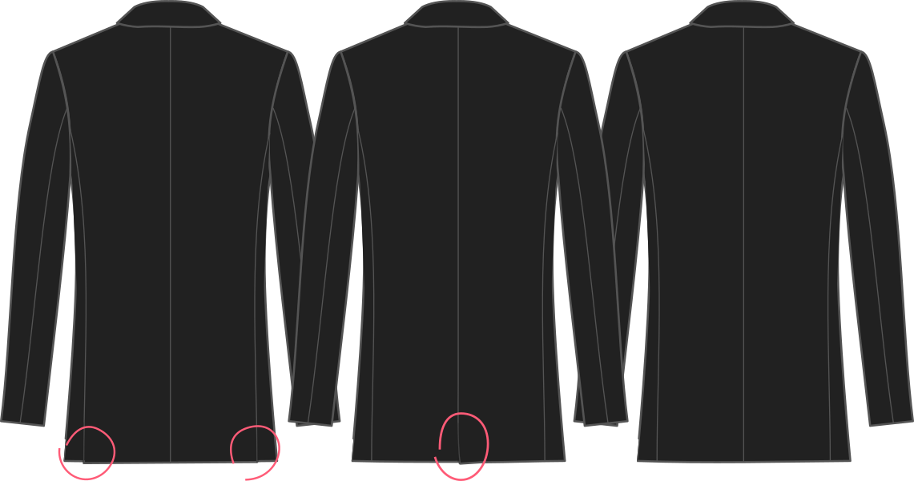

¿Cómo te gustan las ventanillas traseras?

- Dos ventiladores traseros (mostrados a la izquierda)
- Un ventilador trasero central (mostrado en el medio)
- No hay resguardos (se muestra a la derecha)

## Efecto de esta opción en el patrón

