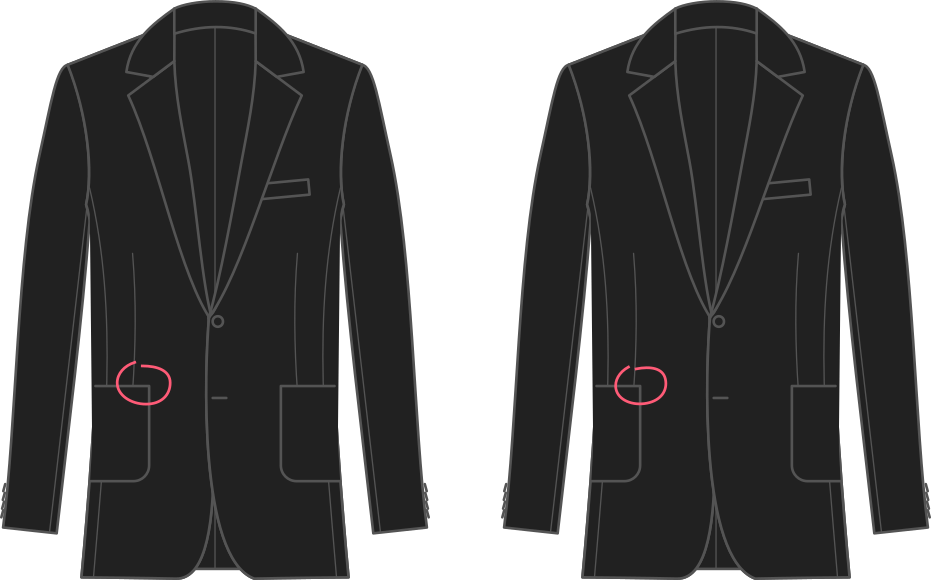

- - -
title: "Front pocket placement"
- - -

Ubicación del bolsillo delantero como proporción de un cuarto de la circunstancia del pecho. Los números más altos lo mueven más al lado.

## Efecto de esta opción en el patrón

