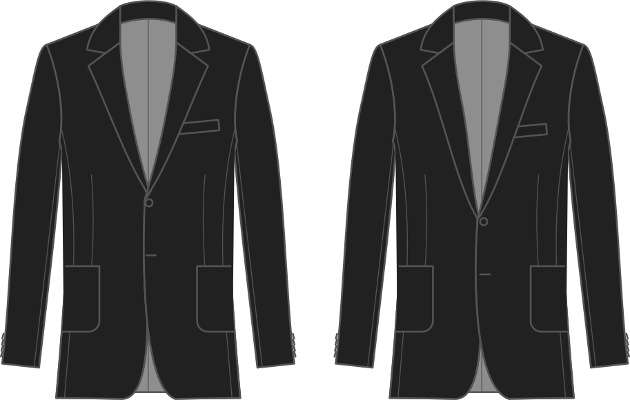

- - -
title: "Lapel start"
- - -

Locatie van het breekpunt van de revers (waar de opening vooraan start). Lagere waarden liggen dichter bij de taille, hogere waarden dichter bij de borst.

## Effect van deze optie op het patroon

